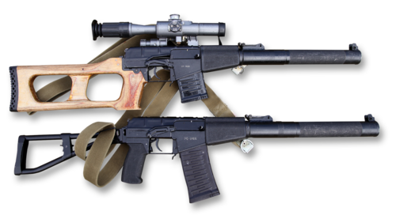

# Karabin szturmowy AS Val
### AS Val Assault Rifle | АС «Вал»

---

## Opis

AS Val (Автомат Специальный Вал — Wał) to rosyjski tłumiony karabin szturmowy kalibru 9×39 mm opracowany przez TsNIITochMash w 1987 roku dla sił specjalnych i służb wywiadowczych ZSRR/Rosji. Tłumik jest integralną częścią konstrukcji (nie demontuje się go do użytku bojowego) — razem z poddźwiękowym nabojem 9×39 mm daje jedną z najcichszych broni automatycznych na świecie. AS Val i jego siostrzana broń snajperska VSS Wintorez zostały zaprojektowane do cichego eliminowania celów w pancerzach osobistych — nabój 9×39 mm przebija kamizelki klasy III do 500 m. Broń służy głównie w FSB, FSO, GRU i Spetsnaz; pojawiła się w Czeczenii, Afganistanie i na Ukrainie.

## Dane techniczne

| Parametr | Wartość |
|----------|---------|
| Typ | Tłumiony karabin szturmowy |
| Kraj produkcji | Rosja |
| Rok wprowadzenia | 1987 |
| Kaliber | 9×39 mm |
| Długość | 875 mm (tłumik zintegrowany, stały) |
| Długość lufy | 200 mm |
| Masa (z tłumikiem) | 2,96 kg |
| Pojemność magazynka | 20 nabojów |
| Prędkość wylotowa | 290–295 m/s (poddźwiękowa) |
| Skuteczny zasięg | 300–400 m (z optiką) |

## Charakterystyczne cechy rozpoznawcze

> Jak odróżnić AS Val od VSS Wintorez i SR-3:

- **Duży integrowany tłumik na całą długość lufy — nie do zdjęcia:** tłumik AS Val jest trwale wbudowany w broń i stanowi jej przód — broń wygląda jakby miała bardzo grubą, długą "lufę"; żaden inny masowo stosowany karabin szturmowy nie ma stałego tłumika
- **Brak kolby składanej standardowej — kolba drewniana lub metalowa szkieletowa:** AS Val często jest wyposażony w drewnianą kolbę wyglądającą archaicznie — bo pochodzi z czasów sowieckich; nowsze wersje mają metalową kolbę składaną, ale nadal wyróżniają się sylwetką
- **Tłumik wyraźnie grubszy niż lufa — cylindryczny:** tłumik zintegrowany AS Val ma charakterystyczny cylindryczny kształt o średnicy znacznie większej niż lufa; od strony czołowej broń wygląda jak gruba rura
- **Różnica wobec VSS Wintorez — brak gniazda optyki i inny chwyt:** VSS ma standardowe gniazdo celownika optycznego na górze i smuklejszy kształt; AS Val jest przeznaczony bardziej do ognia automatycznego — ma większy magazynek (20 zamiast 10) i brak standardowej szyny optycznej w starszych wersjach
- **Grubszy magazynek 9×39 mm — porównywalny z SR-3:** magazynek AS Val jest krótki i gruby (kaliber 9 mm) — wyraźnie inny od smukłych magazynków 5,45 mm AK-74 i AKS-74U
- **Bardzo charakterystyczna "głucha" sylwetka z przodu:** z profilu AS Val ma zupełnie inny wygląd niż AK — brak wyraźnego otworu wylotowego lufy (tłumik go zasłania), brak muszki na końcu, brak hamulca wylotowego

## Ciekawostka

> AS Val i VSS Wintorez były przez wiele lat bronią objętą ścisłą tajemnicą — formalnie nie istniały w sowieckich/rosyjskich katalogach wojskowych. Pierwszy raz potwierdzono ich istnienie dopiero w 1994 roku, gdy Rosja wystawiła je na targach IDEX w Abu Zabi. Do dziś szczegóły techniczne niektórych wersji amunicji 9×39 mm używanej przez rosyjskie służby specjalne są klasyfikowane. Broń zyskała zainteresowanie zachodnie po jej zdobyciu na polach bitew Czeczenii i Syrii — i do dziś uchodzi za jeden z najbardziej zaawansowanych systemów broni osobistej na świecie.

