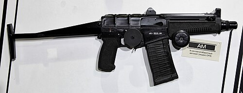

# Karabin szturmowy SR-3 Wihr
### SR-3 Vikhr Assault Rifle | СР-3 «Вихрь»

---

## Opis

SR-3 Wihr (Вихрь — Wicher) to rosyjski kompaktowy karabin szturmowy kalibru 9×39 mm opracowany przez TsNIITochMash w latach 90. dla FSB, FSO i rosyjskich służb specjalnych. Używa poddźwiękowego naboju 9×39 mm przeznaczonego pierwotnie dla tłumionej broni specjalnej (AS Val, VSS Wintorez) — co pozwala na stosowanie tłumika dźwięku z bardzo dobrą efektywnością. SR-3 jest kompaktowy (nieco dłuższy od pistoletu maszynowego), wysoce manewrowy w pomieszczeniach i zdolny do penetracji lekkich kamizelek balistycznych na odległość do 200 m. To broń wybitnie specjalna — w odróżnieniu od karabinów szturmowych ogólnego przeznaczenia; stosowana głównie przez antyterrorystów, ochronę VIP i miejskie oddziały specjalne.

## Dane techniczne

| Parametr | Wartość |
|----------|---------|
| Typ | Kompaktowy karabin szturmowy / PDW |
| Kraj produkcji | Rosja |
| Rok wprowadzenia | 1996 |
| Kaliber | 9×39 mm |
| Długość (kolba rozłożona) | 610 mm |
| Długość (kolba złożona) | 360 mm |
| Długość lufy | 172 mm |
| Masa (bez magazynka) | 2,0 kg |
| Pojemność magazynka | 20 lub 30 nabojów |
| Prędkość wylotowa | 295 m/s (poddźwiękowa) |
| Skuteczny zasięg | 200 m |

## Charakterystyczne cechy rozpoznawcze

> Jak odróżnić SR-3 od AKS-74U i AS Val:

- **Bardzo mała i krótka broń — mniejsza niż AKS-74U:** SR-3 ze złożoną kolbą ma zaledwie 360 mm — to rozmiar dużego pistoletu; AKS-74U ma 490 mm; SR-3 jest tak mała, że często trudno ją zidentyfikować jako karabin szturmowy
- **Brak zewnętrznego tłumika (ale możliwość montażu):** standardowy SR-3 nie ma tłumika (w odróżnieniu od AS Val i VSS) — za to możliwe jest szybkie dołączenie krótkiego tłumika; ten sam nabój 9×39 mm bez tłumika jest wyraźnie głośniejszy niż AS Val
- **Metalowa kolba szkieletowa składana na prawą stronę:** kolba SR-3 to metalowa kratownica składana na prawo — charakterystyczny wygląd, inny od plastikowej kolby AKS-74U
- **Krótkie, masywne łoże bez wyraźnego odcięcia:** SR-3 ma bardzo krótkie łoże z uchwytem przednim — sylwetka jest "zaokrąglona" i kompaktowa, bez charakterystycznej długiej lufy AK
- **Grubszy magazynek 9×39 mm — inny niż AKS-74U:** magazynek SR-3 jest krótszy i grubszy niż magazynek AKS-74U (kaliber 5,45 mm) — przy bezpośrednim porównaniu wyraźna różnica w wymiarach pudełka magazynka
- **Charakterystyczny przód broni bez gazownika ponad lufą:** SR-3 nie ma tradycyjnego bloku gazownika z muszką ponad lufą; układ jest uproszczony, a muszka siedzi bezpośrednio na rurze lufy

## Ciekawostka

> SR-3 Wihr "zasłynął" w mediach po zamachu na Dubrowce w 2002 roku (teatr na Dubrowce, "Nord-Ost") — agenci FSB szturmujący teatr byli uzbrojeni w SR-3. Brak wyraźnych fotografii z szturmu przez lata utrudniał identyfikację broni. Gdy w końcu zidentyfikowano SR-3 na nagraniach, zrozumiano dlaczego: SR-3 jest tak mały, że operatorzy FSB mogli go nosić ukryty pod ubraniem cywilnym aż do momentu szturmu — co byłoby niemożliwe z AKS-74U.

