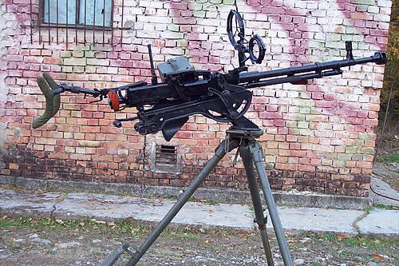

# Ciężki karabin maszynowy DszkK
### DShK Heavy Machine Gun | ДШК (Дегтярёв-Шпагин Крупнокалиберный)

---

## Opis

DShK (Дегтярёв-Szpagin Крупнокалиберный) to radziecki ciężki karabin maszynowy kalibru 12,7×108 mm zaprojektowany przez Wasilija Diegtiarjewa i Gieorgija Szpagina i przyjęty do służby w 1938 roku. Pomimo wieku ponad 85 lat DShK jest nadal w aktywnej służbie w dziesiątkach armii i ruchów zbrojnych na całym świecie — od Afganistanu przez Afrykę po Ukrainę. Używa potężnego naboju 12,7×108 mm zdolnego do rażenia lekkich pojazdów opancerzonych, helikopterów i umocnień na odległość do 2000 m. DShK jest montowany na trójnodze naziemnym, pojazdach (technicals, opancerzone pojazdy) i wieżyczkach morskich. Zmodernizowana wersja DShKM (1946) jest do dziś produkowana w Chinach, Iranie i innych krajach.

## Dane techniczne

| Parametr | Wartość |
|----------|---------|
| Typ | Ciężki karabin maszynowy (HMG) |
| Kraj produkcji | ZSRR |
| Rok wprowadzenia | 1938 (DShKM: 1946) |
| Kaliber | 12,7×108 mm |
| Długość | 1 626 mm |
| Długość lufy | 1 070 mm |
| Masa (bez trójnogu) | 34 kg |
| Zasilanie | Taśma 50 lub 250 nabojów |
| Szybkostrzelność | 600 strz./min |
| Skuteczny zasięg | 2 000 m (cele naziemne) / 1 500 m (cele powietrzne) |

## Charakterystyczne cechy rozpoznawcze

> Jak odróżnić DShK od NSV i Kord:

- **Bardzo masywny i długi — wyraźnie archaiczna, gruba sylwetka:** DShK ma charakterystyczną grubą, masywną lufę z wyraźnymi żebrami chłodzącymi (wzdłużne rowki na lufie); NSV i Kord mają gładsze, cieńsze lufy — DShK wygląda "artyleryjsko" i ciężko
- **Żebra chłodzące na lufie — widoczne prążki wzdłuż lufy:** najbardziej charakterystyczna cecha DShK: wyraźne poziome lub podłużne żebra na lufie; NSV ma lufę gładką lub z minimalnym profilowaniem; żebra DShK są widoczne nawet na zdjęciach z odległości
- **Duży okrągły hamulec wylotowy w kształcie "grzybka":** DShKM ma charakterystyczny okrągły, stożkowy lub "grzybkowy" hamulec wylotowy; Kord ma bardziej nowoczesny kanciasty hamulec; NSV — inny kształt
- **Kołowy lawet artyleryjski z dużymi stalowymi kołami:** DShK może być montowany na kołowym lawecie z dużymi stalowymi kołami — archaiczny wygląd "artylerii polowej" ze stalowymi szprychami; NSV i Kord mają nowocześ­niejsze trójnogi bez kół
- **Podajnik taśmy wychodzący z lewej strony — wyraźny "garb":** podajnik boczny DShKM (z 1946 roku) wychodzi z lewej strony komory zamkowej jako charakterystyczny "garb" podajnikowy; pierwsza wersja DShK 1938 miała bębniany podajnik obrotowy
- **Masywny trójnóg z rozkładanymi nogami — "pajęczy" kształt:** trójnóg DShK ma charakterystyczne trzy grube nogi rozkładane na boki w kształcie gwiazdy; całość wygląda jak ciężka platforma artyleryjska, nie jak przenośna broń

## Ciekawostka

> DShK był jedną z pierwszych broni zdolnych do skutecznego strącania samolotów — i jedna z jego pierwszych ofiar to był... własny samolot radziecki. W 1941 roku radzieccy żołnierze strzelali do wszystkiego, co latało, bo nie mieli opracowanej procedury identyfikacji; zestrzelono kilka własnych bombowców SB. DShK ocalał w służbie dzięki chińskiej kopii (Typ 54) — Chiny wyprodukowały setki tysięcy egzemplarzy i sprzedawały je wszędzie; dziś DShK na "technicalu" to symbol wojen zastępczych zimnowojennych i postzimnowojennch w Afryce i Azji.

