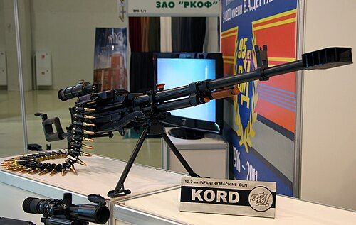

# Ciężki karabin maszynowy Kord
### Kord Heavy Machine Gun | Корд (6П50)

---

## Opis

Kord (6П50) to rosyjski ciężki karabin maszynowy kalibru 12,7×108 mm opracowany przez ZID (Zawod im. Diegtiarjewa) w Kowrowie i przyjęty do służby w 1998 roku jako następnik NSV. Jest znacznie lżejszy od NSV dzięki ulepszonej konstrukcji lufy ze specjalnym systemem odprowadzania gazów — masa Kord to tylko 25,5 kg (porównywalna z NSV), ale kluczową różnicą jest możliwość strzelania z dwójnogu bez trójnogu przez jednego żołnierza (w pewnych warunkach) — czego DShK ani NSV nie potrafią. Kord jest standardowym ciężkim km montowanym na wieżyczkach T-90M, T-14 Armata, BMP-3M i wielu innych pojazdach rosyjskich.

## Dane techniczne

| Parametr | Wartość |
|----------|---------|
| Typ | Ciężki karabin maszynowy (HMG) |
| Kraj produkcji | Rosja |
| Rok wprowadzenia | 1998 |
| Kaliber | 12,7×108 mm |
| Długość | 1 980 mm |
| Długość lufy | 1 070 mm |
| Masa (bez trójnogu) | 25,5 kg |
| Zasilanie | Taśma 50 nabojów |
| Szybkostrzelność | 650–750 strz./min |
| Skuteczny zasięg | 2 000 m |

## Charakterystyczne cechy rozpoznawcze

> Jak odróżnić Kord od NSW i DShK:

- **Nowoczesny, kanciasty hamulec wylotowy w kształcie "skrzynki":** Kord ma charakterystyczny prostokątny wielokomorowy hamulec wylotowy — kanciasty, nowoczesny wygląd; DShK ma okrągły "grzybkowy" hamulec, NSV — inny kształt; hamulec Kord jest od razu rozpoznawalny jako "inny"
- **Wyraźnie dłuższy od NSV — o ok. 40 cm:** Kord ma lufę 107 cm i długość całkowitą ok. 198 cm — jest wyraźnie dłuższy od NSV (156 cm); proporcje Kord są bardziej "armatnie" i rozciągnięte
- **Nowoczesne łoże i chwyt pistoletowy z prawej:** Kord ma nowoczesny ergonomiczny chwyt pistoletowy (jak karabin szturmowy) zamiast tradycyjnych rękojeści; to bardzo wyraźna cecha — DShK i NSV mają klasyczne "uszate" uchwyty
- **Charakterystyczna pełna osłona lufy z otworami:** nad lufą Kord widnieje charakterystyczna metalowa osłona z wyciętymi otworami wentylacyjnymi — estetycznie nowoczesna; DShK i NSV nie mają takiej osłony lufy
- **Montaż na T-90M i T-14 Armata — na nowoczesnych czołgach:** jeśli ciężki km jest widoczny na szczycie wieżyczki T-90M lub T-14 Armata — to prawie na pewno Kord; NSV jest na starszych T-72/T-80; DShK na jeszcze starszych pojazdach
- **Charakterystyczny układ podajnika — skrzynka z boku (prawa strona):** Kord ładuje taśmę z prawej strony (NSV — lewa); ta różnica w stronę podawania taśmy jest dobrym wyróżnikiem przy obserwacji obsługi broni

## Ciekawostka

> Kord był pierwszą radziecko-rosyjską bronią ciężką, która mogła być teoretycznie obsługiwana przez jedną osobę w polu — bez rozkładania trójnogu, przez krótkie serie z dwójnogu lub z biodra (choć jest to niecelne i "akrobatyczne"). Zaprezentowano to na pokazach, wywołując niedowierzanie — przecież DShK ważył 34 kg na trójnogu i potrzebował 4 ludzi do przeniesienia. Kord ze stopą naramienną i dwójnogiem mógł teoretycznie obsługiwać jeden silny żołnierz — choć w praktyce i tak się tego nie robi ze względu na odrzut i celność.

