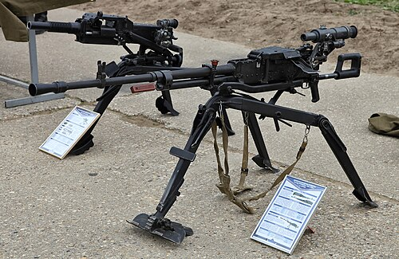

# Ciężki karabin maszynowy NSW
### NSV Heavy Machine Gun | НСВ «Утёс» (Utes)

---

## Opis

NSW (НСВ — Nikitin-Sokolov-Wołkow) Utes (Утёс — Klif) to radziecki ciężki karabin maszynowy kalibru 12,7×108 mm opracowany przez Nikitin, Sokołow i Wołkow i przyjęty do służby w 1971 roku jako następnik DShKM. NSW był znacznie lżejszy od DShKM (25 kg vs 34 kg) i bardziej nowoczesny — zredukowana masa pozwoliła na szersze stosowanie go na wieżyczkach pojazdów opancerzonych (T-72, T-80, T-90, BMP-3). Poza rolą przeciwpancerną (lekkie pancerze do 16 mm) NSW jest skuteczny przeciwko śmigłowcom i piechurze w zasięgu do 2000 m. Szeroko stosowany przez armie postsowieckie; wycofywany z rosyjskiej służby na rzecz Kord, ale wciąż powszechny.

## Dane techniczne

| Parametr | Wartość |
|----------|---------|
| Typ | Ciężki karabin maszynowy (HMG) |
| Kraj produkcji | ZSRR / Rosja |
| Rok wprowadzenia | 1971 |
| Kaliber | 12,7×108 mm |
| Długość | 1 560 mm |
| Długość lufy | 1 100 mm |
| Masa (bez trójnogu) | 25 kg |
| Zasilanie | Taśma 50 nabojów |
| Szybkostrzelność | 700–800 strz./min |
| Skuteczny zasięg | 2 000 m |

## Charakterystyczne cechy rozpoznawcze

> Jak odróżnić NSW od DShK i Kord:

- **Gładka lufa bez żeber chłodzących — w odróżnieniu od DShK:** NSW ma stosunkowo gładką lufę (bez wyraźnych żeber); DShK ma charakterystyczne żebra wzdłuż całej lufy; ta gładkość NSV jest pierwszą wskazówką przy identyfikacji
- **Charakterystyczny podajnik taśmy z lewej — okrągły mechanizm:** mechanizm podajnika NSV jest okrągły lub owoidalny z lewej strony komory zamkowej — wyraźny "guz" boczny; mniej charakterystyczny niż skrzynkowy podajnik DShKM
- **Mniejszy i lżejszy od DShK — wyraźnie smuklejsza bryła:** NSV jest o 9 kg lżejszy od DShK; wizualnie jest smuklejszy i krótszy; przy porównaniu obu broni NSV sprawia wrażenie bardziej "elegancki" i nowocześniejszy
- **Często widoczny na wieżyczkach T-72/T-80/T-90 — jako km przeciwlotniczy:** NSW jest standardowym km przeciwlotniczym montowanym na wieżyczkach czołgów T-72 i T-80; na szczycie wieżyczki czołgu widoczna charakterystyczna pionowa lufa NSV — to "flaga" rozpoznawcza
- **Trójnóg NSP-12 z rozkładanymi nogami:** NSV jest montowany na nowoczesnym stalowym trójnogu z regulacją wysokości; lżejszy i nowocześniejszy od kołowego lawetu DShK
- **Szybkostrzelność wyższa niż DShK — słyszalna różnica w rytmie:** NSV strzela szybciej (700–800 strz./min) niż DShK (600 strz./min); przy nasłuchu różnica w rytmie ognia jest wyczuwalna przez doświadczonych obserwatorów

## Ciekawostka

> NSW był pierwszym sowieckim ciężkim km, który nie pochodził z "fabryki Degtiariewa" — łamiąc monopol, który Diegtiariów miał na sowiecką broń wsparcia od 1926 roku. Kiedy prototyp NSW przeszedł testy, mówiono żartem, że "Degtiariów skręcił się w grobie" — choć konstruktor żył do 1949 roku. NSW zdominował wieżyczki czołgów rosyjskich do tego stopnia, że na Ukrainie żołnierze szybko nauczyli się zdejmować NSV ze zniszczonych rosyjskich czołgów i montować je na własnych pojazdach — gotowa ciężka broń wsparcia bez żadnej adaptacji.

