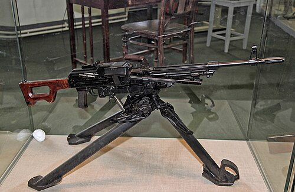

# Karabin maszynowy PK / PKM
### PK/PKM General-Purpose Machine Gun | ПК / ПКМ (Пулемёт Калашникова)

---

## Opis

PK (Пулемёт Калашникова — Karabin maszynowy Kałasznikowa) to radziecka ogólna broń wsparcia (GPMG) kalibru 7,62×54R mm opracowana przez Michaiła Kałasznikowa i przyjęta do służby w 1961 roku. PKM (1969) to zmodernizowana, lżejsza wersja. Zasilany taśmą nabojów o pełnym rynklu 7,62×54R mm (ten sam nabój co karabin snajperski SVD i karabin Moisina) — co daje zasięg skuteczny do 1000 m i celny ogień od 800 m. PK/PKM jest uważany za jeden z najlepszych karabinów maszynowych ogólnego przeznaczenia w historii — prosty, niezawodny, lekki (7,5 kg) i skuteczny. Stosowany przez armie ponad 100 państw; do dziś jest standardową bronią wsparcia drużyny piechoty w armii rosyjskiej.

## Dane techniczne

| Parametr | Wartość |
|----------|---------|
| Typ | Karabin maszynowy ogólnego przeznaczenia (GPMG) |
| Kraj produkcji | ZSRR / Rosja |
| Rok wprowadzenia | 1961 (PK) / 1969 (PKM) |
| Kaliber | 7,62×54R mm |
| Długość | 1 173 mm |
| Długość lufy | 658 mm |
| Masa (bez taśmy) | 7,5 kg (PKM) |
| Zasilanie | Taśma 100, 200 lub 250 nabojów |
| Szybkostrzelność | 650–750 strz./min |
| Skuteczny zasięg | 1 000 m (ogień ciągły) / 1 500 m (ogień bezpośredni) |

## Charakterystyczne cechy rozpoznawcze

> Jak odróżnić PKM od RPK, RPD i NSV:

- **Taśma nabojów 7,62×54R zamiast magazynka — kluczowy identyfikator:** PKM jest zasilany metalową taśmą nabojów (100–250 sztuk w skrzynce); żaden RPK nie ma taśmy — jeśli broń jest zasilana taśmą, to nie jest RPK
- **Charakterystyczna składana trójnóg lub dwójnóg — masywna metalowa konstrkcja:** PKM ma stalowy składany dwójnóg zamontowany w połowie lufy; masywniejszy i dłuższy niż dwójnóg RPK; na trójnogu SPP — wyraźnie cięższy zestaw
- **Zmieniana lufa — widoczna dźwignia zwalniająca:** PKM ma szybkozmienna lufę — po lewej stronie komory zamkowej widoczna jest dźwignia zwalniająca lufę; wymiana lufy to charakterystyczna operacja obsługi PKM widoczna na filmach
- **Klapka podajnika taśmy na górze komory zamkowej:** na górze komory zamkowej PKM widnieje charakterystyczna duża klapka z mechanizmem podajnika taśmy; jest szersza i bardziej wypukła niż klapka AKM
- **Prosta, nieregulowana kolba skrzynkowa (drewniana lub plastikowa):** kolba PKM jest prosta, nieregulowana, z charakterystycznym otworem / skrzynkowym kształtem — inna od smukłej kolby AKM i wyraźnie odróżnia PKM od zachodniej broni wsparcia
- **Lżejszy i krótszy od NSV i Kord:** NSV i Kord to ciężkie km 12,7 mm montowane na pojazdach; PKM jest wyraźnie mniejszy i lżejszy; przy porównaniu gabaryty NSV są dwa razy większe

## Ciekawostka

> PKM stał się symbolem partyzantów i nieregularnych sił zbrojnych na całym świecie — co jest paradoksem, bo projektowany był dla regularnej armii. Afgańscy mudżahedini, hezbollahczycy, żołnierze ISIL i setki innych podmiotów zbrojnych używali PKM, bo jest lekki i bardzo wytrzymały. Taliban zdobywał PKM od wojsk radzieckich w Afganistanie — i do 2001 roku posiadał więcej PKM niż radziecka armia miała planów. Najsłynniejsze zdjęcie PKM to karabin zamontowany na dachu pickupa — "techniczny" z PKM to pół-standardowy pojazd bojowy w Afryce i na Bliskim Wschodzie.

