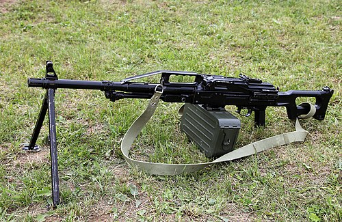

# Karabin maszynowy PKP Pieczenieg
### PKP Pecheneg Machine Gun | ПКП «Печенег»

---

## Opis

PKP Pieczenieg (Печенег — Pieczyngowie, lud koczowniczy) to rosyjski ciężki karabin maszynowy ogólnego przeznaczenia kalibru 7,62×54R mm opracowany przez TsNIITochMash i przyjęty do służby w 1999 roku jako modernizacja PKM. Wyróżnia się systemem wymuszonego chłodzenia lufy przez kanał wewnętrzny — gorące gazy z komory zamkowej cyrkulują wokół lufy, chłodząc ją bez demontażu; pozwala to na oddanie do 600 nabojów bez wymiany lufy (PKM wymaga wymiany co 250–300 nabojów). Pieczenieg nie ma możliwości szybkiej wymiany lufy (i nie potrzebuje jej dzięki chłodzeniu). Stosowany przez rosyjskie siły specjalne, Spetsnaz i jednostki szturmowe.

## Dane techniczne

| Parametr | Wartość |
|----------|---------|
| Typ | Karabin maszynowy ogólnego przeznaczenia |
| Kraj produkcji | Rosja |
| Rok wprowadzenia | 1999 |
| Kaliber | 7,62×54R mm |
| Długość | 1 155 mm |
| Długość lufy | 658 mm |
| Masa (bez taśmy) | 8,2 kg |
| Zasilanie | Taśma 100, 200 lub 250 nabojów |
| Szybkostrzelność | 650–750 strz./min |
| Skuteczny zasięg | 1 500 m |

## Charakterystyczne cechy rozpoznawcze

> Jak odróżnić PKP Pieczenieg od PKM:

- **Grubsza, ciężka lufa bez możliwości wymiany w polu:** lufa Pieczeniega jest wyraźnie grubsza od lufy PKM — o cięższym profilu i z radiatorowymi żebrami; na PKM lufa jest smuklejsza i cieńsza; ta grubość jest kluczową cechą wizualną
- **Brak dźwigni szybkiej wymiany lufy:** PKM ma wyraźną dźwignię zwalniającą lufę po lewej stronie komory zamkowej; Pieczenieg jej nie ma — jego gruba lufa nie jest wymienialna; przy obejrzeniu z boku brak tej dźwigni natychmiast odróżnia broń
- **Uchwyt przedni pionowy pod lufą (bipod jest tu przeniesiony):** Pieczenieg ma charakterystyczny pionowy uchwyt przedni (foregrip) pod lufą; PKM go nie ma; ten uchwyt to bardzo wyraźna cecha wizualna, widoczna natychmiast
- **Charakterystyczna osłona lufy (heat shield) wzdłuż całej lufy:** nad lufą Pieczeniega widnieje metalowa osłona cieplna na całej długości — pozwala na przytrzymanie broni za lufę bez poparzenia; PKM nie ma takiej osłony (lufa PKM jest odsłonięta)
- **Dwójnóg przesunięty w kierunku komory (bardziej do tyłu niż w PKM):** dwójnóg Pieczeniega jest zamontowany bliżej środka ciężkości broni niż w PKM; subtelna różnica w pozycji dwójnogu
- **Cięższy o 0,7 kg od PKM — widoczna solidniejsza bryła:** Pieczenieg waży 8,2 kg vs 7,5 kg PKM; przy porównaniu na oko różnica nie jest dramatyczna, ale sylwetka Pieczeniega jest "solidniejsza" i bardziej "wypełniona"

## Ciekawostka

> Nazwa "Pieczenieg" pochodzi od koczowniczego ludu stepowego, który przez wieki napadał na Ruś Kijowską. Konstruktorzy wybrali tę nazwę, bo — ich zdaniem — nowy km miał być tak nieustępliwy w walce jak starożytni Pieczyngowie. W Czeczenii Pieczenieg zaskoczył rosyjskich żołnierzy: podczas długich zasadzek mogli prowadzić nieprzerwany ogień przez kilkadziesiąt minut bez chłodzenia, podczas gdy obsługi PKM co kilkanaście minut musiały wymieniać lufy lub przerywać ogień. To pierwsza "cold barrel advantage" dla rosyjskiego km od czasów Degtiariewa.

