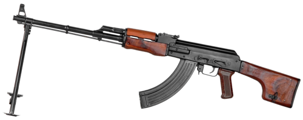

# Ręczny karabin maszynowy RPK
### RPK Light Machine Gun | РПК (Ручной пулемёт Калашникова)

---

## Opis

RPK (Ручной пулемёт Калашникова — Ręczny karabin maszynowy Kałasznikowa) to radziecka lekka broń wsparcia kalibru 7,62×39 mm opracowana przez Michaiła Kałasznikowa i przyjęta do służby w 1961 roku. Stanowi wersję wsparcia ogniowego AKM — ma tę samą mechanikę i wymienną amunicję, ale cięższy lufy, stałą kolbę drewnianą i dwójnóg, co poprawia celność przy ogniu ciągłym. RPK używa standardowych magazynków AKM (30 nabojów) lub specjalnych bębnowych magazynków 40- i 75-nabojowych. Zasięg skuteczny do 800 m. W drugiej połowie lat 70. zastąpiony przez RPK-74 (kaliber 5,45 mm), jednak RPK wciąż jest na wyposażeniu wielu armii i nieregularnych sił zbrojnych.

## Dane techniczne

| Parametr | Wartość |
|----------|---------|
| Typ | Ręczny karabin maszynowy (LMG) |
| Kraj produkcji | ZSRR / Rosja |
| Rok wprowadzenia | 1961 |
| Kaliber | 7,62×39 mm |
| Długość | 1 040 mm |
| Długość lufy | 590 mm |
| Masa (bez magazynka) | 4,8 kg |
| Pojemność magazynka | 40 lub 75 nabojów (bębnowy) |
| Szybkostrzelność | 600 strz./min |
| Skuteczny zasięg | 800 m |

## Charakterystyczne cechy rozpoznawcze

> Jak odróżnić RPK od AKM i PKM:

- **Wyraźnie dłuższa lufa niż AKM — ok. 59 cm zamiast 41 cm:** RPK jest wyraźnie dłuższy od AKM; przy porównaniu obu broni lufa RPK wystaje daleko poza łoże; ta długość jest pierwszym i najważniejszym identyfikatorem
- **Dwójnóg pod lufą — składany w przód:** RPK ma charakterystyczny dwójnóg (bipod) tuż przy wylocie lufy; w pozycji złożonej leży wzdłuż lufy; żaden standardowy AKM nie ma dwójnogu
- **Stała drewniana lub plastikowa kolba bez możliwości składania:** RPK ma stałą kolbę (nie składaną jak AKS lub RPKS); kolba jest szersza i stabilniejsza od kolby AKM — różnica widoczna przy porównaniu kształtu tylca
- **Szerszy trzon kolby i płetwowata stopka:** stopka kolby RPK jest szersza i ma charakterystyczny kształt trapezoidalny — lepsza stabilizacja w czasie ognia ciągłego; AKM ma węższy, prostszy tylec
- **Bębnowy magazynek 75-nabojowy — wyróżniający cechą:** jeśli RPK jest załadowany bębnem 75-nabojowym, wygląda zupełnie inaczej niż AKM — wielki okrągły magazynek pod bronią jest nie do pomylenia
- **Wyraźnie lżejszy i krótszy od PKM:** PKM jest ciężkim karabinem maszynowym na trójnogu lub dwójnogu, z taśmą — RPK jest wyraźnie mniejszy, kompaktowszy i zasilany z magazynka, nie taśmy

## Ciekawostka

> RPK trafił do Wietnamu Północnego przed RPK-74 — i stał się najczęściej stosowaną bronią wsparcia piechoty Viet Congu. Żołnierze amerykańscy opisywali go jako "AK z długą lufą" i przez długi czas mylnie identyfikowali na zdjęciach jako RPD lub DP. Ciekawostką jest, że Vietnamese People's Army (armia Wietnamu Północnego) preferowała RPK od chińskich odpowiedników ze względu na wspólną amunicję z AKM — logistycznie prościej było utrzymywać jeden kaliber dla całego oddziału.

