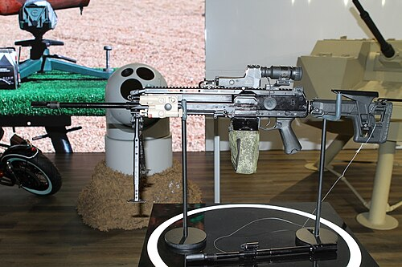

# Ręczny karabin maszynowy RPL-20
### RPL-20 Light Machine Gun | РПЛ-20

---

## Opis

RPL-20 to rosyjski nowoczesny ręczny karabin maszynowy kalibru 5,45×39 mm opracowany przez Konsorcjum Kałasznikowa i zaprezentowany po raz pierwszy w 2021 roku jako broń piechoty nowej generacji w ramach programu "Ratnik-3". Jest bezpośrednim następnikiem RPK-74M — używa tej samej amunicji i podobnej mechaniki, ale ma zupełnie nową ergonomię: szyny Picatinny, regulowaną kolbę, nowoczesne łoże i poprawiony system oddechowy lufy. Wyposażony w pojemnik taśmowy (kaseta 200 nabojów) zamiast tradycyjnych magazynków, co znacznie zwiększa wydajność ognia ciągłego. Stan służby: ograniczone przyjęcie w 2022–2023, trwa doposażanie wybranych jednostek.

## Dane techniczne

| Parametr | Wartość |
|----------|---------|
| Typ | Ręczny karabin maszynowy nowej generacji |
| Kraj produkcji | Rosja |
| Rok wprowadzenia | 2022 (ograniczone) |
| Kaliber | 5,45×39 mm |
| Długość (kolba rozłożona) | 1 000 mm |
| Długość lufy | 550 mm |
| Masa (bez amunicji) | 5,5 kg |
| Pojemność | 200 nabojów (kaseta taśmowa) lub mag. 45 nab. |
| Szybkostrzelność | 700 strz./min |
| Skuteczny zasięg | 800 m |

## Charakterystyczne cechy rozpoznawcze

> Jak odróżnić RPL-20 od RPK-74M i PKP Pieczeniegu:

- **Kaseta taśmowa 200 nabojów pod bronią — charakterystyczny "pojemnik":** RPL-20 może być zasilany z kasety z taśmą montowanej pod bronią — kwadratowy plastikowy pojemnik pod kolbą strzelca; żaden RPK nie ma takiego podajnika; to najważniejszy identyfikator
- **Nowoczesna ergonomia: szyny Picatinny, regulowana kolba, uchwyt kątowy:** RPL-20 ma wygląd nowoczesnej zachodniej broni wsparcia — szyny na całym obwodzie, czarna regulowana kolba, pistolety chwyt jak AR; zupełnie inny wygląd niż drewniano-plastikowy RPK-74M
- **Długa ciężka lufa z charakterystycznym dwójnogiem w połowie:** dwójnóg RPL-20 jest zamontowany w połowie lufy (nie przy wylocie jak w RPK) — podobnie jak w zachodnim Minimi/M249; ta pozycja dwójnogu jest charakterystyczna
- **Wyraźnie mniejszy od PKP Pieczeniegu — to LMG, nie GPMG:** PKP Pieczenieg waży ponad 8 kg i jest ciężką bronią wsparcia na trójnogu; RPL-20 jest wyraźnie lżejszy i mniejszy; proporcje są "pośrednie" między karabinem a ciężkim km
- **Brak drewna i klasycznych plastikowych elementów RPK:** RPL-20 jest w całości pokryty czarnym polimerowym łożem z szynami — żadnych drewnianych lub ciemnoszarych plastikowych elementów charakterystycznych dla rodziny RPK/AK
- **Rzadkość na polu walki — wciąż rzadko spotykany:** RPL-20 jest tak nowy, że widok tej broni na zdjęciach jest wyjątkowy; w 2022–2024 pojawiał się głównie na targach i pokazach, rzadziej w materiale frontowym

## Ciekawostka

> RPL-20 jest pierwszą rosyjską bronią wsparcia piechoty zaprojektowaną od podstaw od czasów ZSRR — wszystkie poprzednie (RPK, RPK-74, PKM, PKP) były modernizacjami lub wariantami wcześniejszych konstrukcji. Projektanci wzięli pod uwagę doświadczenia z Syrii i Donbasu, gdzie rosyjscy żołnierze narzekali, że standardowe magazynki 30- i 45-nabojowe RPK są zbyt małe do prowadzenia ognia zasłonowego. RPL-20 z kasetą 200 nabojów rozwiązuje ten problem — ale kaseta dodaje ok. 1,7 kg masy, co nie wszystkim żołnierzom przypadło do gustu.

