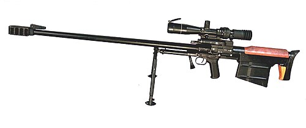

# Karabin snajperski KSVK 12,7
### KSVK 12.7 Anti-Materiel Rifle | КСВК 12,7

---

## Opis

KSVK 12,7 (Крупнокалиберная Снайперская Винтовка Ковровская — Wielkokaliberowy karabin snajperski Kowrowski) to rosyjski wielkokaliberowy karabin snajperski kalibru 12,7×108 mm opracowany przez ZID w Kowrowie i przyjęty do służby w 2002 roku. Przeznaczony do niszczenia sprzętu technicznego — radarów, stacji łączności, śmigłowców na ziemi, lekkich pojazdów opancerzonych i umocnień — z odległości do 1500 m. KSVK jest bronią bolt-action z bultrupsowym układem (bullpup) — magazynek i komora zamkowa są za chwytem, co skraca broń mimo długiej lufy. Stosowany przez rosyjskie siły specjalne i wojska lądowe; pojawia się na Ukrainie.

## Dane techniczne

| Parametr | Wartość |
|----------|---------|
| Typ | Wielkokaliberowy karabin snajperski / przeciwsprzętowy |
| Kraj produkcji | Rosja |
| Rok wprowadzenia | 2002 |
| Kaliber | 12,7×108 mm |
| Długość | 1 420 mm |
| Długość lufy | 1 000 mm |
| Masa (bez celownika) | 12,5 kg |
| Pojemność magazynka | 5 nabojów |
| Prędkość wylotowa | 850–900 m/s |
| Skuteczny zasięg | 1 500 m (cel techniczny) |

## Charakterystyczne cechy rozpoznawcze

> Jak odróżnić KSVK od OSV-96 i broni .50 BMG:

- **Układ bullpup — magazynek za chwytem pistoletowym:** KSVK ma wyraźny bullpup — chwyt pistoletowy jest daleko z przodu, a magazynek jest za chwytem, przy kolbie; OSV-96 ma klasyczny układ ze składaną lufą; ta różnica w układzie jest podstawowym identyfikatorem
- **Bardzo masywna, długa lufa z wielosegmentowym hamulcem:** KSVK ma 1-metrową lufę zakończoną ogromnym wielokomorowym hamulcem wylotowym — hamulec jest wyjątkowo duży nawet jak na broń 12,7 mm; jego rozmiar wynika z konieczności tłumienia ogromnego odrzutu
- **Charakterystyczny kształt "przedłużonej kolby" bullpup:** sylwetka KSVK w układzie bullpup jest charakterystyczna — długa lufa z przodu, krótkie łoże, duży magazynek przy kolbie; ten układ proporcji jest inny od wszystkich klasycznych karabinów snajperskich
- **Kaliber 12,7 mm — wyraźnie grubszy wylot lufy niż 7,62:** otwór wylotowy lufy 12,7 mm jest wyraźnie większy (prawie 1,3 cm) niż 7,62 mm (0,76 cm); przy bliskim oglądaniu lub na fotografii wyraźna różnica w kalibrze
- **Masywny trójnóg lub specjalny dwójnóg pod łożem:** KSVK strzela z trójnogu lub dwójnogu ze względu na masę; specjalny dwójnóg montowany pod lufą przy stopce kolby jest charakterystyczną cechą broni bullpup tej klasy
- **Rzadkość — widoczny tylko w jednostkach specjalnych:** KSVK nie jest bronią masową; widok tej broni sugeruje wyspecjalizowaną jednostkę snajperską lub siły specjalne; brak w wyposażeniu regularnej piechoty

## Ciekawostka

> KSVK miał konkurenta w rosyjskim wojsku — OSV-96 — i wybór między nimi toczył się przez lata 2000. W końcu oba przyjęto do służby, bo miały różne zalety: KSVK (bullpup) jest bardziej kompaktowy i lepszy w terenie zabudowanym; OSV-96 ma składaną lufę i jest wygodniejszy w transporcie. Paradoksalnie rosyjskie siły specjalne preferowały KSVK, a regularni snajperzy dywizyjni — OSV-96. W efekcie Rosja eksploatuje dwa bardzo podobne systemy 12,7 mm równolegle — co logistycy armii komentują ze zrozumiałą frustracją.

