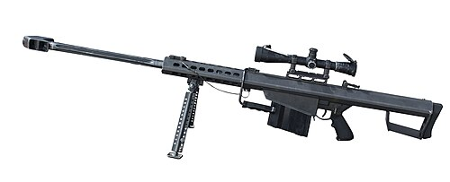

# Karabin snajperski Lobaev SVLK-14S Sumrak
### Lobaev SVLK-14S Sumrak Extreme Long Range Rifle | Лобаев СВЛК-14С «Сумрак»

---

## Opis

SVLK-14S Sumrak (Сумрак — Zmierzch) to rosyjski ekstremalnie dalekosiężny karabin snajperski opracowany przez Lobaev Arms (Moskwa) jako platforma do strzelania długodystansowego na odległości ponad 2000 m. Dostępny w kalibrach .408 Cheyenne Tactical i .375 CheyTac — naboje ekstremalnie dalekosiężne niestosowane w standardowej służbie wojskowej. SVLK-14S uzyskał rosyjski rekord odległości strzału: 4210 m (2019 rok, uderzenie w cel) — jest to jednocześnie jeden z najdłuższych potwierdzonych strzałów snajperskich w historii. Broń nie jest standardową bronią wojskową — to platforma specjalistyczna dla wybranych jednostek i ewentualnie do zastosowań dywersyjnych.

## Dane techniczne

| Parametr | Wartość |
|----------|---------|
| Typ | Ekstremalnie dalekosiężny karabin snajperski bolt-action |
| Kraj produkcji | Rosja |
| Rok wprowadzenia | ok. 2015 |
| Kaliber | .408 CheyTac / .375 CheyTac |
| Długość | ~1 500 mm |
| Długość lufy | 813 mm (.408) |
| Masa (bez celownika) | ok. 9 kg |
| Pojemność magazynka | 5–7 nabojów |
| Prędkość wylotowa | ok. 1 000 m/s |
| Skuteczny zasięg | 2 000–3 000 m (bojowy) / do 4 210 m (rekordowy) |

## Charakterystyczne cechy rozpoznawcze

> Jak odróżnić Lobaev SVLK-14S od Orsis T-5000 i KSVK:

- **Chassis aluminiowy w zachodnim stylu — "nie wygląda jak rosyjska broń":** SVLK-14S ma nowoczesne aluminiowe chassis z pełnymi szynami jak zachodnie platformy precyzyjne; wygląda jak europejski lub amerykański karabin dalekiego zasięgu — bez żadnych cech rosyjskiego dziedzictwa uzbrojenia
- **Bardzo długa, ciężka lufa z agresywnym hamulcem:** lufa 813 mm z masywnym wielokomorowym hamulcem wylotowym jest proporcjonalnie najdłuższa spośród omawianych; hamulec zajmuje ~15% długości lufy — widoczna ogromna "głowica" na końcu
- **Niestandardowy kaliber .408 lub .375 CheyTac — zbyt rzadki dla standardowego wojska:** widok amunicji przy obsłudze broni — naboje .408 lub .375 CheyTac są znacznie dłuższe i smuklejsze niż 7,62 mm i 12,7 mm; bardzo charakterystyczny kształt nabojów
- **Regulowane wszystko — łoże, stopka, policzek, dwójnóg:** SVLK-14S ma wyjątkowo wiele elementów regulacyjnych; wszystkie dostosowane do obsługi; charakterystyczne liczne śruby i pokrętła regulacyjne widoczne na łożu
- **Brak jakichkolwiek cech wizualnych standardowej broni wojskowej:** jeśli karabin wygląda jak sprzęt sportowy lub cywilny, a nie militarny — i jest ekstremalnie długi — to najprawdopodobniej Lobaev lub podobna platforma
- **Celownik wielkokalibrowy >40x lub urządzenia pomiarowe:** SVLK-14S jest zwykle wyposażony w bardzo duży celownik snajperski (Schmidt&Bender, Nightforce itp.) i towarzyszący dalmierz laserowy — charakterystyczny duży tubus celownika na broni

## Ciekawostka

> W 2019 roku strzelec z Lobaev Arms osiągnął potwierdzony strzał na odległość 4210 m — ustanawiając rosyjski rekord i zajmując wysokie miejsce na liście najdłuższych strzałów snajperskich w historii. Cel o wymiarach 60×60 cm został trafiony po kilku strzałach korekcyjnych. Rosyjskie media nagłośniły ten wyczyn jako demonstrację wyższości rosyjskiej technologii snajperskiej nad zachodnią — chociaż recenzenci zagraniczni wskazywali, że rekord kanadyjski z 2017 roku (3540 m z C15 Long Range Sniper Weapon) i rekordowy strzał Tima Fricka (4200 m z .416 Barrett w USA) stały na podobnym poziomie lub wyżej.

