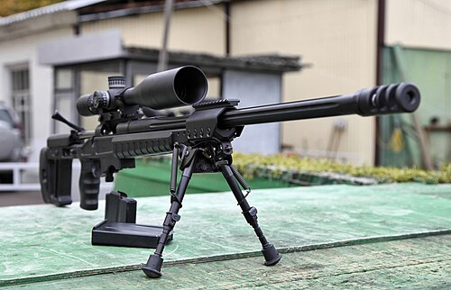

# Karabin snajperski Orsis T-5000
### Orsis T-5000 Sniper Rifle | Орсис Т-5000

---

## Opis

Orsis T-5000 to rosyjski precyzyjny karabin snajperski produkowany przez prywatną firmę Orsis (Москва) i dostępny w kalibrach .308 Winchester, .338 Lapua Magnum i 7,62×54R mm. Zaprezentowany w 2011 roku jako pierwsza w pełni komercyjna rosyjska platforma snajperska klasy premium, konkurująca z zachodnimi systemami jak Accuracy International AXMC czy Sako TRX. T-5000 zyskał rozgłos po tym, jak rosyjski snajper Władimir Onofrijczuk strzelił z niego na igrzyskach olimpijskich w Soczi 2014 (wersja sportowa). Wersja wojskowa jest stosowana przez FSB i wybrane jednostki specjalne; cywilna wersja sportowa jest popularna w rosyjskich zawodach snajperskich.

## Dane techniczne

| Parametr | Wartość |
|----------|---------|
| Typ | Precyzyjny karabin snajperski bolt-action |
| Kraj produkcji | Rosja |
| Rok wprowadzenia | 2011 |
| Kaliber | .308 Win / .338 LM / 7,62×54R |
| Długość | 1 290 mm (.308) |
| Długość lufy | 660 mm (.308) |
| Masa (bez celownika) | 6,5 kg |
| Pojemność magazynka | 10 nabojów |
| Prędkość wylotowa | 840 m/s (.308) |
| Skuteczny zasięg | 1 000 m (.308) / 1 500 m (.338 LM) |

## Charakterystyczne cechy rozpoznawcze

> Jak odróżnić Orsis T-5000 od SV-98 i Lobaev Arms:

- **Wyraźnie nowoczesne zachodnie wzornictwo — "nie wygląda jak rosyjski karabin":** T-5000 jest stylistycznie zbliżony do zachodnich platform jak AI AXMC lub Sako — nowoczesne aluminiowe łoże z szynami, regulowane elementy ergonomiczne; znacznie "zachodniejszy" niż SV-98
- **Aluminiowe łoże chassis z pełnymi szynami Picatinny:** T-5000 ma charakterystyczne aluminiowe łoże (chassis) — widoczne boczne płyty aluminium; SV-98 i SVD mają konwencjonalne drewniane lub plastikowe łoże; ten metaliczny wygląd jest kluczowym identyfikatorem
- **Regulowana stopka kolby i policzek z wyraźnymi śrubami regulacyjnymi:** kolba T-5000 ma wiele możliwości regulacji z widocznymi mechanizmami; charakterystyczne "okucia" regulacyjne
- **Charakterystyczny kanciasty hamulec wylotowy Orsis:** T-5000 ma rozpoznawalny prostokątny wielokomorowy hamulec wylotowy — kanciasty i masywny; inne kształty niż SV-98 i Lobaev
- **Rzadkość w terenie — broń specjalistyczna, nie masowa:** T-5000 na Ukrainie lub w strefie konfliktu to rzadkość; jego widok sugeruje jednostkę specjalną, nie regularną piechotę
- **Brak elementów dziedzictwa AK/SVD — zupełnie inna rodzina konstrukcyjna:** T-5000 nie ma żadnych typowych elementów rosyjskiej szkoły uzbrojenia; wygląda jak karabin zachodnioeuropejski; ta odmienność od klasycznych rosyjskich broni jest sama w sobie identyfikatorem

## Ciekawostka

> Orsis T-5000 stał się geopolitycznie kontrowersyjny po wprowadzeniu sankcji po 2014 roku — firma Orsis importowała kluczowe komponenty (lufy, mechanizmy zamkowe) z USA i Niemiec, i po sankcjach musiała przestawić się na produkcję krajową. Rosyjskie media triumfowały, że "Orsis znalazł krajowe zamienniki", ale niezależne testy wykazały, że krajowe lufy są gorsze od importowanych; celność z 0,3 MOA pogorszyła się do 0,5–0,6 MOA. Mimo to Orsis T-5000 pozostaje symbolem rosyjskich ambicji w segmencie precyzyjnego uzbrojenia snajperskiego.

