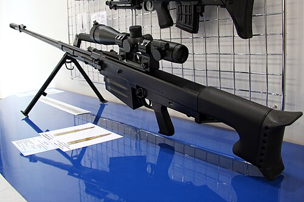

# Karabin snajperski OSV-96
### OSV-96 Anti-Materiel Rifle | ОСВ-96

---

## Opis

OSV-96 (Объектовая Снайперская Винтовка — Obiektowy karabin snajperski) to rosyjski wielkokaliberowy karabin snajperski kalibru 12,7×108 mm opracowany przez KBP w Tule i przyjęty do służby w 1994 roku. Wyróżnia się mechanizmem składania lufy na pół — lufa składa się ku tyłowi nad komorę zamkową, skracając broń z 1746 mm do ok. 1,1 m przy transporcie; pozwala to na przewożenie go w samochodzie lub śmigłowcu. OSV-96 jest półautomatyczny (gas-operated) — może prowadzić ogień seryjny, co odróżnia go od powtarzalnego KSVK. Stosowany przez rosyjskie siły specjalne i wojsko lądowe; pojawia się na Ukrainie i w Syrii.

## Dane techniczne

| Parametr | Wartość |
|----------|---------|
| Typ | Wielkokaliberowy karabin snajperski półautomatyczny |
| Kraj produkcji | Rosja |
| Rok wprowadzenia | 1994 |
| Kaliber | 12,7×108 mm |
| Długość (lufa złożona) | ~1 100 mm |
| Długość (lufa rozłożona) | 1 746 mm |
| Długość lufy | 1 000 mm |
| Masa (bez celownika) | 12,9 kg |
| Pojemność magazynka | 5 nabojów |
| Prędkość wylotowa | 900 m/s |
| Skuteczny zasięg | 1 800 m |

## Charakterystyczne cechy rozpoznawcze

> Jak odróżnić OSV-96 od KSVK i Lobaev SVLK-14S:

- **Składana lufa — broń "złamana w połowie" w transporcie:** OSV-96 w transporcie wygląda jak karabin złożony na pół; lufa jest złożona ku tyłowi nad komorę zamkową; żaden inny karabin snajperski 12,7 mm nie ma tej cechy; widok złożonego OSV-96 jest natychmiast rozpoznawalny
- **Klasyczny układ — magazynek przed chwytem pistoletowym (nie bullpup):** OSV-96 ma klasyczny układ z uchwytem i magazynkiem z przodu — inaczej niż KSVK (bullpup); przy rozłożonej lufie proporcje są typowe dla konwencjonalnego karabinu
- **Duży hamulec wylotowy cylinder-klatkowy na końcu długiej lufy:** OSV-96 ma charakterystyczny duży cylindryczny lub klatkowy hamulec wylotowy; jego kształt jest inny od hamulców KSVK i Lobaev
- **Półautomatyczny — widoczna rura gazowa nad lufą:** OSV-96 jest gaz-operated (semi-auto) — ma charakterystyczną rurę gazową biegnącą nad lufą, jak karabin szturmowy; KSVK (bolt-action) nie ma rury gazowej
- **Masywny stalowy dwójnóg montowany pod środkiem lufy:** dwójnóg OSV-96 jest bardzo masywny i montowany przy środku długiej lufy; rozkładane nogi stalowe z wyraźnymi "łokciami" — widoczny już z odległości
- **Bardzo duże rozmiary przy rozłożonej lufie — prawie 1,75 m:** rozłożony OSV-96 ma prawie 1,75 m długości; obsługujący go żołnierz wydaje się przy nim małoskalowy; ta długość jest natychmiast zauważalna

## Ciekawostka

> OSV-96 stał się znany w Polsce za sprawą kontrowersyjnego zdarzenia z 1995 roku: rosyjski agent wywiadu próbował przemycić rozkładany OSV-96 przez Warszawę w walizce dyplomatycznej (zasłyszane z wywiadowczych źródeł polskich — nieoficjalne). Mechanizm składania lufy sprawia bowiem, że rozkładany OSV-96 wchodzi do typowej twardej walizki podróżnej — co było jedną z cech eksploatowanych przez rosyjskie służby. Szczegóły zdarzenia nigdy nie zostały oficjalnie potwierdzone przez żadną ze stron.

