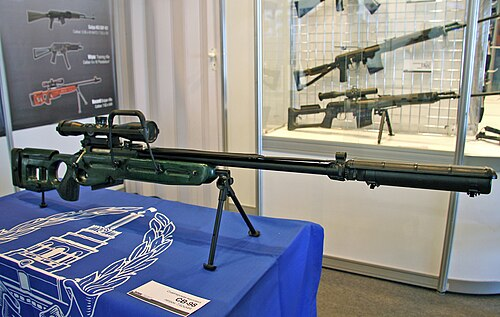

# Karabin snajperski SV-98
### SV-98 Sniper Rifle | СВ-98

---

## Opis

SV-98 to rosyjski precyzyjny karabin snajperski kalibru 7,62×54R mm opracowany przez IZHMASH (dziś Konsorcjum Kałasznikowa) i przyjęty do służby w 2003 roku. W odróżnieniu od SVD (który jest półautomatyczny i przeznaczony dla snajpera drużynowego), SV-98 jest bronią stricte precyzyjną — powtarzalną (bolt-action) — przeznaczoną dla wyszkolonych snajperów wojskowych i antyterrorystycznych. Lufa o wysokiej dokładności, ciężki profil i łoże z regulowanymi policzkami i stopką zapewniają celność poniżej 0,5 MOA. Dostępny też w kalibrze .308 Winchester do eksportu. Stosowany przez FSB, Rosyjskie Jednostki Specjalne i regularną armię; pojawia się regularnie na Ukrainie.

## Dane techniczne

| Parametr | Wartość |
|----------|---------|
| Typ | Karabin snajperski powtarzalny (bolt-action) |
| Kraj produkcji | Rosja |
| Rok wprowadzenia | 2003 |
| Kaliber | 7,62×54R mm (.308 Win w wersji eksportowej) |
| Długość | 1 270 mm |
| Długość lufy | 650 mm |
| Masa (bez celownika) | 5,5 kg |
| Pojemność magazynka | 10 nabojów |
| Prędkość wylotowa | 820 m/s |
| Skuteczny zasięg | 1 000 m (precyzyjny) |

## Charakterystyczne cechy rozpoznawcze

> Jak odróżnić SV-98 od SVD i Orsis T-5000:

- **Regulowane łoże z wystającymi policzkiem i stopką — nowoczesna ergonomia:** SV-98 ma charakterystyczne regulowane łoże snajperskie z wysuwanym policzkiem i regulowaną stopką kolby — typowy wygląd nowoczesnej precyzyjnej platformy bolt-action; SVD ma stałą ażurową kolbę
- **Masywna ciężka lufa bez gazownika (bolt-action):** SV-98 jest powtarzalny (bolt-action) — nie ma układu gazowego, rury gazowej ani gazownika nad lufą; lufa jest grubsza i "masywniejsza" niż w SVD; brak rury gazowej to kluczowy wyróżnik od SVD
- **Charakterystyczna szyna Picatinny na górze komory:** SV-98 ma standardową szynę Picatinny na górze — montaż nowoczesnych celowników; SVD ma boczną szynę po lewej; ta różnica w lokalizacji szyny to ważny identyfikator
- **Mała rękojeść (bolt handle) wyraźnie z prawej strony:** u broni bolt-action widoczna jest charakterystyczna pałka zamkowa z prawej strony komory — wyraźna "rączka" zamka; u SVD (półautomatyczny) nie ma widocznej pałki zamkowej w tym miejscu
- **Dwójnóg zamontowany przy komorze nabojowej (dalej od wylotu niż w SVD):** SV-98 montuje dwójnóg w środkowej części łoża; SVD jeśli ma dwójnóg, to przy wylocie lufy lub go nie ma; pozycja dwójnogu jest cechą identyfikującą
- **Podłużny hamulec wylotowy w kształcie "walca":** SV-98 ma charakterystyczny cylindryczny lub stożkowy hamulec wylotowy; wyraźnie inny od hamulca SVD (jeśli w ogóle jest montowany)

## Ciekawostka

> SV-98 zdobył popularność po tym, jak rosyjskie siły specjalne użyły go podczas oblężenia szkoły w Biesłanie w 2004 roku — i po raz pierwszy oficjalnie użyto go w tak nagłośnionej operacji. Dziennikarze fotografowali rosyjskich specnazowców z charakterystycznym karabinem, co spowodowało falę zainteresowania tą bronią. Broń wniesiona do Biesłanu przez terrorystów to były AKS i RPG-7 — a SV-98 był odpowiedzią po stronie służb. Zdaniem ekspertów Biesłan ujawnił zarówno siłę, jak i słabości rosyjskiej taktyki snajperskiej.

