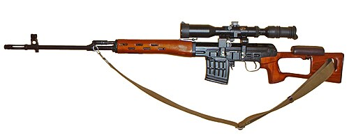

# Karabin snajperski SVD Dragunow
### SVD Dragunov Sniper Rifle | СВД (Снайперская винтовка Драгунова)

---

## Opis

SVD (Снайперская Винтовка Драгунова — Snajperski karabin Dragunowa) to radziecki karabin snajperski kalibru 7,62×54R mm zaprojektowany przez Jewgienija Dragunowa i przyjęty do służby w 1963 roku. Jest jednym z najbardziej rozpoznawalnych i powszechnych karabinów snajperskich na świecie — produkowany w ponad 30 krajach, stosowany przez armie ponad 50 państw. SVD wyróżnia się gazową automatyką umożliwiającą ogień półautomatyczny przy zachowaniu celności — może oddawać 30 strzałów na minutę bez utraty możliwości snajperskich do 600 m. Standardowy celownik PSO-1 (4×) pozwala na skuteczny ogień do 1300 m. SVD przez dekady był standardowym karabinem drużynowego snajpera w całym Układzie Warszawskim — w tym w Polsce.

## Dane techniczne

| Parametr | Wartość |
|----------|---------|
| Typ | Karabin snajperski półautomatyczny |
| Kraj produkcji | ZSRR / Rosja |
| Rok wprowadzenia | 1963 |
| Kaliber | 7,62×54R mm |
| Długość | 1 225 mm |
| Długość lufy | 620 mm |
| Masa (bez celownika) | 4,3 kg |
| Pojemność magazynka | 10 nabojów |
| Prędkość wylotowa | 830 m/s |
| Skuteczny zasięg | 800–1 300 m |

## Charakterystyczne cechy rozpoznawcze

> Jak odróżnić SVD od PSL (rumuński) i SV-98:

- **Charakterystyczna "ażurowa" drewniana lub plastikowa kolba z otworem:** kolba SVD ma charakterystyczny otwór w kształcie koła lub owalu — "ażurowa" konstrukcja odróżniająca ją od każdej innej kolby snajperskiej; ten otwór jest wizualnym znakiem rozpoznawczym SVD z 100 metrów
- **Pistoletowy chwyt oddzielony od kolby — układ semi-pistol grip:** SVD ma klasyczny układ z uchwytem pistoletowym oddzielonym od kolby, widocznym pod komorą spustową; SV-98 ma układ burstowy
- **Celownik PSO-1 (lub PSO-4) na bocznej szynie — zielony metalowy korpus:** standardowy celownik PSO-1 jest charakterystycznym zielono-szarym (lub czarnym) metalowym tubusem montowanym na bocznej szynie po lewej stronie komory zamkowej; to ikona SVD
- **Krótkie, wąskie łoże sięgające tylko do połowy lufy:** łoże SVD sięga do połowy lufy, zostawiając przednią połowę lufy odsłoniętą; charakterystyczna smukłość i długość "nagiej" lufy
- **Mały magazynek 10-nabojowy — wąski i prawie prosty:** magazynek SVD na 10 nabojów 7,62×54R jest wąski i niemal prosty (bo nabój z rantem); bardzo inny od zaokrąglonych magazynków AK
- **Długa, smukła lufa — proporcjonalnie dłuższa niż AK:** SVD jest wyraźnie dłuższy od AKM; smukła długa lufa to cecha "snajperska" widoczna przy porównaniu z bronią szturmową

## Ciekawostka

> SVD jest tak ikonicznym karabinem, że rumuńscy konstruktorzy stworzyli niemal identyczną kopię PSL — która mimo identycznego wyglądu nie ma z SVD żadnej wspólnej części. PSL jest oparty na mechanice RPK, nie SVD. Skutek? Przez dekady zachodnie wywiady myliły PSL z SVD na zdjęciach satelitarnych i w raportach. Dopiero po fizycznym zbadaniu obu broni zorientowano się, że "dwa SVD" to dwa zupełnie różne karabiny w identycznej kamuflażowej sukience.

