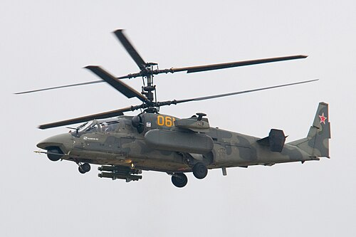
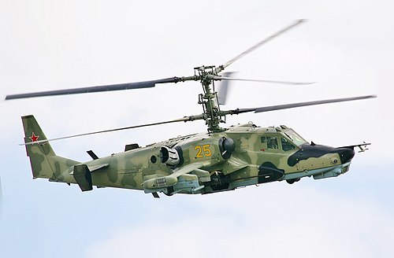

# Ka-52 Aligator
### Kamov Ka-52 Alligator | Камов Ка-52 «Аллигатор»

---

## Opis

Ka-52 "Aligator" to rosyjski śmigłowiec szturmowy dwumiejscowy, opracowany przez biuro Kamowa jako rozwinięcie jednosobowego Ka-50 "Czarny Rekin". Jego najważniejszą cechą konstrukcyjną jest układ dwóch współosiowych wirników przeciwbieżnych — całkowicie eliminujący potrzebę wirnika ogonowego. Dzięki temu Ka-52 jest wyjątkowo zwrotny i może wykonywać manewry niemożliwe dla śmigłowców z klasycznym układem napędu. Śmigłowiec wszedł do służby w 2011 roku i jest szeroko stosowany przez Siły Powietrzno-Kosmiczne Rosji — brał udział w operacji w Syrii oraz w inwazji na Ukrainę od 2022 roku, gdzie poniósł znaczne straty, głównie od zachodnich zestawów rakietowych MANPADS i systemów przeciwlotniczych.

## Dane techniczne

| Parametr | Wartość |
|----------|---------|
| Typ | Śmigłowiec szturmowy |
| Kraj produkcji | Rosja |
| Rok wprowadzenia | 2011 |
| Masa startowa | 10 800 kg (maks.) |
| Długość | 13,50 m (kadłub bez wirników) |
| Średnica rotorów | 14,50 m (dwa wirniki współosiowe) |
| Uzbrojenie | Działko 2A42 kalibru 30 mm (ruchoma wieżyczka); ppk 9M120 Ataka, Ch-25ML; rakiety S-8, S-13; bomby |
| Silnik | 2 × Klimov VK-2500 (turbowałowy, 1 800 kW każdy) |
| Prędkość maks. | 315 km/h |
| Pułap | 5 500 m |
| Zasięg | 460 km (bojowy) |
| Załoga | 2 os. (pilot i operator uzbrojenia, fotele wyrzucane) |

## Charakterystyczne cechy rozpoznawcze

> Jak odróżnić Ka-52 od Mi-28 i Mi-24:

- **Dwa współosiowe wirniki przeciwbieżne — brak wirnika ogonowego:** To absolutnie unikatowa i natychmiast widoczna cecha. Ka-52 nie ma wirnika ogonowego — zamiast niego dwa pięciołopatowe wirniki kręcą się jeden nad drugim w przeciwnych kierunkach. Z każdej strony i z przodu widać "podwójny dysk" wirnikowy.
- **Belka ogonowa bez wirnika bocznego:** Ogon Ka-52 kończy się płetwą pionową bez dodatkowego wirnika — charakterystyczny "goły" ogon ze statecznikami poziomymi i pionowym, zamiast typowej łopatki wirnika ogonowego.
- **Szerokie, płaskie fotele obok siebie (side-by-side):** W odróżnieniu od Mi-28 i Mi-24, obaj członkowie załogi siedzą obok siebie w tej samej kabinie — stąd wyraźnie szerszy nos śmigłowca, widoczny od przodu jako dwuszybowa kokpit z boku na bok.
- **Kompaktowy, "przysadzisty" kadłub:** Ka-52 jest krótszy i bardziej masywny niż Mi-28 — proporcje są bardziej kwadratowe, bez długiej smukłej belki dziobowej.
- **Fotele wyrzucane katapultą:** Ka-52 i Ka-50 to jedyne seryjnie produkowane śmigłowce z wyrzucanymi fotelami ratunkowymi — niewielkie ładunki wybuchowe na górze wirników odrywają łopaty przed wyrzuceniem pilotów.
- **Działko 30 mm z prawej strony nosa:** Ruchoma wieżyczka z działkiem 2A42 zamontowana jest po prawej stronie przedniej części kadłuba — asymetryczne umiejscowienie jest dobrze widoczne z przodu i z boku.

## Ciekawostka

> Ka-52 (podobnie jak Ka-50) jest jedynym śmigłowcem bojowym na świecie produkowanym seryjnie z fotelami wyrzucanymi — systemu K-37-800. Przed katapultowaniem specjalne ładunki pirotechniczne detonują łopaty wirników, aby nie zabiły pilota. Cały proces zajmuje ułamek sekundy.
