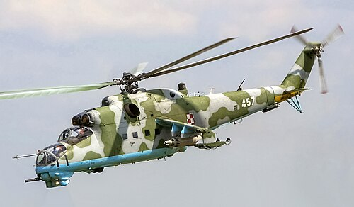
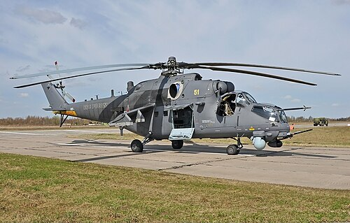

# Mi-24 Hind
### Mil Mi-24 | Миль Ми-24

---

## Opis

Mi-24 to radzieckie ciężkie wojskowe śmigłowce szturmowo-transportowe, opracowane przez biuro Michaiła Mila w latach 60. XX wieku. Koncepcja była nowatorska: połączenie potężnego śmigłowca uderzeniowego z zdolnością transportu ośmiu żołnierzy desantu — stąd określenie "latający czołg" lub "latający IFV". Chrzest bojowy przeszedł podczas Ogadenu (1977–78), jednak prawdziwą sławę zyskał w Afganistanie w latach 1979–1989, gdzie za waleczność i odporność na ostrzał Mudżahedini nadali mu przezwisko "Szatan" (Shaitan-Arba). Do dziś służy w wojskach rosyjskich i jest szeroko stosowany w konflikcie na Ukrainie.

## Dane techniczne

| Parametr | Wartość |
|----------|---------|
| Typ | Śmigłowiec szturmowo-transportowy |
| Kraj produkcji | ZSRR / Rosja |
| Rok wprowadzenia | 1972 |
| Masa startowa | ~11 500 kg (maks.) |
| Długość | 17,51 m (kadłub) |
| Średnica rotora | 17,30 m (pięciołopatowy) |
| Uzbrojenie | Działko dwulufowe 12,7 mm lub 23 mm GSh-23L; rakiety S-5/S-8/S-24; ppk 9M114 Sztorm / 9M120 Ataka; bomby |
| Silnik | 2 × Klimov TV3-117 (turbowałowy, ok. 1640 kW każdy) |
| Prędkość maks. | 335 km/h (rekordowa 368 km/h) |
| Pułap | 4 500 m (dynamiczny ok. 4 950 m) |
| Zasięg | 450 km (bojowy); 1 000 km (z dodatkowymi zbiornikami) |
| Załoga | 2 os. + do 8 żołnierzy desantu |

## Charakterystyczne cechy rozpoznawcze

> Jak odróżnić Mi-24 od innych śmigłowców:

- **Charakterystyczny "garb" kabiny:** Dwuosobowa kabina z siedzeniami w układzie tandem (strzelec z przodu, pilot wyżej z tyłu) — tworzy wyraźnie owalny, wypukły kształt dzioba widoczny z odległości.
- **Skrzydła boczne (sponsony):** Mi-24 jako jedyny spośród rosyjskich śmigłowców bojowych posiada krótkie, przykabinowe skrzydła nośne z twardymi punktami uzbrojenia — wyglądają jak małe, odchylone w dół skrzydełka po obu stronach kadłuba.
- **Ogromny, zamknięty przedział desantowy:** Kadłub jest znacząco szerszy i wyższy niż u Mi-28 czy Ka-52 — widać to szczególnie od tyłu i z boku; śmigłowiec wygląda "pulchniej".
- **Pięciołopatowy rotor główny:** Wyraźnie duży, pięciołopatowy rotor o średnicy 17,3 m widoczny z góry, zazwyczaj z charakterystycznym świstem.
- **Trójkołowe podwozie chowane:** Większość wariantów posiada chowane podwozie kołowe — w locie widać schowany do kadłuba układ podwozia, co odróżnia go od wielu zachodnich śmigłowców z płozami.
- **Gondola uzbrojenia pod dziobem:** Zależnie od wariantu — obrotowa wieżyczka z działkiem (Mi-24V/P) lub stałe działko 30 mm (Mi-24P) umieszczone wyraźnie po prawej stronie dzioba, nadając mu asymetryczny wygląd.

## Ciekawostka

> Mi-24 jest jedynym na świecie śmigłowcem bojowym, który w 1978 roku oficjalnie pobił rekord prędkości dla śmigłowców — specjalnie zmodyfikowany egzemplarz Mi-24A osiągnął 368,4 km/h, a rekord ten przez wiele lat był oficjalnie homologowany przez FAI.
