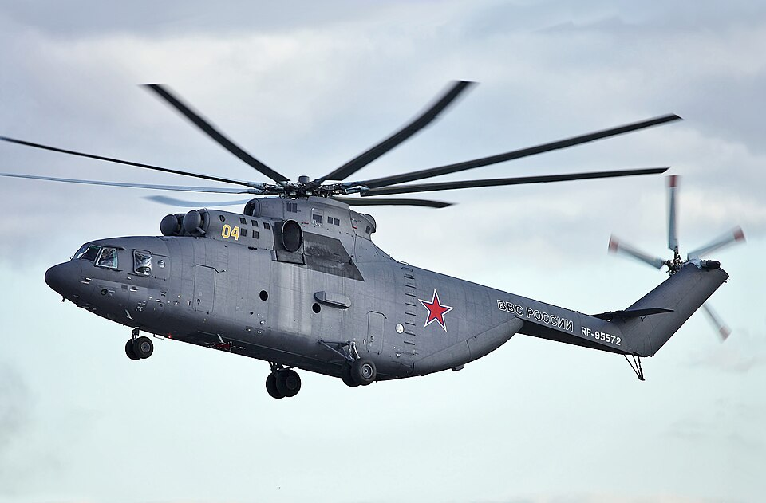

# Mi-26 — ciężki śmigłowiec transportowy
### Mil Mi-26 Halo | Ми-26

---

## Opis

Mi-26 (NATO: Halo) to największy produkowany seryjnie śmigłowiec na świecie, opracowany w ZSRR i będący w służbie od 1983 r. Jego 8-łopatowy wirnik o średnicy 32 metrów pozwala na transport ładunków do 20 ton — więcej niż Boeing C-17 Globemaster w ładowni. Mi-26 jest niezastąpiony przy transporcie ciężkich pojazdów, sprzętu inżynieryjnego i zaopatrzenia w trudnym terenie. W Ukrainie Rosja używa Mi-26 do zaopatrzenia z tyłu, a nie przy linii frontu — ze względu na jego olbrzymie rozmiary jest zbyt cennym celem, by ryzykować w strefie ognia.

## Dane techniczne

| Parametr | Wartość |
|----------|---------|
| Typ | Ciężki śmigłowiec transportowy |
| Kraj produkcji | ZSRR / Rosja |
| Rok wprowadzenia | 1983 |
| Długość (kadłub) | 33,7 m |
| Długość całkowita (z wirnikami) | 40,0 m |
| Średnica wirnika | **32,0 m** (największy wirnik na świecie w produkcji seryjnej) |
| Masa startowa (maks.) | 56 000 kg |
| Ładowność | **20 000 kg** lub 90 żołnierzy / 60 noszy |
| Silniki | 2 × Lotarev D-136 (turbinowy), po 8 380 kW |
| Prędkość maks. | 295 km/h |
| Zasięg | 800 km |
| Pułap | 4 600 m |
| Załoga | 5 + obsługa ładunku |

## Charakterystyczne cechy rozpoznawcze

> Jak odróżnić Mi-26 od Mi-8 i Mi-17:

- **Rozmiar absolutnie nie do pomylenia** — Mi-26 jest DUŻO większy od każdego innego śmigłowca; 33,7 m długości, 56 ton; Mi-8 ma 18 m i 13 ton; sam wirnik Mi-26 (32 m) jest szerszy niż rozpiętość wielu samolotów myśliwskich
- **8 łopat wirnika głównego** — Mi-8/Mi-17 mają 5 łopat; Mi-26 ma 8 smukłych łopat, widocznych ze wszystkich stron jako „gęste wachlarze"
- **Tylna rampa załadunkowa** — bagażnik z tyłu otwiera się na dole jak u samolotu transportowego; ładunek wjeżdża pojazdem bezpośrednio do środka
- **Wysoka, „bramkowa" sylwetka** — ogon uniesiony wysoko; wejście pod ogonem wygląda jak brama garażowa w porównaniu z Mi-8
- **Dwa silniki na dachu** — podobnie jak Mi-8, ale dużo większe gondole silnikowe; turbiny Lotarev D-136 to największe silniki śmigłowcowe w produkcji
- **Kolor i oznakowanie** — rosyjskie wojskowe Mi-26 mają typowe szaro-zielone kamuflaże lub oliwkowe malowanie, czasem z białymi oznaczeniami taktycznymi

## Ciekawostka

> W 1999 r. szwajcarski Mi-26 wydobył z lodowca Sölden w Alpach doskonale zachowane szczątki mamuta sprzed 20 000 lat — jedyne śmigłowiec zdolny do uniesienia tak ciężkiego i dużego ładunku z góry 3000 m. W 2002 r. rosyjski Mi-26 zestrzelony w Czeczenii zginął z 127 osobami na pokładzie — największa katastrofa lotnictwa wojskowego po II wojnie światowej.
