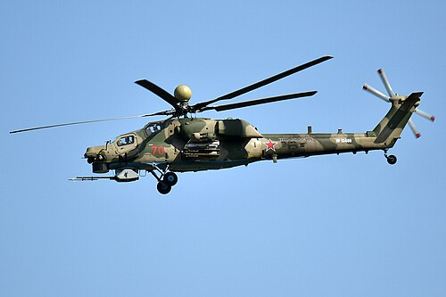
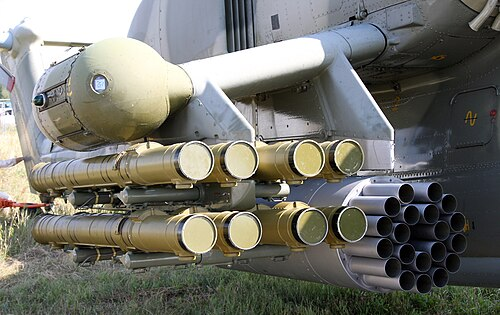

# Mi-28 Havoc
### Mil Mi-28N Night Hunter | Миль Ми-28Н «Ночной охотник»

---

## Opis

Mi-28 to rosyjski śmigłowiec szturmowy czwartej generacji, opracowany przez biuro Mila od 1980 roku jako odpowiedź na amerykański AH-64 Apache. W odróżnieniu od swojego poprzednika Mi-24, jest to wyspecjalizowana maszyna uderzeniowa bez przedziału desantowego — cały nacisk położono na zdolności bojowe i przeżywalność. Wariant Mi-28N "Nocny Myśliwy" (Nocnoj Ochotnik) wyposażono w radar nad wirnikiem i systemy noktowizyjne, co umożliwia operacje nocne. Śmigłowiec wszedł do służby operacyjnej dopiero w 2009 roku i szybko stał się jedną z głównych maszyn bojowych Sił Powietrzno-Kosmicznych Rosji, uczestnicząc w operacjach w Syrii i na Ukrainie.

## Dane techniczne

| Parametr | Wartość |
|----------|---------|
| Typ | Śmigłowiec szturmowy |
| Kraj produkcji | Rosja |
| Rok wprowadzenia | 2009 |
| Masa startowa | 11 500 kg (maks.) |
| Długość | 17,01 m (kadłub) |
| Średnica rotora | 17,20 m (pięciołopatowy) |
| Uzbrojenie | Działko 2A42 kalibru 30 mm; ppk 9M120 Ataka (do 16 szt.); rakiety S-8, S-13; zasobniki NARS |
| Silnik | 2 × Klimov VK-2500 (turbowałowy, 1 636 kW każdy) |
| Prędkość maks. | 320 km/h |
| Pułap | 5 700 m |
| Zasięg | 435 km |
| Załoga | 2 os. (pilot i operator uzbrojenia) |

## Charakterystyczne cechy rozpoznawcze

> Jak odróżnić Mi-28 od Mi-24 i Ka-52:

- **Smukły, wrzecionowaty kadłub:** Mi-28 nie ma przedziału desantowego — kadłub jest znacznie węższy i bardziej aerodynamiczny niż u Mi-24; profil boczny przypomina wydłużoną kroplę z wyraźnie oddzielonymi kabinami.
- **Kopuła radarowa nad wirnikiem (Mi-28N):** Charakterystyczna sferyczna lub owalna kulista osłona radaru umieszczona ponad płaszczyzną wirnika głównego — to najbardziej rozpoznawalny element, odróżniający Mi-28N od wszystkich innych rosyjskich śmigłowców.
- **Tandemowe kabiny z wyraźnym "schodkiem":** Kabina pilota (z tyłu, wyżej) i operatora uzbrojenia (z przodu, niżej) tworzą wyraźny schodkowy profil — bardziej kwadratowe i ostrzejsze niż zaokrąglony "garb" Mi-24.
- **Brak skrzydeł nośnych w stylu Mi-24:** Sponsony z uzbrojeniem są krótsze i bardziej prostopadłe do kadłuba, bez charakterystycznego odchylenia w dół typowego dla Mi-24.
- **Działko 30 mm w ruchomej wieżyczce poddziobowej:** Kątnisty montaż działka pod przednią częścią kadłuba — przemieszcza się widocznie w bok podczas celowania, co jest dobrze widoczne na zdjęciach i nagraniach.
- **Niskie, sztywne podwozie kołowe (niechowane):** Mi-28 ma stałe podwozie kołowe z wyraźną osią główną i kółkiem ogonowym — w locie brak jakichkolwiek ruchomych elementów podwozia pod kadłubem.

## Ciekawostka

> Pomimo oficjalnego przyjęcia do służby dopiero w 2009 roku, Mi-28 latał jako prototyp już od 1982 roku — przez niemal 27 lat trwały testy, modyfikacje i rywalizacja z Ka-50, zanim śmigłowiec trafił do linii bojowych. To jeden z najdłuższych procesów wdrożeniowych w historii rosyjskiego lotnictwa wojskowego.
