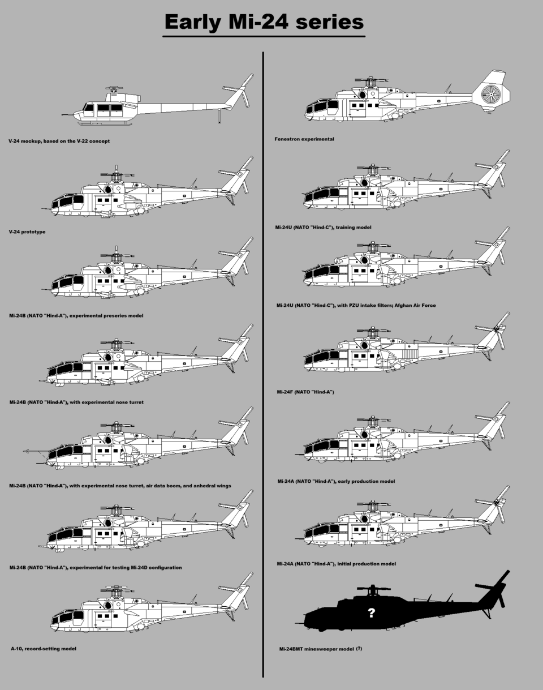

# Mi-35M — wielozadaniowy śmigłowiec bojowy
### Mil Mi-35M Hind-E | Ми-35М

---

## Opis

Mi-35M (NATO: Hind-E) to gruntownie zmodernizowany wariant Mi-24 Hind, produkowany od 1999 r. Zachowuje unikalną dla Mi-24 zdolność łączenia roli śmigłowca szturmowego z transportem żołnierzy (8 osób w kabinie desantowej). W porównaniu z Mi-24 otrzymał skrócone, nieskładane skrzydła, silniki TV3-117VMA lub WK-2500, nową awionikę ze szklanym kokpitem i zmodernizowane uzbrojenie. Eksportowany do Brazylii, Wenezueli, Azerbejdżanu i Kazachstanu. W Ukrainie używany do bezpośredniego wsparcia ogniowego i przewozu małych grup desantowych na tyły.

## Dane techniczne

| Parametr | Wartość |
|----------|---------|
| Typ | Wielozadaniowy śmigłowiec bojowy (atak + transport) |
| Kraj produkcji | Rosja |
| Rok wprowadzenia | 1999 |
| Długość (kadłub) | 17,5 m |
| Średnica wirnika | 17,2 m |
| Masa startowa (maks.) | 12 000 kg |
| Uzbrojenie stałe | Działko NPPU-23 (23 mm, 2 lufy, ruchome) w gondoli pod nosem |
| Uzbrojenie podwieszane | Do 8 × PPKR 9M120 Ataka-W + wyrzutnie S-8 (2 × po 20 rakiet) |
| Silniki | 2 × Klimov WK-2500 (turbinowy), po 2 191 kW |
| Prędkość maks. | 310 km/h |
| Zasięg | 460 km |
| Pułap | 5 400 m |
| Załoga | 2 (tandem) + 8 żołnierzy desantu |

## Charakterystyczne cechy rozpoznawcze

> Jak odróżnić Mi-35M od Mi-24 i Ka-52:

- **Krótkie, nieskładane skrzydła** — główna różnica od Mi-24; Mi-24 ma dłuższe skrzydła z możliwością złożenia; Mi-35M ma wyraźnie krótsze, bardziej „przystrzyżone" skrzydła
- **Gondola działka pod nosem** — podwójne działko NPPU-23 w ruchomej gondoli nosowej; Ka-52 ma działko na prawym boku kadłuba; Mi-28 ma działko w podnosowej wieżyczce
- **Profil tandemowy** — pilot i operator siedzi jeden za drugim jak w Ka-52 i Mi-28, ale Mi-35M ma wyraźnie inny kształt nosa (bardziej „nosaty", zakrzywiony) od płaskiego ka-52
- **Koła podwozia głównego** — Mi-35M ma chowane koła (trójkołowe podwozie), Mi-24 podobnie; Mi-28 ma koła z przodu, Ka-52 — stałe podwozie z kółkiem ogonowym
- **Identyczne proporcje z Mi-24** — ktokolwiek rozpoznaje Mi-24 Hind z boku, zobaczy Mi-35M jako „prawie to samo, ale ze skrótszymi skrzydłami i nowszą awioniką"
- **Wieżyczka FLIR pod nosem** — w wersji nocnej widoczna kulista głowica optyczno-termowizyjna (OES-52)

## Ciekawostka

> Mi-35M jako jedyny śmigłowiec szturmowy na świecie może zabrać 8 żołnierzy bezpośrednio na pole walki i jednocześnie zapewnić im wsparcie ogniowe — ta podwójna funkcja jest wyjątkowa. W czasie zimnej wojny NATO określiło Mi-24/Mi-35 mianem „latającego czołgu". Brazylia używa Mi-35M do walki z narkotykowym handlem i misji Amazońskich — był używany w polowaniu na kartele podczas operacji VIPIANA w lasach tropikalnych.
