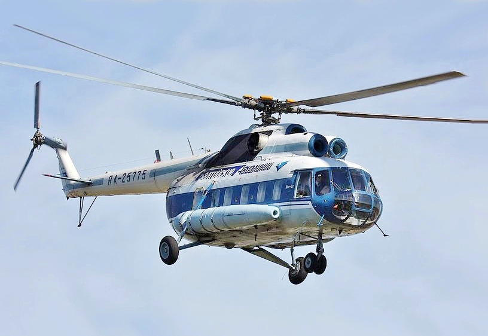

# Mi-8 — wielozadaniowy śmigłowiec transportowy
### Mil Mi-8 Hip | Ми-8

---

## Opis

Mi-8 (NATO: Hip) to radziecki wielozadaniowy śmigłowiec średni, najliczniej produkowany śmigłowiec wojskowy na świecie (ponad 17 000 egzemplarzy). Wszedł do służby w 1967 r. i od tamtej pory jest standardowym transportowcem lotniczym Rosji. W konfiguracji wojskowej (Mi-8AMTSz, Mi-8MTV) może przewozić 24–36 żołnierzy, ewakuować rannych lub działać jako uzbroiony gunship z wyrzutniami rakiet. W Ukrainie jest używany masowo przez obie strony — do przerzutu wojsk, zaopatrzenia i ewakuacji medycznej. Rosja straciła ponad 100 śmigłowców rodziny Mi-8/Mi-17 w Ukrainie do 2025 r.

## Dane techniczne

| Parametr | Wartość |
|----------|---------|
| Typ | Wielozadaniowy śmigłowiec transportowy / uzbroiony |
| Kraj produkcji | ZSRR / Rosja |
| Rok wprowadzenia | 1967 |
| Długość (kadłub) | 18,2 m |
| Średnica wirnika | 21,3 m |
| Masa startowa (maks.) | 13 000 kg |
| Ładowność | 4 000 kg wewnętrznie lub 3 000 kg na zewnętrznym haczyku |
| Uzbrojenie (Mi-8TV) | 4 wyrzutnie rakiet S-8 (po 20 szt.) + 2 × PKT 7,62 mm |
| Silniki | 2 × Klimov TV3-117 (turbinowy), po 1 435 kW |
| Prędkość maks. | 250 km/h |
| Zasięg | 610 km |
| Pułap | 4 500 m |
| Załoga | 3 (pilot, kopilot, mechanik pokładowy) + 24 żołnierze |

## Charakterystyczne cechy rozpoznawcze

> Jak odróżnić Mi-8 od Mi-24 i Ka-52:

- **Prostokątne duże drzwi ładunkowe po prawej stronie** — charakterystyczne boczne drzwi przesuwane; jest to śmigłowiec transportowy z wejściem dla żołnierzy; Ka-52 i Mi-24 ich nie mają
- **Pięciołopatowy wirnik główny + trójłopatowy wirnik ogonowy** — prosty układ, wirnik ogonowy po lewej stronie; brak ogona-belki jak w Ka-52 (bez wirnika)
- **Dwie turbiny po bokach nad kabiną** — silniki zamontowane na górze kadłuba, widoczne boczne wyloty; charakterystyczne „garby" na dachu tuż przed wirnikiem
- **Prostokątne okna w kabinie transportowej** — seria małych okiennych iluminatorów wzdłuż burt; wyraźnie różni od okien bojowych Mi-24/Mi-28
- **Cylindryczny, gruby kadłub** — „beczkowaty" przekrój poprzeczny; wyraźnie szerszy i bardziej pudełkowaty niż śmigłowce szturmowe
- **Białe pasy taktyczne** — w Ukrainie rosyjskie Mi-8 mają namalowane białe skośne pasy na ogonie jako oznaczenie własne

## Ciekawostka

> Mi-8 to najczęściej używany śmigłowiec wojskowy w historii — latał w ponad 50 wojnach i konfliktach. W 1988 r. afgański Mi-8 (przechwycony przez mudżahedinów) był pierwszym śmigłowcem zestrzelonym przez Stingera. Mi-8 był też śmigłowcem użytym do ewakuacji reaktora Czernobyla w 1986 r. — trzy śmigłowce i ich załogi pochłonęły śmiertelne dawki promieniowania podczas zrzutu materiałów gaśniczych.
