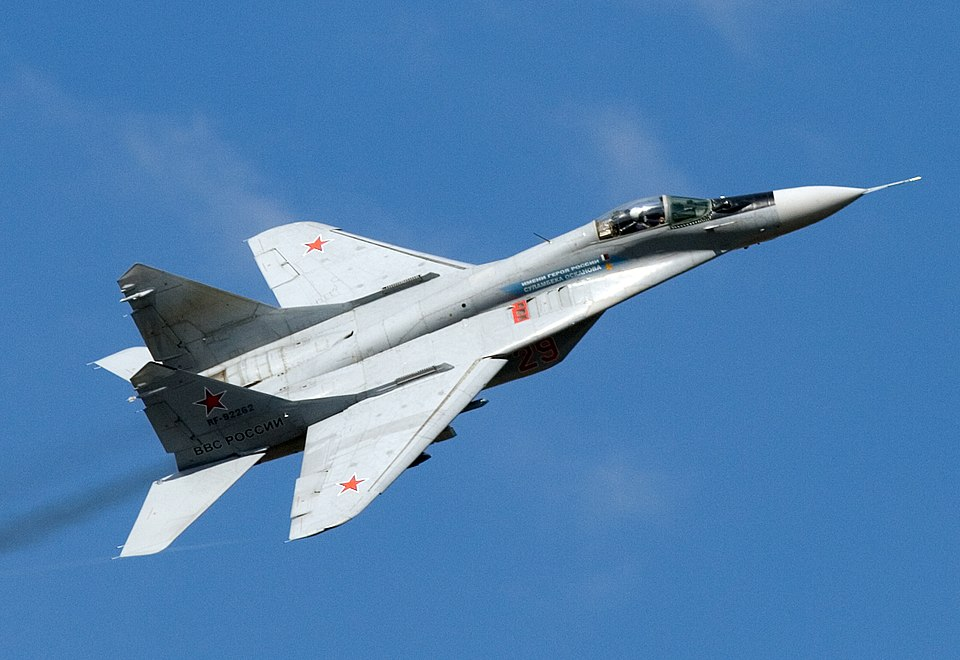

# MiG-29 — lekki myśliwiec wielozadaniowy
### Mikoyan MiG-29 Fulcrum | МиГ-29

---

## Opis

MiG-29 (NATO: Fulcrum) to radziecki lekki myśliwiec powietrze–powietrze czwartej generacji, wprowadzony do służby w 1983 r. jako odpowiedź na amerykańskie F-15 i F-16. Jego cechą szczególną jest zdolność do walki powietrznej z bliskiej odległości przy użyciu kasków z namierzaniem celów wzrokiem (HMDS) i rakiet R-73. Był eksportowany do wielu krajów, m.in. Polski, Niemiec i Ukrainy. W wojnie na Ukrainie walczą po obu stronach — Rosja używa MiG-29 do misji powietrznych, Ukraina do obrony swego terytorium. Polska i Niemcy przekazały Ukrainie łącznie ok. 30 MiG-29 w 2023 r.

## Dane techniczne

| Parametr | Wartość |
|----------|---------|
| Typ | Lekki myśliwiec powietrze–powietrze / wielozadaniowy |
| Kraj produkcji | ZSRR / Rosja |
| Rok wprowadzenia | 1983 |
| Długość | 17,3 m |
| Rozpiętość skrzydeł | 11,4 m |
| Masa startowa (maks.) | 18 500 kg |
| Uzbrojenie stałe | Działko GSh-30-1 (30 mm, 150 naboi) |
| Podwieszenia | 7 węzłów, do 3 500 kg (R-60, R-73, R-27, bomby) |
| Silniki | 2 × Klimov RD-33 (dopalacz), po 81,3 kN ciągu |
| Prędkość maks. | 2 445 km/h (Mach 2,3) |
| Zasięg bojowy | 700 km |
| Pułap | 18 000 m |
| Załoga | 1 |

## Charakterystyczne cechy rozpoznawcze

> Jak odróżnić MiG-29 od Su-27 i Su-35:

- **Dwa stateczniki pionowe nachylone na zewnątrz** — podobnie jak Su-27, ale całkowity sylwetka MiG-a jest wyraźnie mniejsza i „ciaśniejsza"; ogony stateczników pionowych są krótsze
- **Wloty powietrza pod kadłubem** — zamiast bocznych wlotów jak w Su-24, MiG-29 ma wloty z przodu-dołu kadłuba z widocznymi siatkami ochronnymi podczas kołowania (zamykają się przy starcie)
- **Siatki na wlotach** — unikalna cecha: podczas taksowania i startu dolne wloty można zasłonić kratownicami, a powietrze pobierane jest przez górne otwory LERX (widoczne jako szczeliny za kabiną)
- **Kompaktowy, masywny kadłub** — mniejszy i bardziej zbity niż Su-27; stosunek długości do rozpiętości inny niż u Flankera
- **LERX (nawisy krawędzi natarcia)** — duże, trapezoidalne spływy aerodynamiczne przed skrzydłami, widoczne z góry i z boku
- **Krótki nos** bez dużego radaru jak w Su-27; bardziej kompaktowe rozmieszczenie szyby kabiny

## Ciekawostka

> MiG-29 jako jedyny samolot bojowy na świecie ma górne wloty powietrza LERX — kratki zabezpieczające dolne wloty przed wciąganiem kamieni i ptaków przy kołowaniu. Gdy pilot zamknie dolne klapy, silniki pobierają powietrze przez wąskie szczeliny wzdłuż grzbietu kadłuba. Ukraiński pilot kpt. Andriy Pilshchykov, znany jako „Juice", latał na MiG-29 i zginął w wypadku lotniczym w 2023 r. — stał się jednym z symboli ukraińskiego lotnictwa w wojnie.
