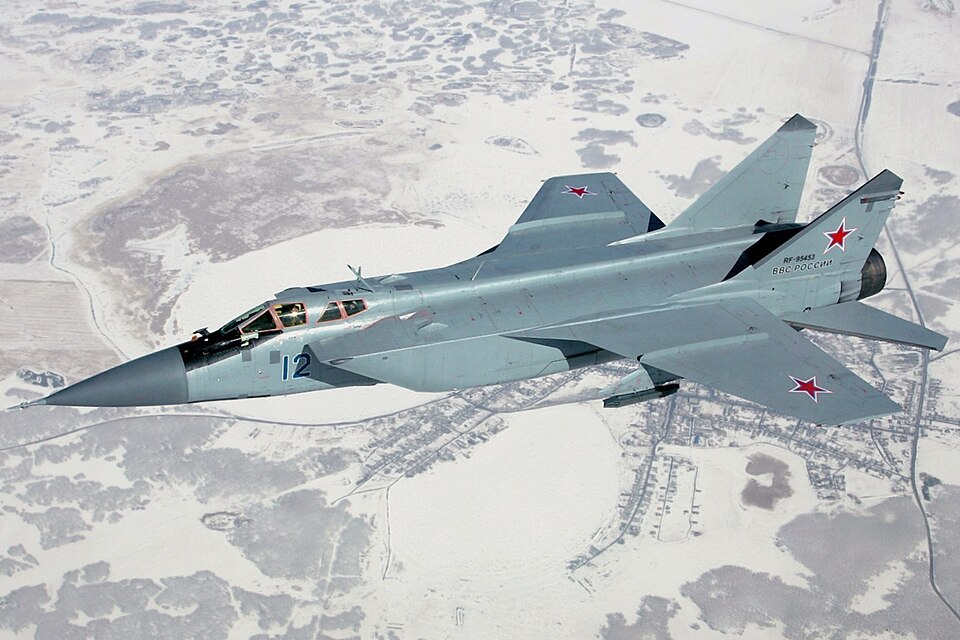

# MiG-31K — myśliwiec przechwytujący / nosiciel rakiet Kindżał
### Mikoyan MiG-31K Foxhound | МиГ-31К

---

## Opis

MiG-31K (NATO: Foxhound) to dwumiejscowy dwusilnikowy naddźwiękowy myśliwiec przechwytujący i platforma nosiciela hipersonicznej rakiety Kh-47M2 Kindżał. Bazowa wersja MiG-31 weszła do służby w 1981 r. jako najszybszy samolot operacyjny świata — zdolny do lotu z prędkością Mach 2,83. Wersja MiG-31K z podwieszonym Kindżałem (modyfikacja z 2017 r.) jest głównym narzędziem rosyjskich ataków hipersonicznych na Ukrainę. Rakieta Kindżał startuje z prędkości ok. Mach 2,5, po czym przyspiesza do Mach 10–12, co przez długi czas czyniło ją trudną do zestrzelenia — do czasu kiedy Ukraina użyła Patriota PAC-3.

## Dane techniczne

| Parametr | Wartość |
|----------|---------|
| Typ | Myśliwiec przechwytujący / nosiciel pocisków hipersonicznych |
| Kraj produkcji | ZSRR / Rosja |
| Rok wprowadzenia | 1981 (MiG-31), 2017 (wariant K z Kindżałem) |
| Długość | 22,7 m |
| Rozpiętość skrzydeł | 13,5 m |
| Masa startowa (maks.) | 46 200 kg |
| Uzbrojenie stałe | Działko GSh-6-23 (23 mm, 6 luf) |
| Uzbrojenie MiG-31K | 1 × Kh-47M2 Kindżał (rakieta hipersoniczna, zasięg 2 000+ km) |
| Silniki | 2 × Aviadvigatel D-30F6 (dopalacz), po 152 kN ciągu |
| Prędkość maks. | 3 000 km/h (Mach 2,83) — najszybszy myśliwiec operacyjny świata |
| Prędkość bojowa z Kindżałem | ok. Mach 2,5 |
| Zasięg | 3 000 km |
| Pułap | 20 600 m |
| Załoga | 2 (pilot + oficer systemów uzbrojenia) |

## Charakterystyczne cechy rozpoznawcze

> Jak odróżnić MiG-31K od MiG-29 i Su-27:

- **Ogromne rozmiary** — MiG-31 jest niemal dwukrotnie cięższy od MiG-29 (46 vs 18 ton) i wyraźnie większy; przy oglądaniu obok siebie różnica jest ogromna
- **Prostokątne, płaskie wloty powietrza** — boczne wloty z widocznymi separatorami i prostokątnym przekrojem; inaczej niż trójkątne LERX-y MiG-a-29 czy zaokrąglone wloty Su-27
- **Dwa stateczniki pionowe, proste (bez skosu na zewnątrz)** — inaczej niż w MiG-29 (nachylone na zewnątrz); stateczniki MiG-a-31 są bardziej pionowe
- **Duży, tępy nos z radarem** — radar Zaslon (pierwszy na świecie z anteną fazowaną na myśliwcu); wyraźna „główka" z przodu
- **Charakterystyczna sylwetka: ciężki, prostoliniowy kadłub** — brak zaokrąglonych linii Su-27; prostszy, bardziej „ciężki" wygląd jak bombowiec niż myśliwiec
- **Z podwieszonym Kindżałem** — wielka (ok. 8 m) rakieta widoczna pod kadłubem; nie można pomylić z żadnym innym podwieszeniem

## Ciekawostka

> W maju 2023 r. ukraiński system Patriot PAC-3 zestrzelił nad Kijowem rakietę Kindżał — po raz pierwszy hipersoniczna broń rosyjska została zneutralizowana. Wcześniej Rosja twierdziła, że Kindżał jest „nie do zestrzelenia". MiG-31K lata tak szybko, że jego maks. prędkość Mach 2,83 to jedyny rekord szybkości myśliwca operacyjnego utrzymywany przez Rosję — USA nie mają odpowiednika.
