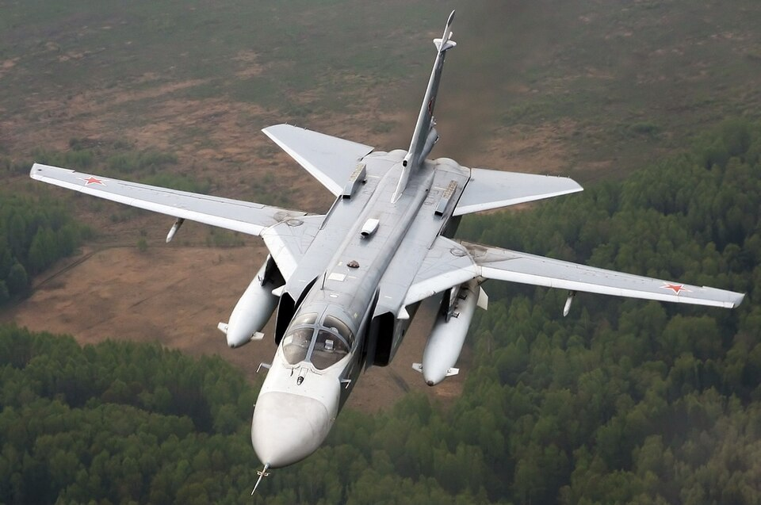

# Su-24M — samolot szturmowy dalekiego zasięgu
### Sukhoi Su-24M Fencer | Су-24М

---

## Opis

Su-24M (NATO: Fencer) to dwumiejscowy, naddźwiękowy samolot szturmowy ze skrzydłami zmiennej geometrii, będący podstawowym samolotem uderzeń na cel naziemny rosyjskiego lotnictwa taktycznego. Opracowany w ZSRR w latach 60., wszedł do służby w 1974 r., a zmodernizowana wersja Su-24M — w 1983 r. Zaprojektowany do przebijania się na małych wysokościach przez obronę przeciwlotniczą i rażenia celów naziemnych każdej pogody, stał się kluczowym narzędziem ataków na Ukrainę. Rosja wykorzystuje go do zrzucania bomb szybujących FAB-500M54 z modułem UMPC, które pozwalają atakować cele bez wlatywania w zasięg ukraińskiej obrony. Straty: ponad 60 Su-24M potwierdzonych jako zniszczone lub uszkodzone w Ukrainie do 2025 r.

## Dane techniczne

| Parametr | Wartość |
|----------|---------|
| Typ | Samolot szturmowy ze skrzydłami zmiennej geometrii |
| Kraj produkcji | ZSRR / Rosja |
| Rok wprowadzenia | 1974 (Su-24), 1983 (Su-24M) |
| Długość | 24,6 m |
| Rozpiętość skrzydeł | 17,6 m (rozłożone) / 10,4 m (złożone 69°) |
| Masa startowa (maks.) | 43 755 kg |
| Uzbrojenie stałe | Działko GSh-6-23 (23 mm, 6 luf, 500 naboi) |
| Podwieszenia | 7 węzłów, do 8 000 kg (bomby, rakiety Kh-23, Kh-25, Kh-29, Kh-58) |
| Silniki | 2 × Saturn AL-21F-3A (dopalacz), po 109,8 kN ciągu |
| Prędkość maks. | 1 550 km/h (Mach 2,2 na wysokości) |
| Zasięg bojowy | 560 km (małą wysokością) / 950 km (duża wysokość) |
| Pułap | 11 500 m |
| Załoga | 2 (pilot + nawigator/operator uzbrojenia) |

## Charakterystyczne cechy rozpoznawcze

> Jak odróżnić Su-24M od Su-34 i Tu-22M3:

- **Skrzydła zmiennej geometrii** — najważniejsza cecha; widoczna zmiana kształtu sylwetki: szerokie (16°) przy lądowaniu, strzałkowe (69°) podczas przelotu
- **Dwa prostokątne wloty powietrza po bokach kadłuba** — płaskie, z widocznymi separatorami warstwy przyściennej; inaczej niż „nozdrza" MiG-a-31
- **Dwa stateczniki pionowe** — wyraźnie widoczne z tyłu, rozstawione jak w MiG-u-29, ale na znacznie większym samolocie
- **Tandemowy kokpit** — dwie szklane osłony kabiny ustawione jedna za drugą; w odróżnieniu od Su-34 z kabiną side-by-side
- **Bardzo niski kształt nosa** — profilowany, ostry dziób; brak „płaskiego kaczora" jak w Su-34
- **Rozmiar pośredni** — wyraźnie mniejszy od Tu-22M3 i Tu-160, ale większy od Su-25

## Ciekawostka

> W 2024 r. Rosja masowo zastosowała Su-24M do zrzucania bomb FAB-500 z modułem szybującym UMPC — tanie „inteligentne bomby" ze standardowych bomb swobodnie spadających. Jeden Su-24M może przenosić 3–4 takie bomby z zasięgiem ok. 50–70 km, co pozwala atakować bez wlatywania w strefę ukraińskich Patriotów. Ukraiński pilot o pseudonimie „Juice" jako pierwsza kobieta-pilot myśliwska w historii, która zestrzeliła wrogi samolot bojowy w walce powietrznej, służyła na Su-24M i wróg zestrzelił ją właśnie na Su-24MR.
