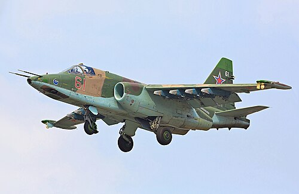
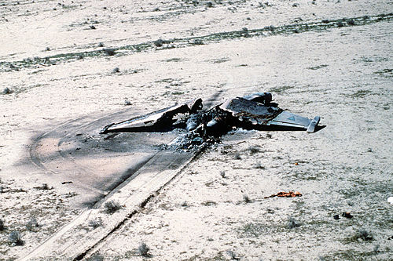

# Su-25 Gracz
### Sukhoi Su-25 Frogfoot | Сухой Су-25 «Грач»

---

## Opis

Su-25 "Gracz" (ros. Грач — kawka) to radziecki/rosyjski samolot szturmowy bliskiego wsparcia, zaprojektowany specjalnie do bezpośredniego wsparcia wojsk lądowych w strefie kontaktu. Opracowany od końca lat 60., po raz pierwszy oblatany 22 lutego 1975 roku, wszedł do służby w 1981 roku i natychmiast trafił do Afganistanu, gdzie sprawdził się znakomicie. Zaprojektowany z myślą o przeżywalności: kokpit pilota chroniony jest tytanową "wanną" odporną na ogień karabinów maszynowych i odłamki; silniki otoczone są stalowymi przegrodami. Samolot uczestniczył w niemal każdym konflikcie zbrojnym z udziałem państw postsowieckich, od Czeczenii przez Gruzję aż po Ukrainę 2022+, gdzie obie strony używają Su-25 do szturmowania pozycji naziemnych.

## Dane techniczne

| Parametr | Wartość |
|----------|---------|
| Typ | Samolot szturmowy (CAS) |
| Kraj produkcji | ZSRR / Rosja |
| Rok wprowadzenia | 1981 |
| Masa startowa | 19 300 kg (maks.) |
| Długość | 15,53 m |
| Rozpiętość skrzydeł | 14,36 m |
| Uzbrojenie | Działko 30 mm GSh-30-2 (250 naboi); do 4 000 kg bomb, rakiet S-5/S-8/S-24/Ch-25, zasobników działek; ppk Ch-29 |
| Silnik | 2 × Tumanski R-195 (odrzutowy, 44,18 kN każdy) |
| Prędkość maks. | 975 km/h |
| Pułap | 7 000 m |
| Zasięg | 750 km (bojowy) |
| Załoga | 1 os. |

## Charakterystyczne cechy rozpoznawcze

> Jak odróżnić Su-25 od innych samolotów szturmowych:

- **Mocno podwieszony, wysoko osadzony płat wysoki:** Skrzydła osadzone są wysoko na kadłubie, w konfiguracji niemal średniopłata — z przodu widać prosty trapezowy profil skrzydła z lekkim skosem przy krawędzi natarcia i bardzo wyraźnymi węzłami podwieszeń (do 10 pylonów).
- **Dwa silniki odrzutowe po bokach kadłuba — "paczki" gondol:** Su-25 ma dwa silniki umieszczone w cylindrycznych gondolach po bokach tylnej części kadłuba (nie w kadłubie). Z tyłu i z boku widać wyraźnie dwie okrągłe dysze wyrzutu spalin symetrycznie po obu stronach ogona.
- **Charakterystyczna "krótka i przysadzista" sylwetka:** Samolot jest relatywnie krótki i chudy — proporcje kadłuba (okrągły przekrój, krótkie skrzydła) nadają mu sylwetkę niemal ciężkiej rury z małymi skrzydłami.
- **Płaski nos z ostrą krawędzią — bez radaru:** Dziób Su-25 jest zaostrzony i stosunkowo płaski, bez charakterystycznej stożkowej osłony radarowej — to samolot szturmowy, nie myśliwiec, więc nos jest prosty.
- **Duże spojlery i klapy na skrzydłach:** Z bliska lub na zdjęciach lądowania widać rozbudowany system klap i spoilerów zajmujący dużą część tylnej krawędzi skrzydła — potrzebny do operowania z krótkich pasów.
- **Tytanowy "kocioł" w okolicach kabiny:** Grube opancerzenie wokół kokpitu jest widoczne jako wyraźnie grubsza sekcja kadłuba tuż za dziobem — Su-25 wygląda "bardziej mięsisty" w środkowej części niż typowy odrzutowiec.

## Ciekawostka

> Opancerzenie kabiny Su-25 składa się z tytanowej "wanny" o grubości 24 mm i ważącej samo w sobie 595 kg — stanowi to ok. 7% pustej masy samolotu. Wanna chroni pilota ze wszystkich stron i od dołu przed ostrzałem z broni strzeleckiej i odłamkami artylerii przeciwlotniczej.
