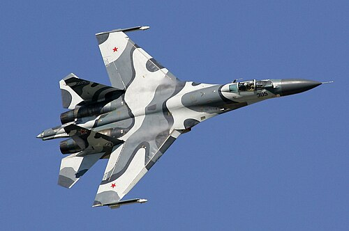
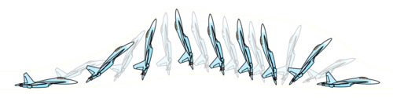

# Su-27 Flanker
### Sukhoi Su-27 Flanker | Сухой Су-27

---

## Opis

Su-27 "Flanker" to radziecki/rosyjski myśliwiec czwartej generacji, opracowany jako odpowiedź na amerykańskie F-15 Eagle. Zaprojektowany przez biuro Suchoja w latach 70., wszedł do służby w 1985 roku jako podstawowy myśliwiec superiorności powietrznej radzieckich sił obrony powietrznej. Charakteryzuje się wyjątkową zwrotnością, zasięgiem (ponad 3 500 km bez doładowania) i dużą ładownością uzbrojenia. Su-27 dał początek całej rodzinie maszyn — Su-30, Su-33, Su-34, Su-35 — które do dziś stanowią kręgosłup rosyjskiego lotnictwa bojowego. W konflikcie ukraińskim zarówno Rosja, jak i Ukraina używają różnych wariantów tej rodziny.

## Dane techniczne

| Parametr | Wartość |
|----------|---------|
| Typ | Myśliwiec superiorności powietrznej |
| Kraj produkcji | ZSRR / Rosja |
| Rok wprowadzenia | 1985 |
| Masa startowa | 33 000 kg (maks.) |
| Długość | 21,94 m |
| Rozpiętość skrzydeł | 14,70 m |
| Uzbrojenie | Działko 30 mm GSh-30-1 (150 naboi); do 10 rakiet powietrze–powietrze R-73, R-27, R-77; możliwość przenoszenia bomb i rakiet powietrze–ziemia |
| Silnik | 2 × Saturn AL-31F (turboodrzutowy z dopalaczem, 2 × 122,6 kN z dopalaczem) |
| Prędkość maks. | ~2 500 km/h (Mach 2,35) |
| Pułap | 19 000 m |
| Zasięg | 3 530 km (bez zbiorników dodatkowych) |
| Załoga | 1 os. |

## Charakterystyczne cechy rozpoznawcze

> Jak odróżnić Su-27 od MiG-29 i zachodnich myśliwców:

- **Podwójne stateczniki pionowe (dublowane ogony):** Su-27 ma dwa pionowe stateczniki — jeden nad każdym silnikiem. Ten charakterystyczny "podwójny ogon" jest widoczny z każdego kierunku i natychmiast odróżnia go od większości myśliwców z jednym usterzeniem pionowym.
- **Bardzo długi, smukły kadłub z "nacelle" silników:** Dwie gondole silnikowe biegną wzdłuż całej tylnej połowy kadłuba, widocznie wystając za linię skrzydła — z dołu i z tyłu widać charakterystyczny "grzebień" dwóch równoległych wyrzutni dyszy.
- **Charakterystyczny profil nosa z dużą radome:** Długi, zaostrzony nos z wyraźnie zaokrągloną osłoną radaru (radome) zajmującą ok. jednej trzeciej długości dzioba — wyraźnie większy i bardziej dominujący niż np. u MiG-29.
- **Skrzydła typu "odwróconego delta" z LERX:** Duże, trapezowe skrzydła z mocno zaciągniętym skosem przy nasadzie (LERX — leading edge root extension) tworzą charakterystyczny esowaty kształt przedniej krawędzi widziany z góry lub z przodu.
- **Wloty powietrza z przodu pod kadłubem:** Dwa prostokątne wloty powietrza umieszczone symetrycznie pod kadłubem między silnikami a krawędzią natarcia skrzydła — z przodu widać wyraźnie dwa "nozdrza" po bokach dolnej części kadłuba.
- **Duże rozmiary — wyraźnie większy od MiG-29:** Su-27 jest dużo większy od MiG-29 (o ok. 6 m dłuższy) — ta różnica skali jest widoczna na lotnisku lub w porównaniu do innych samolotów obok.

## Ciekawostka

> Na pokazach lotniczych Su-27 zasłynął manewrem "kobra Pugaczowa" — pilotowanym przez Wiktora Pugaczowa na Paris Air Show w 1989 roku. Samolot unosi dziób pionowo (a nawet odchyla się do tyłu), zwalnia niemal do zera i wraca do lotu poziomego, zachowując w przybliżeniu trajektorię poziomą. Żaden zachodni myśliwiec tamtej epoki nie był w stanie wykonać tego manewru, co wywarło ogromne wrażenie na zachodniej publiczności i analitykach wojskowych.
