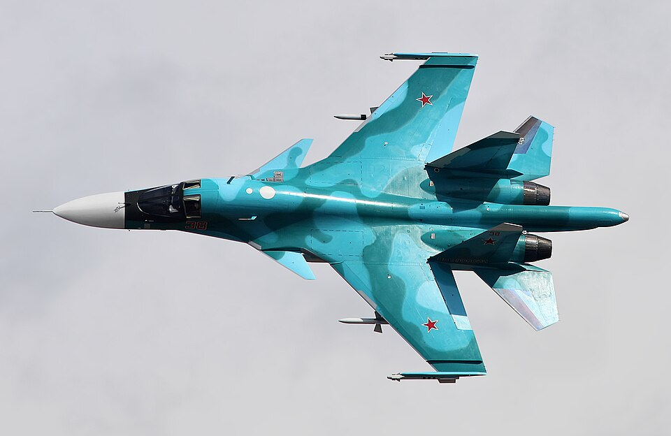

# Su-34 — samolot szturmowy (myśliwiec-bombowiec)
### Sukhoi Su-34 Fullback | Су-34

---

## Opis

Su-34 (NATO: Fullback) to rosyjski naddźwiękowy myśliwiec-bombowiec opracowany jako następca Su-24M. Wyróżnia się unikalną w lotnictwie wojskowym kabiną z miejscami obok siebie (side-by-side), opancerzoną jak czołg — tytanowa wanna chroni załogę przed ogniem z ziemi. Posiada galley (kuchnię) i toaletę dla długich misji. Wszedł do służby w 2014 r. i stał się głównym rosyjskim samolotem uderzeń w Ukrainie. Zrzuca bomby szybujące FAB-500/1500 z modułami UMPC, kierowane rakiety Kh-29, Kh-31 i Kh-35. Do 2025 r. Rosja straciła ponad 30 Su-34 — kosztowny i trudny do zastąpienia typ.

## Dane techniczne

| Parametr | Wartość |
|----------|---------|
| Typ | Myśliwiec-bombowiec (samolot uderzeniowy) |
| Kraj produkcji | Rosja |
| Rok wprowadzenia | 2014 |
| Długość | 23,3 m |
| Rozpiętość skrzydeł | 14,7 m |
| Masa startowa (maks.) | 45 100 kg |
| Uzbrojenie stałe | Działko GSh-301 (30 mm, 150 naboi) |
| Podwieszenia | 12 węzłów, do 8 000 kg (bomby FAB, rakiety Kh-29, Kh-31, Kh-35, Kh-59) |
| Silniki | 2 × Saturn AL-31FM1 (dopalacz), po 132 kN ciągu |
| Prędkość maks. | 1 900 km/h (Mach 1,8) |
| Zasięg bojowy | 1 100 km |
| Zasięg maks. | 4 000 km |
| Pułap | 17 000 m |
| Załoga | 2 (pilot i operator uzbrojenia, obok siebie) |

## Charakterystyczne cechy rozpoznawcze

> Jak odróżnić Su-34 od Su-24M i Su-27:

- **Unikalny, spłaszczony „dziób kaczki"** — płaski, kwadratowy nos (stąd przezwisko „Platypus" / „Kaczor"); jest najszerzą częścią przodu kadłuba i rozpoznawalny natychmiastowo
- **Kabina side-by-side** — canopy (oszklenie kabiny) jest szerokie i płaskie, nie wąskie tandemowe; piloci siedzą obok siebie jak w samolocie pasażerskim
- **Szerszy kadłub niż Su-27** — widoczna różnica przy oglądaniu od przodu; boczne wloty powietrza zmieszczone niżej
- **LERX (nawisy krawędzi natarcia)** — duże, zaokrąglone przewężenia przed skrzydłami jak u Su-27, ale z inaczej ukształtowanym czołem
- **Usterzenie ogonowe identyczne z Su-27/Su-35** — podwójne stateczniki pionowe i poziome jak u Flankera, ale nos zupełnie różny
- **Profil boczny**: tępy nos + wydłużony kadłub + flankerowe usterzenie = natychmiastowe rozpoznanie

## Ciekawostka

> Tytanowa opancerzona kabina Su-34 waży ponad 1 500 kg — więcej niż cały samochód. Piloci mogą wstać i wyprostować się w kabinie (wysokość 1,1 m), co umożliwia zmiany przy sterach podczas wielogodzinnych misji. W 2022 r. jeden Su-34 zestrzelony przez ukraińskie siły wylądował niemal nieuszkodzony na polu w obwodzie chersońskim — maszyna wpadła w ręce Ukraińców z prawie kompletną elektroniką.
