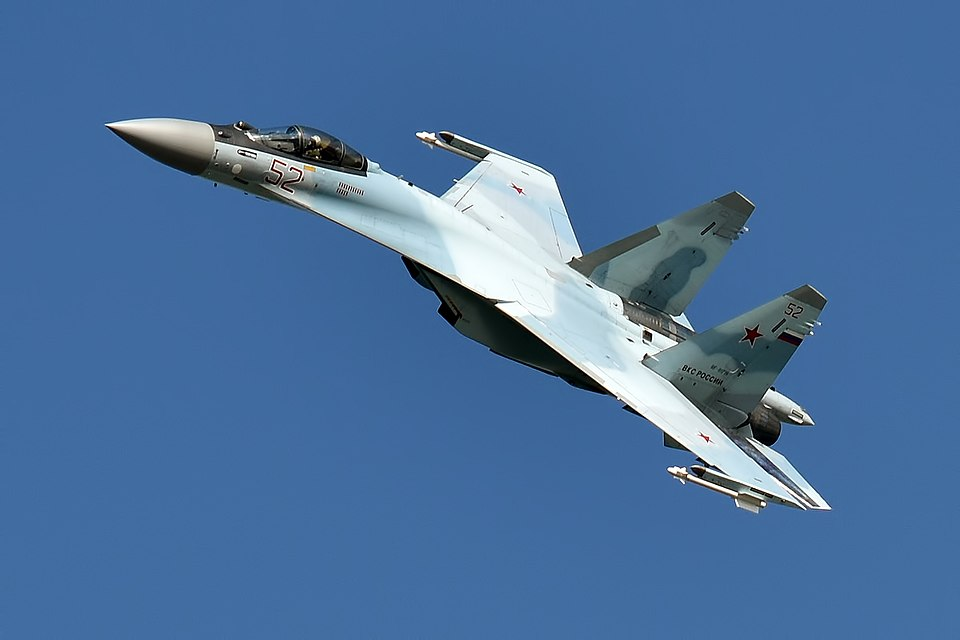

# Su-35S — wielozadaniowy myśliwiec ciężki
### Sukhoi Su-35S Flanker-E | Су-35С

---

## Opis

Su-35S (NATO: Flanker-E) to rosyjski jednomiejscowy wielozadaniowy myśliwiec ciężki czwartej generacji++, produkowany od 2012 r. Będąc głęboko zmodernizowaną wersją Su-27, łączy w sobie możliwości myśliwca powietrznego z zaawansowanymi zdolnościami uderzeniowymi. Wyposaży jest w radar fazowy Irbis-E śledzący 30 celów jednocześnie i zdolny do wykrycia myśliwca z odległości 400 km. Silniki z wektorowaniem ciągu nadają mu niezwykłą zwrotność — Su-35S może wykonywać manewry niemożliwe dla innych myśliwców czwartej generacji. Jest głównym rosyjskim myśliwcem osłony lotniczej w wojnie w Ukrainie; od 2022 r. Rosja straciła ponad 25 Su-35S.

## Dane techniczne

| Parametr | Wartość |
|----------|---------|
| Typ | Wielozadaniowy myśliwiec ciężki (generacja 4++) |
| Kraj produkcji | Rosja |
| Rok wprowadzenia | 2014 |
| Długość | 21,9 m |
| Rozpiętość skrzydeł | 15,3 m |
| Masa startowa (maks.) | 34 500 kg |
| Uzbrojenie stałe | Działko GSh-30-1 (30 mm, 150 naboi) |
| Podwieszenia | 12 węzłów, do 8 000 kg (R-77, R-73, Kh-29, Kh-31, bomby) |
| Silniki | 2 × Saturn AL-41F1S z **wektorowaniem ciągu**, po 142,2 kN |
| Prędkość maks. | 2 400 km/h (Mach 2,25) |
| Zasięg bojowy | 1 600 km |
| Pułap | 18 000 m |
| Załoga | 1 |

## Charakterystyczne cechy rozpoznawcze

> Jak odróżnić Su-35S od Su-27, Su-34 i MiG-29:

- **Jeden duży statecznik pionowy** zamiast dwóch mniejszych jak w starszym Su-27 — jedna pionowa płetwa ogonowa; to główna różnica wizualna vs wcześniejsze Flankery (su-27 ma dwa)
- **Dysze silnikowe z wektorowaniem ciągu** — owalne, ruchome dysze (TVC) widoczne pod ciałem za skrzydłami; mogą odchylać się w górę i dół; charakterystyczny wygląd „ruchomych ust"
- **Brak przednich kadłubowych płetw (canardów)** — Su-30MKI, Su-33 mają canards; Su-35S ich nie ma; czysty, uproszczony przód
- **Usterzenie ogonowe „stinger"** — ogon między dyszami znacznie dłuższy niż w Su-27; wydłużony „żądło" (stinger) za silnikami
- **Sylwetka: smukły, elegancki kadłub** — bez płaskiego nosa jak Su-34; bardziej liniowy i wydłużony niż MiG-29
- **Profil Flankera** — niezaprzeczalnie należy do rodziny Flankerów (Su-27/30/33/35); identyczny kształt skrzydeł

## Ciekawostka

> Su-35S potrafi wykonać manewr „kołyszący się Cobra" trwający kilkanaście sekund, podczas którego nos może być skierowany do tyłu przy locie do przodu. Radar Irbis-E emituje 20 kW mocy szczytowej — to 4 razy więcej niż radar F-35 AN/APG-81. Chiny zakupiły 24 Su-35S w 2016 r., ale szybko rozmontowały je, by skopiować silniki AL-41F1S do własnego J-16.
