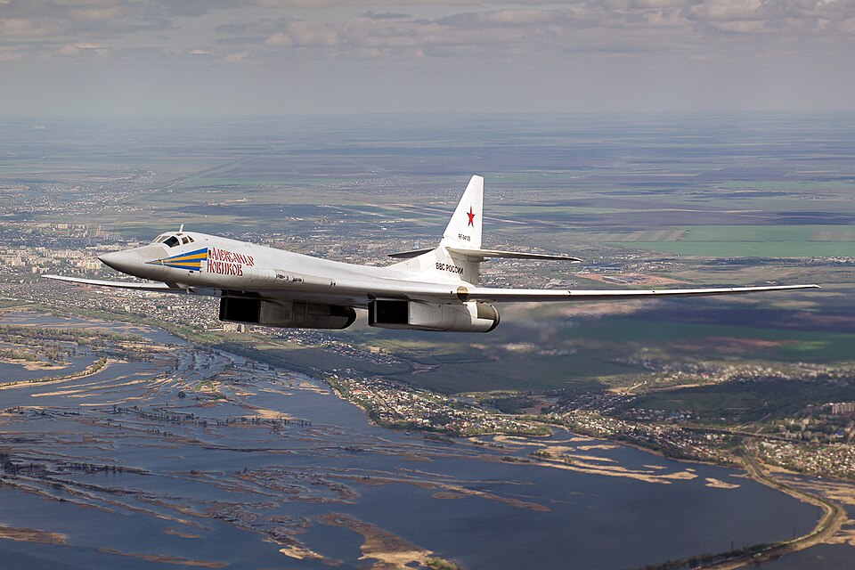

# Tu-160 — strategiczny bombowiec naddźwiękowy
### Tupolev Tu-160 Blackjack | Ту-160

---

## Opis

Tu-160 (NATO: Blackjack) to największy i najcięższy samolot bojowy w historii lotnictwa — naddźwiękowy bombowiec strategiczny ze skrzydłami zmiennej geometrii. Opracowany w ZSRR w latach 70., wszedł do służby w 1987 r. jako odpowiedź na amerykański B-1 Lancer. Może przenosić do 40 000 kg uzbrojenia — rakiety manewrujące Kh-55, Kh-101 i Kh-102 (nuklearne). Biały lakier i ogromne rozmiary sprawiają, że w Rosji nazywany jest „Białym Łabędziem". Rosja posiada ok. 16 sprawnych Tu-160 i wznowiła produkcję zmodernizowanej wersji Tu-160M2.

## Dane techniczne

| Parametr | Wartość |
|----------|---------|
| Typ | Strategiczny bombowiec naddźwiękowy ze skrzydłami zmiennej geometrii |
| Kraj produkcji | ZSRR / Rosja |
| Rok wprowadzenia | 1987 |
| Długość | 54,1 m (najdłuższy samolot bojowy na świecie) |
| Rozpiętość skrzydeł | 55,7 m (rozłożone 20°) / 35,6 m (złożone 65°) |
| Masa startowa (maks.) | 275 000 kg |
| Uzbrojenie | Do 40 000 kg: 12 × Kh-55/Kh-101/Kh-102 w 2 komorach bombowych |
| Silniki | 4 × Kuznetsov NK-32 (dopalacz), po 245 kN ciągu |
| Prędkość maks. | 2 220 km/h (Mach 2,05 na pułapie) |
| Zasięg | 12 300 km |
| Pułap | 16 000 m |
| Załoga | 4 (dwaj piloci + dwaj operatorzy uzbrojenia, siedzą parami) |

## Charakterystyczne cechy rozpoznawcze

> Jak odróżnić Tu-160 od Tu-22M3, Tu-95MS i B-1B:

- **Absolutnie największy samolot bojowy** — 54 m długości, 275 ton; widok z ziemi jest przytłaczający; znacznie większy od Tu-22M3 (42 m) i B-1B (44 m)
- **Skrzydła zmiennej geometrii + 4 silniki** — Tu-22M3 też ma zmienne geometrię, ale 2 silniki; Tu-160 ma 4 silniki w gondolach pod skrzydłami
- **Układ krzyżowy (cruciform) usterzenia poziomego** — widoczne poziome płetwy usterzeniowe + głęboki trapez pionowych stateczników; unikalny kształt ogona
- **Biały lakier „Białego Łabędzia"** — jako jedyny rosyjski bombowiec strategiczny malowany na biało (Tu-95 i Tu-22M3 szaro-zielone)
- **Cztery silniki w dwóch parach** — dwie gondole po dwa silniki każda, widoczne pod skrzydłami; przy kursie czołowym: cztery duże wloty powietrza
- **Ostry, długi nos** — dzioby strzelcze bez wieżyczek, spiczasty kształt, widoczna sonda tankowania w locie

## Ciekawostka

> Tu-160 ustanowił ponad 44 rekordy świata — w tym lot bez lądowania przez 48 godzin 33 minuty (z tankowaniem w powietrzu) i prędkość ponad 2 000 km/h przy masie startowej 275 ton. W 1991 r. Ukraina przejęła 19 Tu-160 po rozpadzie ZSRR; w 1999–2000 r. Rosja odkupiła 8 z nich w zamian za umorzenie ukraińskiego długu gazowego.
