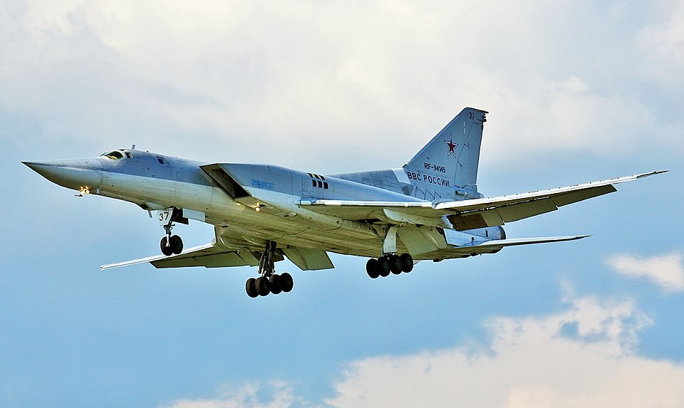

# Tu-22M3 — bombowiec strategiczny (Backfire)
### Tupolev Tu-22M3 Backfire-C | Ту-22М3

---

## Opis

Tu-22M3 (NATO: Backfire-C) to radziecko-rosyjski dwusilnikowy naddźwiękowy bombowiec strategiczny ze skrzydłami zmiennej geometrii, zdolny do przenoszenia broni konwencjonalnej i jądrowej. Wszedł do służby w 1976 r. i od lat pozostaje jednym z głównych nośników rosyjskiej potęgi uderzeniowej. W wojnie z Ukrainą wykorzystywany do ataków rakietami manewrującymi Kh-22 na duże obiekty infrastrukturalne. W październiku 2024 r. ukraiński dron dalekiego zasięgu po raz pierwszy uderzył w Tu-22M3 na lotnisku Soltsy — pierwszy taki atak na samolot tej klasy na terytorium Rosji od II wojny światowej.

## Dane techniczne

| Parametr | Wartość |
|----------|---------|
| Typ | Naddźwiękowy bombowiec strategiczny ze skrzydłami zmiennej geometrii |
| Kraj produkcji | ZSRR |
| Rok wprowadzenia | 1976 |
| Długość | 42,4 m |
| Rozpiętość skrzydeł | 34,3 m (rozłożone) / 23,3 m (złożone 65°) |
| Masa startowa (maks.) | 126 000 kg |
| Uzbrojenie | Do 24 000 kg: 1–3 × Kh-22, lub 10 × Kh-15, lub bomby swobodnie spadające |
| Silniki | 2 × Kuznetsov NK-25 (dopalacz), po 245 kN ciągu |
| Prędkość maks. | 2 300 km/h (Mach 2,05) |
| Zasięg bojowy | 2 200 km |
| Pułap | 14 000 m |
| Załoga | 4 |

## Charakterystyczne cechy rozpoznawcze

> Jak odróżnić Tu-22M3 od Tu-160 i Tu-95MS:

- **Skrzydła zmiennej geometrii + DWA silniki** — jak Tu-160, ale dwa silniki (nie cztery); jak Tu-95, ale odrzutowy (nie turbośmigłowy); unikalna kombinacja
- **Wloty powietrza po bokach kadłuba, tuż za kabiną** — masywne prostokątne wloty umieszczone na bokach, inaczej niż w Tu-160 (gdzie gondole pod skrzydłami)
- **Schodkowa kabina załogi** — widok z boku: kokpit lekko uniesiony, profil kadłuba z wyraźnym przeskokiem wysokości; brak bladej symetrii Tu-160
- **Tylna wieżyczka obronna** — gniazdo strzeleckie z tyłu kadłuba (widoczne z tyłu); Tu-160 nie ma wieżyczek
- **Rozmiar pośredni** — wyraźnie mniejszy od Tu-160 (54 m), ale duży (42 m); Tu-95 ma podobne rozmiary, lecz śmigłowy
- **Układ podwozia głównego** — podwozie chowane w bocznych gondolach kadłubowych, widoczne wypukłości za skrzydłami

## Ciekawostka

> Rosja ma ok. 60 sprawnych Tu-22M3. Rakieta Kh-22 przenoszona przez Tu-22M3 waży 5 900 kg i leci z prędkością Mach 4,6 — jest praktycznie niemożliwa do zestrzelenia przez systemy SHORAD. W 2024 r. ukraiński dron uderzył Tu-22M3 na rosyjskim lotnisku Soltsy-2 — to pierwszy samolot tej klasy zniszczony na ziemi przez drona od II wojny światowej.
