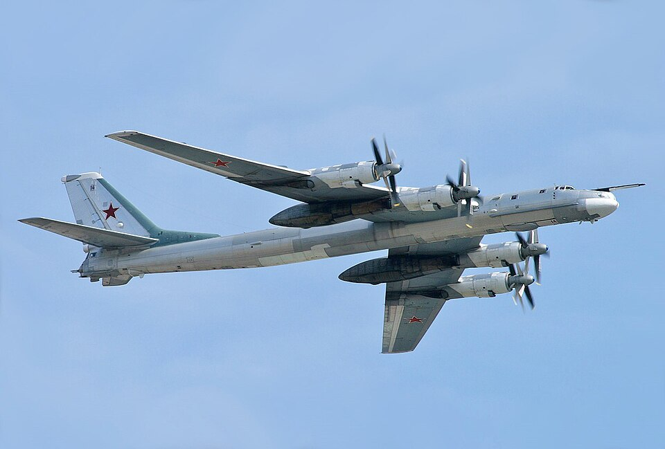

# Tu-95MS — strategiczny bombowiec rakietowy
### Tupolev Tu-95MS Bear-H | Ту-95МС

---

## Opis

Tu-95MS (NATO: Bear-H) to radziecki czteromotorowy bombowiec strategiczny z turbośmigłowymi silnikami napędowymi, będący najdłużej służącym bombowcem w historii lotnictwa (w służbie od 1956 r.). Wersja MS (Morskoy Strategicheskiy) to wyspecjalizowany nosiciel rakiet manewrujących Kh-55 i Kh-101. Mimo pozornie przestarzałej turbośmigłowej konstrukcji pozostaje głównym rosyjskim nośnikiem broni jądrowej i konwencjonalnych rakiet strategicznych. Od 2022 r. regularnie atakuje Ukrainę salwami rakiet Kh-101 odpalanymi znad rosyjskiego terytorium lub Morza Kaspijskiego — bez konieczności zbliżania się do ukraińskiej obrony.

## Dane techniczne

| Parametr | Wartość |
|----------|---------|
| Typ | Strategiczny bombowiec rakietowy (turbośmigłowy) |
| Kraj produkcji | ZSRR |
| Rok wprowadzenia | 1956 (Tu-95), 1981 (Tu-95MS) |
| Długość | 49,13 m |
| Rozpiętość skrzydeł | 50,04 m |
| Masa startowa (maks.) | 185 000 kg |
| Uzbrojenie | 6–16 rakiet Kh-55 / Kh-101 / Kh-102 (w komorze i na podwieszeniach) |
| Silniki | 4 × Kuznetsov NK-12MP (turbośmigłowy, każdy 11 033 kW) z **przeciwbieżnymi śmigłami** |
| Prędkość maks. | 925 km/h |
| Zasięg | 15 000 km (bez tankowania) |
| Pułap | 12 000 m |
| Załoga | 6–7 osób |

## Charakterystyczne cechy rozpoznawcze

> Jak odróżnić Tu-95MS od Tu-160 i Tu-22M3:

- **Cztery pary przeciwbieżnych śmigieł** — absolutnie unikalna cecha; 8 śmigieł (2 na każdym silniku, obracają się w przeciwnych kierunkach), widoczne z odległości; żaden inny bombowiec na świecie nie wygląda tak samo
- **Dźwięk: głośne „wycie" śmigieł** — jeden z najgłośniejszych dźwięków ze wszystkich samolotów wojskowych; rozpoznawalny z kilku kilometrów; charakterystyczne ululanie turbośmigłowych silników
- **Strzałkowe wysokie skrzydła** — 35° skosu; przymocowane wysoko do kadłuba; pod skrzydłami cztery pary gondoli silnikowych
- **Ogromny, wrzecionowaty kadłub** — 49 m długości, olbrzymi jak pasażerski Boeing 747, ale znacznie dłuższy od typowych samolotów wojskowych
- **Wieżyczki strzeleckie** — starsze egzemplarze mają widoczne wieże obronne z tyłu; Tu-95MS często je zachował
- **Nie ma odrzutowych dysz** — brak dyszowych wylotów silników jak w Tu-160 czy Tu-22M3; widoczne są tylko śmigła

## Ciekawostka

> Tu-95MS jest starszy od większości swoich pilotów i wielu oficerów NATO. Pierwszy lot odbył się 12 listopada 1952 r. — rok przed śmiercią Stalina. Silniki NK-12 z przeciwbieżnymi śmigłami generują tak wielki hałas, że załogi zawsze noszą ochraniacze słuchu podczas startu; na zewnątrz głośność przekracza 150 dB. Rosyjskie Tu-95MS wylatały w sumie miliony godzin i nie są planowane do wycofania przed 2040 r.
