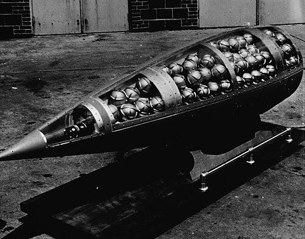

# Mina kasetowa KPOM-2
### KPOM-2 Cluster Submunition | КПОМ-2

---

## Opis

KPOM-2 (Кассетный Противопехотный Осколочный Минный элемент-2) to rosyjski element minowy kasetowy — mały submunition odłamkowy rozsypywany z rakiet artyleryjskich wieloprowadnicowych (BM-21 Grad, BM-30 Smierć) lub bomb lotniczych kasetowych. Każda rakieta Grad może przenosić dziesiątki elementów KPOM-2, które po wyrzuceniu rozsypują się nad obszarem docelowym i po kontakcie z ziemią natychmiast aktywują się — tworząc pole mini-min w promieniu kilkudziesięciu metrów. KPOM-2 ma zapalnik uderzeniowy i mechanizm autodestrukcji (zazwyczaj zawodny). Bardzo trudna do wykrycia i rozbrojenia ze względu na mały rozmiar. Stosowana masowo w Syrii i na Ukrainie; dokumentowana przez Human Rights Watch jako zagrożenie dla ludności cywilnej.

## Dane techniczne

| Parametr | Wartość |
|----------|---------|
| Typ | Kasetowy submunition przeciwpiechotny |
| Kraj produkcji | Rosja |
| Dostarczanie | Rakiety BM-21 Grad, BM-30 Smierć |
| Masa | ok. 0,5 kg |
| Ładunek | ok. 40–60 g materiału wybuchowego |
| Zasięg rażenia | kilka metrów |
| Autodestrukcja | Teoretyczna (często zawodna) |
| Aktywacja | Uderzeniowa |

## Charakterystyczne cechy rozpoznawcze

> Jak odróżnić KPOM-2 od innych submunitions i granatów:

- **Bardzo mały rozmiar — "miniaturowy granat" leżący na ziemi:** KPOM-2 jest mały i lekki; po rozsypaniu leży na ziemi wśród innych odłamków i śmieci wojennych; łatwo pomylić z kawałkiem metalu, kamieniem lub śmieciem
- **Charakterystyczny cylindryczny lub kanciasty kształt ze stabilizatorem:** KPOM-2 ma małe "ogonki" lub stabilizatory zapewniające prawidłową orientację przy opadaniu; te małe stabilizatory są widoczne przy bliskim oglądaniu
- **Różnobarwne — zielone, szare lub żółtawe — bez wyraźnego oznakowania:** KPOM-2 nie ma wyraźnych oznaczeń kolorystycznych widocznych z odległości; wygląda jak "mały kawałek sprzętu wojskowego" bez wskazania, co to jest
- **Rozsypane grupami po ataku artyleryjskim — "konstelacja" małych obiektów:** po ataku Gradem lub Smierczem z głowicami kasetowymi teren jest pokryty grupami KPOM-2; saperzy identyfikują "pole submunitions" po charakterystycznym wzorze rozsypania wielu małych obiektów
- **Niewykrywalne wzrokiem po zamarznięciu lub przysypaniu śniegiem/błotem:** na Ukrainie zimą 2022–2023 KPOM-2 pokryte śniegiem były niewidoczne; wiosną topnienie śniegu "ujawniało" pole min, które tam przez całą zimę leżało
- **Zawodna autodestrukcja — pozostają aktywne długo po ataku:** jak PFM-1 i POM-2, KPOM-2 ma mechanizm autodestrukcji, który często zawodzi; raport Human Rights Watch z 2022 roku dokumentuje KPOM-2 aktywne tygodnie po ataku

## Ciekawostka

> KPOM-2 i inne submunitions kasetowe są tematem Konwencji o amunicji kasetowej (2008), którą podpisało ponad 110 państw — ale nie Rosja ani Ukraina. Kiedy w 2023 roku USA dostarczyły Ukrainie amunicję kasetową (do armat M777 i haubic M109), wywołało to ogromną debatę — bo Ukraina używała jej do rażenia rosyjskich pozycji, ale Rosja wciąż stosuje KPOM-2 i inne submunitions na ukraińskim terytorium cywilnym. Human Rights Watch dokumentuje, że obie strony używają submunitions kasetowych — ale Rosja robi to na terenach cywilnych wielokrotnie częściej i na większą skalę.

