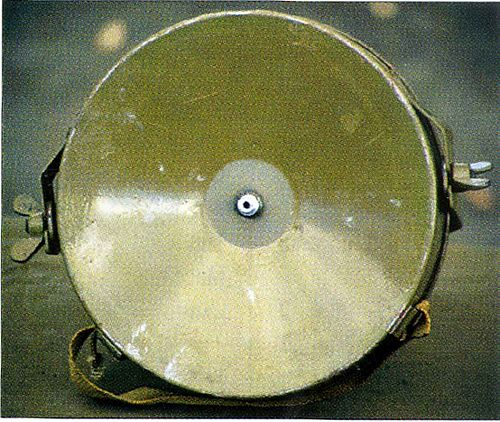

# Mina kierunkowa MON-100
### MON-100 Directional Mine | МОН-100

---

## Opis

MON-100 (Мина Осколочная Направленного действия-100) to radziecka duża mina kierunkowa odłamkowa, opracowana jako "ciężka siostra" MON-50. Zawiera 2000 g RDX i 400 stalowych kulek 12 mm — znacznie większych od kulek MON-50 (6 mm). Kąt sektora rażenia to 30° (węższy niż 54° MON-50), ale zasięg śmiercionośny wynosi 100 m zamiast 50 m — co daje ponad dwukrotnie głębszą strefę rażenia. MON-100 jest przeznaczona do rażenia celów w większej odległości i do zatrzymywania kolumn pojazdów (kulki 12 mm mogą penetrować lekkimi pancerzami). Aktywowana elektrycznie lub przez zapalnik naciskowy/optyczny. Stosowana w zasadzkach i obronie stałych pozycji.

## Dane techniczne

| Parametr | Wartość |
|----------|---------|
| Typ | Duża kierunkowa mina odłamkowa |
| Kraj produkcji | ZSRR / Rosja |
| Rok wprowadzenia | lata 70. |
| Masa | 5,0 kg |
| Masa ładunku | 2 000 g RDX |
| Wymiary | 235 × 80 mm (okrągła) |
| Liczba kulek | 400 (12 mm stal) |
| Kąt sektora rażenia | 30° (poziomo) |
| Strefa śmierci | do 100 m |
| Aktywacja | Elektryczna |

## Charakterystyczne cechy rozpoznawcze

> Jak odróżnić MON-100 od MON-50 i innych min kierunkowych:

- **Okrągła forma "tarczy" lub "fryzbee" z wypukłością — inny kształt niż prostokątny MON-50:** MON-100 ma okrągłą lub eliptyczną formę (nie prostokątną jak MON-50); wygląda jak okrągła "tarcza" lub "fryzbee"; ten okrągły kształt jest pierwszym identyfikatorem różniącym MON-100 od MON-50
- **Wyraźnie większa i cięższa od MON-50 — 5 kg vs 2 kg:** MON-100 jest 2,5 razy cięższa od MON-50; przy transporcie wyraźna różnica masy; "ciężka okrągła tarcza" vs "lekka prostokątna deska"
- **Szerszy kąt 30° vs 54° MON-50 — węższy sektor, głębszy zasięg:** MON-100 robi węższy but głębszy lejek rażenia; taktycznie przeznaczona do rażenia wąskiego pasa ale głębiej; MON-50 pokrywa szerszy sektor ale płycej
- **Montowana nieruchomo — ciężka do przeniesienia i instalacji:** ze względu na masę 5 kg, MON-100 jest zazwyczaj montowana stacjonarnie na stałych pozycjach; MON-50 (2 kg) jest bardziej "mobilna" i często stosowana w zasadzkach ruchomych
- **Kabel elektryczny detonatora — identyczny jak MON-50:** MON-100 jak MON-50 jest aktywowana elektrycznie; charakterystyczny kabel elektryczny wychodzący od miny; przy polu min z MON-100 widoczna sieć kabli biegnących do centralnego stanowiska detonacji
- **Napis cyrylicą na stronie rażenia — identycznie jak MON-50:** MON-100 ma napis wskazujący kierunek na stronie rażącej; cyrylica identyczna jak w MON-50; standardowa cecha rosyjskich min kierunkowych

## Ciekawostka

> MON-100 jest uznawana za "myśliwską" wersję miny kierunkowej — zaprojektowaną do rażenia celów w odległości 50–100 m, gdzie MON-50 jest już nieskuteczna. Na ukraińskim froncie obrońcy stosowali MON-100 jako drugą linię obrony zasadzkowej za MON-50 — schemat: MON-50 "przywita" pierwszą falę na 50 m, MON-100 razi podchodzące posiłki na 100 m. Ta dwupozycyjna zasadzka minowa jest zalecaną techniką w rosyjskim i ukraińskim podręczniku saperskim. Rosja stosowała tę technikę w Syrii do ochrony dróg zaopatrzenia przed atakami piechoty.

