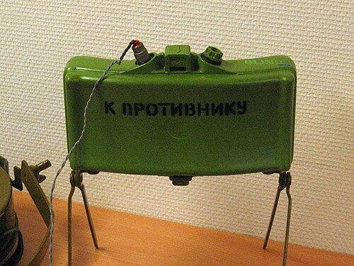

# Mina kierunkowa MON-50
### MON-50 Directional Mine | МОН-50

---

## Opis

MON-50 (Мина Осколочная Направленного действия-50 — Mina Odłamkowa Kierunkowa-50) to radziecka mina kierunkowa odłamkowa, odpowiednik zachodniej M18 Claymore, opracowana w latach 60. i przyjęta do służby. Zawiera 485 g RDX i 540 stalowych kulek 6 mm — przy detonacji wystrzeliwuje je łukiem 54° poziomo i 9° pionowo na odległość do 50 m skuteczności (strefa śmierci do 60 m). MON-50 jest aktywowana elektrycznie (kabel) lub przez zapalnik optyczny/naciskowy. Może być montowana na kołkach lub przytwierdzona do drzew/ścian. W odróżnieniu od PMN, MON-50 jest bronią taktyczną kontrolowaną przez żołnierza — zazwyczaj nie jest miną "czekającą", ale detonowaną zdalnie podczas zasadzki. Szeroko stosowana w Syrii, Czeczenii i na Ukrainie.

## Dane techniczne

| Parametr | Wartość |
|----------|---------|
| Typ | Kierunkowa mina odłamkowa |
| Kraj produkcji | ZSRR / Rosja |
| Rok wprowadzenia | lata 60. |
| Masa | 2,0 kg |
| Masa ładunku | 485 g RDX |
| Wymiary | 230 × 150 × 85 mm |
| Liczba kulek | 540 (6 mm stal) |
| Kąt sektora rażenia | 54° (poziomo) × 9° (pionowo) |
| Strefa śmierci | do 60 m |
| Aktywacja | Elektryczna / optyczna / nacisk |

## Charakterystyczne cechy rozpoznawcze

> Jak odróżnić MON-50 od PMN i M18 Claymore:

- **Prostokątna "deseczka" z wypukłą stroną — zupełnie inny kształt niż okrągłe miny:** MON-50 ma charakterystyczny prostokątny kształt jak "wygięta deska" — 23 cm × 15 cm, wypukła z przodu; zupełnie inny od okrągłej PMN i cylindrycznej OZM-72; ten prostokątny kształt jest natychmiastowym identyfikatorem
- **Napis "СТРЕЛЯЕТ В ЭТУ СТОРОНУ" (Strzela w tę stronę) na wypukłej stronie:** MON-50 ma wygrawerowany napis na wypukłej stronie wskazujący kierunek odłamków; zachodnia M18 Claymore ma napis "FRONT TOWARD ENEMY"; widok napisu cyrylicą jednoznacznie identyfikuje rosyjską minę
- **Cztery nóżki ze skręcanymi kołkami do montażu w ziemi:** MON-50 ma charakterystyczne cztery skośne nóżki/podpory, na których jest montowana — jak "mała deska na czterech nóżkach"; ta podstawa jest widoczna przy zamontowanej minie
- **Kabel elektryczny lub przewód detonatora wychodzący z boku:** MON-50 aktywowana elektrycznie ma charakterystyczny kabel elektryczny wychodzący z boku ku stanowisku detonatora; widok kabla biegnącego przez teren to sygnał miny kierunkowej
- **Montowana na drzewach, ścianach i ogrodzeniach — nie zakopywana:** MON-50 często jest przymocowywana do drzew, ścian lub słupów zamiast zakopywania; widok "deski przymocowanej do drzewa na wysokości talii" jest charakterystyczny dla pola zasadzki z MON-50
- **Bez zakopywania — widoczna na powierzchni:** w odróżnieniu od PMN i OZM-72, MON-50 jest zazwyczaj widoczna (jeśli jej nie ukryto specjalnie); saperzy szukają jej wzrokiem, nie metalodektorem

## Ciekawostka

> MON-50 i jej zachodnia siostra M18 Claymore zostały zaprojektowane niezależnie w tym samym czasie i działają niemal identycznie — co jest jednym z ciekawszych przykładów "równoległej ewolucji" w historii uzbrojenia. Obie miny mają napisy skierowane do użytkownika ("strzela w tę stronę"), bo doświadczenie pokazało, że żołnierze MYLILI strony i detonowali je w nieodpowiednim kierunku. W czasie zimnej wojny obie strony zakładały u siebie zdobyczne miny przeciwnika i odkryły, że mogą używać amunicji zamiennie — bo zapalniki elektryczne miały te same specyfikacje napięcia i wtyki.

