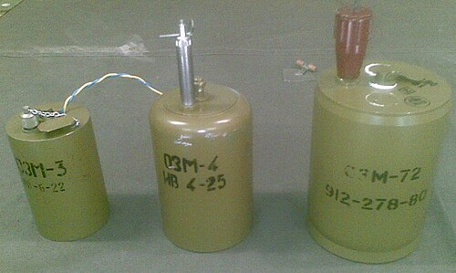

# Mina przeciwpiechotna OZM-72
### OZM-72 Bounding Mine | ОЗМ-72

---

## Opis

OZM-72 (Осколочная Заградительная Мина-72 — Odłamkowa Zagradzająca Mina-72) to radziecka wyskakująca mina przeciwpiechotna odłamkowa (bounding mine) opracowana i przyjęta do służby w 1972 roku. Gdy aktywowana (drut lub nacisk), mina wyskakuje na wysokość 0,5–1 m nad powierzchnię ziemi i dopiero wtedy eksploduje — rażąc odłamkami poziomo w promieniu do 25 m. Wybuchwanie nad ziemią czyni ją kilkakrotnie skuteczniejszą wobec piechoty niż miny detonujące pod ziemią (których odłamki lecą głównie w górę i są częściowo absorbowane przez grunt). OZM-72 jest jedną z najgroźniejszych min przeciwpiechotnych — odpowiedzialna za bardzo wysokie straty wśród żołnierzy i ludności cywilnej.

## Dane techniczne

| Parametr | Wartość |
|----------|---------|
| Typ | Wyskakująca mina odłamkowa (bounding mine) |
| Kraj produkcji | ZSRR / Rosja |
| Rok wprowadzenia | 1972 |
| Masa | 5,0 kg |
| Masa ładunku | 660 g A-IX-1 |
| Średnica cylindra | 108 mm |
| Wysokość | 172 mm |
| Zasięg odłamków | 25 m |
| Aktywacja | Drut tripwire lub nacisk |

## Charakterystyczne cechy rozpoznawcze

> Jak odróżnić OZM-72 od PMN i min kierunkowych MON:

- **Cylindryczna forma — "słoik" lub "puszka" stojąca w ziemi:** OZM-72 jest cylindryczna — jak metalowy słoik 10 cm średnicy; wizualnie zupełnie inny od płaskiej PMN; po częściowym zakopaniu widoczny jest cylindryczny wierzch wyrastający z ziemi
- **Widoczna antena lub drut tripwire wyciągnięty w teren:** OZM-72 jest zazwyczaj aktywowana drutem tripwire — cienki drut rozciągnięty przy ziemi między miną a kołkiem w odległości 5–15 m; widoczny przy uważnym oglądaniu terenu jako "nitka" przy ziemi; PMN nie ma drutu
- **Charakterystyczny "wyrzutnik" — mina wylatuje w górę przed eksplozją:** to cecha, którą można zaobserwować (przy dużym szczęściu lub na nagraniach): OZM-72 najpierw wyskakuje z ziemi (głośny "puff"), zanim nastąpi eksplozja; odróżnia to wyraźnie od min detonujących natychmiast
- **Zakopana głębiej niż PMN — tylko wierzch wystaje:** OZM-72 jest zakopana tak, że cylindryczny wierzch jest na poziomie gruntu lub kilka cm powyżej; saperzy szukają charakterystycznej "puszki" przy powierzchni
- **Cięższa i większa od PMN — 5 kg vs 550 g:** OZM-72 jest prawie 10 razy cięższa od PMN; przy transporcie i instalacji obsługa dźwiga wyraźnie większe i cięższe urządzenie
- **Pole min OZM-72 — wiele "słoiczków" rozstawionych w terenie z drutami między nimi:** pole min OZM-72 można rozpoznać (przy wiedzy i doświadczeniu) po siatce drutów tripwire między zainstalowanymi minami; sapera szkolony rozpoznaje to jako "pole wyskakujących min"

## Ciekawostka

> OZM-72 jest wyjątkowo niebezpieczna dla rozbrajających, bo drut tripwire może być zamontowany przez wroga tak, aby aktywacja nastąpiła przy... demontażu miny. Czyli saper wyciągający OZM-72 z ziemi może aktywować dodatkowy drut zabezpieczający podłączony do innej miny. Ta "pułapka na saperów" była stosowana przez siły rosyjskie w Syrii i na Ukrainie — sprawiając, że tempo oczyszczania pól minowych dramatycznie spada. HALO Trust (organizacja rozminowywania) szacuje, że OZM-72 należy do najtrudniejszych i najniebezpieczniejszych min do rozbrajania spośród wszystkich sowieckich/rosyjskich typów.

