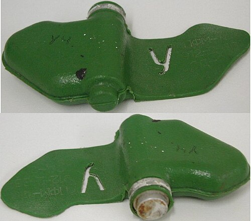

# Mina-motyl PFM-1
### PFM-1 Butterfly Mine | ПФМ-1 («Попугай», «Бабочка»)

---

## Opis

PFM-1 (Противопехотная Фугасная Мина-1, potocznie "Motyl" lub "Papuga") to radziecka mina lotnicza rozsypywana z powietrza, opracowana w latach 70. i stosowana masowo w Afganistanie od 1979 roku. Charakterystyczny kształt "motyla" lub "kolibrzącej zabawki" — asymetryczne plastikowe skrzydełka spowalniają opadanie i powodują losowe lądowanie w pozycji gotowości. Mina zawiera zaledwie 37 ml ciekłego materiału wybuchowego DMDNB (nitroestry) — wystarczające do odjęcia stopy lub dłoni przy aktywacji przez nacisk powyżej 4–12 kg. Brak metalu (plastikowa obudowa) czyni ją niemal niewykrywalną metalodektorem. Używana masowo w Afganistanie, Angoli, Mozambiku i Syrii — i uznawana za jedną z najbardziej "humanitarnie problematycznych" broni XX wieku.

## Dane techniczne

| Parametr | Wartość |
|----------|---------|
| Typ | Lotnicza rozsypywana mina naciskowa |
| Kraj produkcji | ZSRR / Rosja |
| Rok wprowadzenia | ok. 1979 (Afganistan) |
| Masa | 77 g |
| Masa ładunku | 37 ml DMDNB (ciekły) |
| Wymiary | 120 × 63 mm |
| Ciśnienie aktywacji | 4–12 kg |
| Czas życia aktywnej | miesiące do lat |
| Autodestrukcja | BRAK |

## Charakterystyczne cechy rozpoznawcze

> Jak odróżnić PFM-1 od innych min i "nie pomylić z zabawką":

- **Charakterystyczny kształt "skrzydlaty" — jak motyl lub helikopter z tworzywa:** PFM-1 ma unikalny asymetryczny kształt z dwoma "skrzydełkami" — wygląda jak plastikowa zabawka, ptaszek lub liść; żadna inna mina nie wygląda tak; ten kształt jest absolutnym identyfikatorem
- **Jasnozielony, oliwkowy lub beżowy kolor plastiku — prawie jak zabawka:** PFM-1 jest wykonana z ciemnooliwkowego lub jasnozielonego twardego plastiku; na piaszczystym lub kamienistym terenie jest niemal niewidoczna; na trawie lub liściach wygląda jak kawałek plastiku lub zabawka
- **Mała — 12 × 6 cm — można ją pomylić z ptaszkiem lub liściem:** PFM-1 jest mała i lekka; wśród kamieni, liści i roślinności jest wyjątkowo trudna do dostrzeżenia; to właśnie jej główna cecha "stealth" — kamufluje się jako śmieć lub liść
- **Brak metalu — metalodetektor jej nie wykryje:** PFM-1 jest w całości plastikowa; standardowe metalodektory są przy niej bezużyteczne; do wykrywania potrzeba specjalnych technik (sonda, radar GPR, psy wyszkolone do wykrywania min)
- **Leży na powierzchni — nie zakopywana:** jak PTM-3 i POM-2, PFM-1 ląduje na powierzchni; nie jest zakopywana; leży na ziemi wśród naturalnych elementów terenu
- **BRAK autodestrukcji — może być aktywna latami:** PFM-1 nie ma żadnego mechanizmu autodestrukcji; ciekły materiał wybuchowy DMDNB może być aktywny przez miesiące lub lata; to jedna z najdłużej pozostających aktywnych min

## Ciekawostka

> PFM-1 "Motyl" stała się symbolem jednej z największych kontrowersji humanitarnych zimnej wojny. W Afganistanie radzieckie śmigłowce Mi-8 rozsypywały miny PFM-1 mieszane z zabawkami — bo dowódcy radzieccy mieli nadzieję, że afghańskie dzieci będą zbierać "kolorowe zabawki" i detonować miny, zmuszając rodziny do porzucenia wiosek. ONZ nigdy nie potwierdziło oficjalnie tej taktyki mieszania z zabawkami, ale odniesieniach afgańskich ocalałych i w dokumentacjach ICRC z lat 1980–1988 znaleziono liczne relacje o cierpieniu dzieci po zbieraniu "motylich zabawek". PFM-1 do dziś leży w górach Afganistanu i co roku okalecza dzieci.

