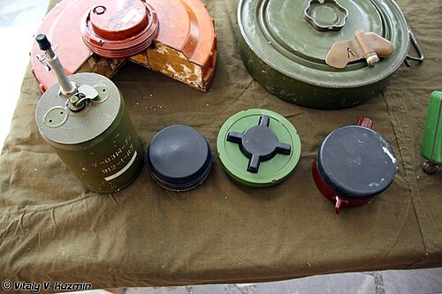

# Mina przeciwpiechotna PMN-2
### PMN-2 Anti-Personnel Mine | ПМН-2

---

## Opis

PMN-2 to radziecka modernizacja miny PMN, opracowana w 1979 roku, wyróżniająca się obudową z prawie wyłącznie tworzywa sztucznego — znacznie utrudniającą wykrycie metalodektorem. Okrągła, płaska forma (jak PMN) z gumową czarną pokrywą naciskową; aktywacja przy nacisku 5–25 kg; ładunek 100 g TNT amputuje stopę lub niszczy kończynę do kolana. Brak metalu w obudowie (jedyną metalową częścią jest iglica zapalnika — kilka gramów stali) czyni PMN-2 jedną z "najtrudniejszych" min do wykrycia i jedną z najbardziej problematycznych humanitarnie spośród radzieckich min. Stosowana masowo w Afganistanie od 1979 roku, Angoli, Mozambiku, Syrii i na Ukrainie.

## Dane techniczne

| Parametr | Wartość |
|----------|---------|
| Typ | Nacisgowa mina przeciwpiechotna (trudna do wykrycia) |
| Kraj produkcji | ZSRR / Rosja |
| Rok wprowadzenia | 1979 |
| Masa | 400 g |
| Masa ładunku | 100 g TNT |
| Średnica | 120 mm |
| Wysokość | 54 mm |
| Ciśnienie aktywacji | 5–25 kg |
| Zawartość metalu | minimalna (iglica ~8 g stali) |

## Charakterystyczne cechy rozpoznawcze

> Jak odróżnić PMN-2 od PMN i innych min AP:

- **Plastikowa obudowa beżowo-szara lub jasna — nie ciemnozielona jak PMN:** PMN-2 ma plastikową obudowę w kolorze szarobeżowym, jasnooliwkowym lub jasnym szarym; PMN jest ciemnozielona lub szara metaliczna; kolor jest pierwszą wskazówką odróżniającą PMN od PMN-2
- **Gumowa czarna pokrywa naciskowa — taka jak PMN:** oba granaty mają identyczną czarną gumową pokrywę naciskową; ta część jest jedynym "wspólnym" elementem wizualnym PMN i PMN-2; pokrywa "gumowe kółko" jest widoczne w obu minach
- **Plastikowa obudowa — "matowy plastik" zamiast "błyszczący metal":** PMN-2 w dotyku i wyglądzie jest wyraźnie "plastikowa"; PMN ma metaliczne wykończenie; na zdjęciach bliskich różnica tekstury jest widoczna; przy trzymaniu miny różnica materiału jest natychmiastowa
- **Metalodetektor nie wykrywa — efektywna tylko sondera ręczna lub pies saperski:** saperzy w terenie, którzy "nie dostają sygnału" od metalodektora, ale sonda trafia w twardy obiekt pod ziemią — mogą mieć do czynienia z PMN-2; to cecha taktyczna rozpoznawalna przez doświadczonych saperów
- **Rozmiar identyczny z PMN — 12 cm średnicy:** PMN i PMN-2 mają prawie identyczne rozmiary; odróżnienie po samym rozmiarze jest niemożliwe; potrzeba oceny koloru i materiału obudowy
- **Bardzo długa żywotność — aktywna przez dziesiątki lat:** PMN-2 z TNT jest aktywna przez dziesiątki lat; saperzy znajdowali sprawne PMN-2 w Angoli i Mozambiku po 30–40 latach od zakończenia konfliktów

## Ciekawostka

> PMN-2 jest jedną z broni, których pojawienie się w Afganistanie w 1979 roku spowodowało pilną rewizję standardów saperskich NATO. Do 1979 roku standardowy metalodetektor był uważany za wystarczający sprzęt do wykrywania min; po analizach afgańskich pól minowych okazało się, że PMN-2 "jest niewidzialna". USA i Wielka Brytania przyspieszyły rozwój alternatywnych technologii wykrywania (radary GPR, psy wykrywające materiały wybuchowe) właśnie w odpowiedzi na PMN-2. To jeden z przykładów, jak konkretna broń wymusiła zmiany w globalnych standardach saperskich.

