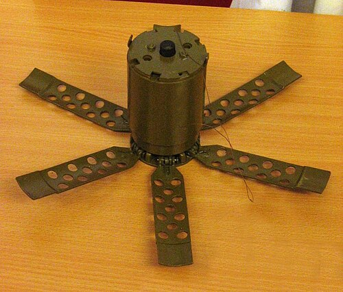

# Mina przeciwpiechotna POM-2
### POM-2 Anti-Personnel Mine | ПОМ-2

---

## Opis

POM-2 (Противопехотная Осколочная Мина-2 — Przeciwpiechotna Odłamkowa Mina-2) to radziecka rozsypywana mina przeciwpiechotna przeznaczona do stosowania z systemów artyleryjskich i lotniczych, opracowana w latach 70.–80. Po wylądowaniu mina automatycznie rozkłada kilka cienkich "wąsów" (druciane tripwire) na długości 10 m każdy — tworząc "pajęczynę" drutów tripwire wokół siebie; dotknięcie któregokolwiek druta aktywuje ładunek odłamkowy niszczący w promieniu 16 m. POM-2 jest uważana za wyjątkowo niebezpieczną — po rozsypaniu tworzy "niewidzialną pułapkę" z drutami praktycznie niemożliwymi do zauważenia w terenie roślinnym. Podlega krytyce ze względu na wysoki odsetek zawodności autodestrukcji.

## Dane techniczne

| Parametr | Wartość |
|----------|---------|
| Typ | Rozsypywana mina odłamkowa z tripwire |
| Kraj produkcji | ZSRR / Rosja |
| Rok wprowadzenia | lata 80. |
| Masa | 1,4 kg |
| Masa ładunku | 140 g A-IX-1 |
| Czas autodestrukcji | 4–100 godzin |
| Zasięg rażenia | 16 m |
| Długość drutów tripwire | do 10 m (4–6 drutów) |
| Aktywacja | Drut tripwire (napięcie ok. 500 g) |

## Charakterystyczne cechy rozpoznawcze

> Jak odróżnić POM-2 od OZM-72 i PMN:

- **Plastikowa cylindryczna forma z charakterystycznym "kwiatkiem" drutów:** POM-2 po lądowaniu rozkłada kilka cienkich drutów promieniście jak "promienie gwiazdy" lub "płatki kwiatu" wokół cylindrycznej tuby; ten wzór "mina + druty promieniście" jest charakterystyczny i unikalny
- **Cienkie, niemal niewidoczne druty tripwire ciągnące się 10 m od miny:** druty tripwire POM-2 są wyjątkowo cienkie i trudne do zauważenia (szczególnie w trawie lub na ziemi pokrytej liśćmi); saperzy szukają ich wyjątkowo ostrożnie używając lusterek i latarek pod niskim kątem
- **Leży na powierzchni po rozsypaniu — nie zakopywana:** jak PTM-3, POM-2 jest rozsypywana z powietrza i leży na powierzchni; nie jest zakopana; cylindryczna mina leżąca na ziemi z rozpostartymi drutami jest widoczna dla doświadczonego sapera
- **Cylindryczna forma z "kapslem" i małą antenką na górze:** POM-2 ma charakterystyczny cylindryczny kształt z widocznym zapalnikiem i mechanizmem rozkładania drutów na górze; wygląda jak "mała kapsuła" z "antenkami"
- **Rozsypywana grupami — widoczne "konstelacje" min na terenie:** po rozsypaniu przez artylerię lub śmigłowiec, POM-2 leżą w charakterystycznych grupach na terenie; saperzy identyfikują zainfekowany teren po wzorze rozsypania (jedno działo = jedna "konstelacja")
- **Autodestrukcja (teoretyczna) — praktycznie zawodna:** POM-2 ma mechanizm autodestrukcji, ale Human Rights Watch dokumentuje przypadki, gdzie > 30% egzemplarzy nie uległo autodestrukcji w czasie; teren zaminowany POM-2 jest traktowany jako trwałe zagrożenie

## Ciekawostka

> POM-2 jest jedną z min, którą Human Rights Watch w 2022 roku udokumentowała jako stosowaną przez Rosję na Ukrainie w obszarach zaludnionych — co jest możliwym naruszeniem prawa humanitarnego. Małe, cienkie druty tripwire POM-2 są praktycznie niewidoczne dla ludności cywilnej, a mechanizm autodestrukcji zawodzi zbyt często, by mina mogła być uznana za "samolikwidującą się" w sensie traktatowym. Ukraińskie służby rozminowywania raportują, że oczyszczanie terenów z POM-2 jest jednym z najtrudniejszych zadań ze względu na niewidzialność drutów i ryzyko detonacji przy próbie usunięcia.

