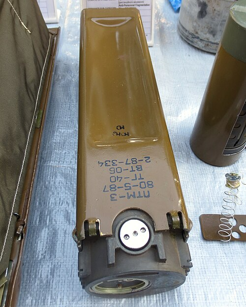

# Mina przeciwpancerna PTM-3
### PTM-3 Anti-Tank Mine | ПТМ-3

---

## Opis

PTM-3 (Противотанковая Мина-3) to radziecka rozsypywana mina przeciwpancerna kalibru 275 mm, opracowana i przyjęta do służby w 1978 roku do stosowania z systemów minowania artyleryjskiego i lotniczego. W odróżnieniu od TM-62, PTM-3 nie jest zakopywana ręcznie — jest rozsypywana przez działa artyleryjskie (system UMZ), śmigłowce lub samoloty i po kontakcie z ziemią "samoczynnie" przyjmuje pozycję gotowości. Ma zapalnik z mechanizmem autodestrukcji (po 16–24 godzinach lub 40 dniach w zależności od ustawienia) — co częściowo redukuje długotrwałe zagrożenie humanitarne. PTM-3 jest miną przeciwpancerną kumulacyjną — skierowana dnem ku górze, wybucha pod pojazdem eksplodując w stronę spodu kadłuba.

## Dane techniczne

| Parametr | Wartość |
|----------|---------|
| Typ | Rozsypywana mina przeciwpancerna (FASCAM) |
| Kraj produkcji | ZSRR / Rosja |
| Rok wprowadzenia | 1978 |
| Masa | 1,6 kg |
| Masa ładunku | 1,0 kg RDX |
| Średnica | 275 mm |
| Czas autodestrukcji | 16–24 h lub 40 dni (ustawialny) |
| Aktywacja | Magnetyczna / naciskowa |
| Przenikanie pancerza | 100–120 mm stali |

## Charakterystyczne cechy rozpoznawcze

> Jak odróżnić PTM-3 od TM-62 i zakopywanych min AP:

- **Płaska, dyskoidalna forma — "frisbee" lub "latający talerz":** PTM-3 ma charakterystyczny płaski, okrągły kształt jak dysk lub spodek latający; po wylądowaniu leży poziomo na ziemi; całkowicie inny od cylindrycznej TM-62 i prostokątnej MON-50
- **Leży na powierzchni — nie zakopywana:** PTM-3 jest rozsypywana z powietrza lub artylerii i leży na powierzchni gruntu; nie jest zakopywana jak TM-62; widoczna mina "disk" leżąca na ziemi to charakterystyczny widok pola zaminowanego PTM-3
- **Małe "nóżki" lub "stopy" stabilizujące przy lądowaniu:** PTM-3 ma małe elementy stabilizujące, które po lądowaniu ustalają właściwą orientację dnem ku górze (tak aby głowica kumulacyjna była skierowana w spód pojazdu); te stabilizatory są widoczne przy bliskim oglądaniu
- **Wyraźnie mniejsza od TM-62 — 275 mm vs 320 mm, 1,6 kg vs 10 kg:** PTM-3 jest lżejsza i mniejsza od TM-62; przy trzymaniu — wyraźnie lżejsza; rozmiar "frisbee" vs "duży talerz" TM-62
- **Często widoczna w grupach po rozsypaniu artyleryjskim:** PTM-3 jest rozsypywana grupami przez jedno działo lub jeden pasaż śmigłowca; na terenie zaminowanym widać je w grupach "kilku-kilkunastu dysków" w promieniu kilkudziesięciu metrów
- **Autodestrukcja po określonym czasie — (teoretycznie) ograniczone zagrożenie trwałe:** PTM-3 ma mechanizm autodestrukcji po 16–40 dniach; jednak ten mechanizm często zawodzi, pozostawiając aktywne miny na długo; zachodnie organizacje rozminowywania traktują PTM-3 jako potencjalnie trwałe zagrożenie

## Ciekawostka

> PTM-3 jest jedną z min, których użycie w Syrii i na Ukrainie dokumentowały organizacje Human Rights Watch i Landmine Monitor, wskazując, że mimo mechanizmu autodestrukcji, znaczna część tych min pozostaje aktywna długo po upływie zadeklarowanego czasu. Rosja, podobnie jak Ukraina, nie jest sygnatariuszem Traktatu Ottawskiego (zakaz min przeciwpiechotnych) — i obie strony używają różnych typów min bez ograniczeń traktatowych. PTM-3 jest "legalną" bronią wojskową w rosyjskiej doktrynie, stosowaną masowo do tworzenia szybkich pól minowych przed natarciem lub wycofywaniem.

