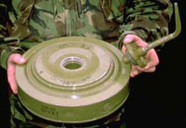

# Mina przeciwpancerna TM-57
### TM-57 Anti-Tank Mine | ТМ-57

---

## Opis

TM-57 (Танковая Мина-57 — Mina Czołgowa-57) to radziecka ciężka nacisgowa mina przeciwpancerna opracowana i przyjęta do służby w 1957 roku jako następnik TM-46. Masywny ładunek 6,5 kg TNT/amatolu daje siłę wybuchu zdolną do przebicia spodu kadłuba nawet ciężkiego czołgu; mina szczególnie skuteczna jest wobec gąsienic i układu jezdnego. Metalowa stalowa obudowa sprawia, że TM-57 jest wykrywalna metalodektorem — ale ze względu na masywną grubość (12 cm) jest trudna do minowania ręcznego. Zapalnik MV-57 aktywuje się przy nacisku ponad 200 kg (silnik pojazdu) lub ponad 120 kg (osie pojazdu). TM-57 jest wycofywana przez nowsze TM-62, ale wciąż jest w magazynach i pojawia się w konfliktach.

## Dane techniczne

| Parametr | Wartość |
|----------|---------|
| Typ | Ciężka nacisgowa mina przeciwpancerna |
| Kraj produkcji | ZSRR |
| Rok wprowadzenia | 1957 |
| Masa | 9,0 kg |
| Masa ładunku | 6,5 kg TNT/Amatol |
| Średnica | 316 mm |
| Wysokość | 120 mm |
| Ciśnienie aktywacji | >120–200 kg |
| Obudowa | Stalowa |

## Charakterystyczne cechy rozpoznawcze

> Jak odróżnić TM-57 od TM-62 i min lżejszych:

- **Starszy projekt — grubsza i masywniejsza obudowa niż TM-62:** TM-57 jest wyraźnie bardziej masywna i grubsza od TM-62 (12 cm vs 12,8 cm, ale TM-57 jest wyraźnie cięższa przez grubszą stalową obudowę); "ciężki stalowy talerz" to opis TM-57
- **Stalowa obudowa z charakterystycznym żebrowaniem lub wzorem:** TM-57 ma ciemnostalową obudowę z charakterystycznym wzorem żeber lub przetłoczeń na górnej płycie; TM-62 ma gładką lub mniej wyraźnie żebrowaną powierzchnię
- **Zapalnik MV-57 ze specyficznym kapturkiem:** zapalnik TM-57 ma charakterystyczny kapturek i sposób montażu; znający miny saper rozróżnia zapalniki TM-57 i TM-62 po formie zapalnika
- **Starsza technologia — bardziej "archaiczny" wygląd od TM-62:** TM-57 wygląda jak broń z lat 50. — co jest zgodne z prawdą; grubsze połączenia, mniej ergonomiczne detale, inne przetłoczenia; TM-62 jest z lat 60. i wyraźnie "nowocześniejsza"
- **Masa 9 kg — podobna do TM-62 (9,5–10 kg) — ciężka mina AT:** przy transportowaniu miny saper czuje ciężar zbliżony do TM-62; odróżnienie po samej masie jest trudne — potrzeba oglądania obudowy
- **Coraz rzadsza — wypierana przez TM-62 w aktywnych stockach:** TM-57 pojawia się głównie w starych magazynach lub na polach minowych z lat 60.–80.; na nowych polach minowych dominuje TM-62; "stara mina" jest identyfikatorem epoki zakładania pola

## Ciekawostka

> TM-57 była pierwszą radziecką miną przeciwpancerną wystarczająco potężną do niezawodnego zniszczenia ciężkich czołgów amerykańskich M60 i M48. Wcześniejsza TM-46 była projektowana pod czołgi WWII i w testach z lat 50. okazała się niewystarczająca wobec nowego ciężkiego opancerzenia. TM-57 z 6,5 kg materiału wybuchowego przebijała spód M60 i niszczyła przedział silnikowy. To wymaganie taktyczne — "mina musi zniszczyć M60" — dyktowało parametry całej rodziny TM-57/TM-62 i jest eleganckim przykładem, jak konkretne zagrożenie operacyjne kształtuje parametry broni.

