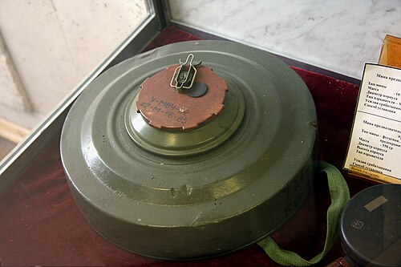

# Mina przeciwpancerna TM-62M
### TM-62M Anti-Tank Mine | ТМ-62М

---

## Opis

TM-62M (Танковая Мина-62М — Mina Czołgowa-62M) to radziecka nacisgowa mina przeciwpancerna z metalową obudową, opracowana w 1962 roku jako modernizacja TM-57. Jest jedną z najszerzej stosowanych min przeciwpancernych na świecie — produkowana w licznych wariantach (TM-62B z drewnianą obudową, TM-62P z plastikową) i eksportowana do ponad 50 krajów. Okrągła obudowa z naciągową płytą — wybucha przy nacisku ponad 200–500 kg, co powoduje eksplozję 7–8 kg TNT niszczącą gąsienice, koła lub podwozie pojazdu opancerzonego. Wersja TM-62P2 i TM-62P3 mają plastikową obudowę trudną do wykrycia metalodektorem. Szeroko stosowana na Ukrainie.

## Dane techniczne

| Parametr | Wartość |
|----------|---------|
| Typ | Nacisgowa mina przeciwpancerna |
| Kraj produkcji | ZSRR / Rosja |
| Rok wprowadzenia | 1962 |
| Masa | 9,5–10 kg |
| Masa ładunku | 7,0–8,0 kg TNT |
| Średnica | 320 mm |
| Wysokość | 128 mm |
| Ciśnienie aktywacji | 200–500 kg |
| Wersje | TM-62M (metal), TM-62B (drewno), TM-62P (plastik) |

## Charakterystyczne cechy rozpoznawcze

> Jak odróżnić TM-62M od PMN i PTM-3:

- **Duży okrągły "talerz" — wyraźnie większy od min przeciwpiechotnych:** TM-62M ma średnicę 32 cm — wyraźnie większa od okrągłych min przeciwpiechotnych PMN (11 cm); "duży okrągły talerz" to natychmiastowy identyfikator miny przeciwpancernej
- **Wyraźna płyta naciskowa z wgłębieniem pośrodku:** na górze TM-62M widoczna jest okrągła płyta naciskowa z charakterystycznym wgłębieniem lub wzniosłością pośrodku; to element aktywujący przez nacisk pojazdu; charakterystyczny wygląd płyty naciskowej
- **Stalowa (TM-62M), drewniana (TM-62B) lub plastikowa (TM-62P) obudowa — różne kolory:** TM-62M metalowa jest ciemnozielona; TM-62B drewniana ma jasnobeżowy kolor surowego drewna; TM-62P plastikowa jest szarawobiała lub oliwkowa; kolor obudowy zależy od wersji
- **Zakopywana głębiej niż miny przeciwpiechotne — do 10 cm pod powierzchnią:** TM-62M jest zakopywana głębiej; saperzy szukają jej na głębokości 10 cm; nierówności gruntu i charakterystyczne ślady zakopywania (świeżo spulchniona ziemia) mogą ją zdradzić
- **Waga 10 kg — wyraźnie cięższa od min przeciwpiechotnych:** TM-62M waży 10 kg; PMN waży 550 g; przy transporcie w plecaku lub wozie amunicyjnym wyraźna różnica w ciężarze; pole min TM-62M jest zakładane przez pojazdy lub wielu żołnierzy
- **Okrągły kształt z dwiema symetrycznie rozmieszczonymi dziurami (zapalniki):** TM-62M ma dwie otwory na zapalniki umieszczone symetrycznie po obu stronach płyty naciskowej; te otwory są charakterystyczną cechą wizualną przy oglądaniu miny z góry

## Ciekawostka

> TM-62P (plastikowa) jest uważana za jeden z największych problemów humanitarnych związanych z rozminowywaniem, bo wykrywacz metali jej nie wykrywa — a sonda ręczna jest powolna i niebezpieczna. Na polach bitew Angoli, Mozambiku i Kambodży TM-62P leży w ziemi od 40–50 lat i wciąż jest aktywna — bo TNT nie ulega degradacji. Szacuje się, że w samej Angoli w ziemi leży 10–15 milionów TM-62P i PMN-2. HALO Trust i inne organizacje rozminowywania twierdzą, że przy obecnym tempie pracy pełne rozminowanie Angoli zajmie kolejne 20–30 lat.

