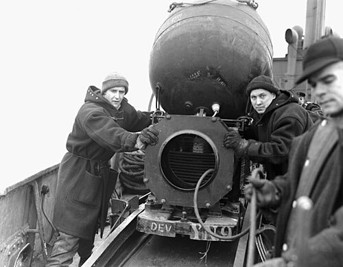

# System minowania UMZ
### UMZ Scatterable Mine System | УМЗ (Универсальный Минный Заградитель)

---

## Opis

UMZ (Универсальный Минный Заградитель — Universalny Minny Zagraditiel — Powszechny Systemu Minowania) to radziecko-rosyjski system rozsypywania min z pojazdów naziemnych, opracowany w latach 70. i przyjęty do służby w 1978 roku. Montowany na ciężarówce (najczęściej Ural-375D lub ZiL-131), pozwala na szybkie minowanie terenu w ruchu — pojazd jadący z prędkością 30–40 km/h rozsypuje miny z pojemników zamontowanych z tyłu. Jeden pojazd może zaminować pas terenu 1–1,5 km długości i 80–100 m szerokości w ciągu kilku minut. UMZ rozsypuje miny PTM-3 (przeciwpancerne), POM-2 (przeciwpiechotne) lub ich kombinacje. Stosowany masowo w Syrii i na Ukrainie.

## Dane techniczne

| Parametr | Wartość |
|----------|---------|
| Typ | Naziemny system rozsypywania min |
| Kraj produkcji | ZSRR / Rosja |
| Rok wprowadzenia | 1978 |
| Platforma | Ural-375D lub ZiL-131 |
| Pojemność | 8 pojemników po 30 min (240 min łącznie) |
| Prędkość minowania | 30–40 km/h |
| Czas minowania pasa 1 km | ok. 2 minuty |
| Szerokość pasa min | 80–100 m |
| Typy min | PTM-3 (PT) / POM-2 (PP) / mieszane |

## Charakterystyczne cechy rozpoznawcze

> Jak odróżnić UMZ od zwykłej ciężarówki i innych systemów minowania:

- **Charakterystyczne metalowe pojemniki-zasobniki na pace ciężarówki:** UMZ ma charakterystyczne 8 prostokątnych metalowych pojemników (zasobniki na miny) zamontowanych na pace ciężarówki; ta "rzędowa" konfiguracja pojemników na tyle pojazdu jest widoczna z daleka i odróżnia UMZ od zwykłej ciężarówki
- **Ciężarówka Ural lub ZiL z charakterystycznym sprzętem z tyłu — "coś wyrzuca":** UMZ w działaniu widoczny jest jako ciężarówka pozostawiająca za sobą "deszcz" min padających na ziemię; ta wizualna cecha — pojazd "rozsypujący przedmioty" — jest rozpoznawalna na zdjęciach lotniczych i nagraniach
- **Przewody sterowania i kable widoczne między pojemnikami:** zestaw UMZ ma charakterystyczne kable i przewody łączące pojemniki z centralnym mechanizmem wyrzutu; ta sieć kabli na pace ciężarówki jest widoczna przy bliskim oglądaniu
- **Rozsypane miny PTM-3 lub POM-2 za przejazdem pojazdu:** efektem działania UMZ jest "pole dyskoidalnych min PTM-3 lub spaghetti drutów POM-2" na drodze przejazdu; zaminowany teren po przejściu UMZ jest rozpoznawalny po wzorze rozsypania min (równoległy pas)
- **Zdjęcia satelitarne lub dronowe — widoczny pas zaminowany:** na nagraniach dronem lub zdjęciach satelitarnych (po wyjściu UMZ) widoczny jest charakterystyczny pas terenu o innej fakturze — "posypany" obiektami PTM-3 lub innymi elementami
- **Szybkie tworzenie pól minowych — UMZ znika po kilku minutach:** specyfika UMZ to szybkość; żołnierze obserwujący teren widzą, że "ciężarówka przejechała i zniknęła"; zaminowany teren pojawia się błyskawicznie, bez długotrwałej pracy saperów w ziemi

## Ciekawostka

> UMZ był jedną z pierwszych broni masowego zaminowania, którą Zachód udokumentował na Ukrainie w 2022 roku. Nagrania drona pokazały pojazdy UMZ szybko zaminowujące drogi i pola przed rosyjskim wycofaniem z obwodu kijowskiego. Tempo zaminowania zaskoczyło ukraińskich saperów — w ciągu jednej nocy jedna ciężarówka UMZ może zaminować kilka kilometrów drogi lub terenu, tworząc barierę minową niemożliwą do szybkiego oczyszczenia. Ukraina szacuje, że 30–40% jej terytorium zajętego przez Rosję jest zaminowane — a UMZ i śmigłowcowe systemy rozsypywania odpowiadają za większość nowych min zakładanych od 2022 roku.

