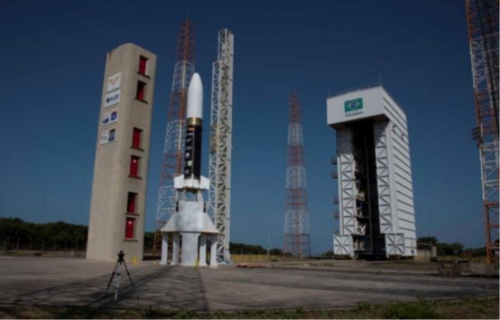

# Mina przeciwpancerna VS-50
### VS-50 Anti-Personnel Mine | ВС-50

---

## Opis

VS-50 to włoska mina przeciwpancerna (produkowana przez Valsella Meccanotecnica) szeroko eksportowana i stosowana przez różne strony konfliktów — w tym Rosję i siły rosyjskie w Syrii i Czeczenii. Choć nie jest rosyjskiej produkcji, jest często confiscated i stosowana przez rosyjskie siły zbrojne i siły powiązane z Rosją. Plastikowa obudowa z prawie zerową zawartością metalu czyni ją niemal niewykrywalną metalodektorem. Aktywowana przez nacisk powyżej 8 kg — eksplozja 40 g materiału wybuchowego amputuje stopę lub niszczy kończynę dolną. Pojawia się regularnie na terenach kontrolowanych przez siły rosyjskie i prorosyjskie w Syrii i Donbasie.

## Dane techniczne

| Parametr | Wartość |
|----------|---------|
| Typ | Mina naciskowa (głównie przeciwpiechotna) |
| Kraj produkcji | Włochy (Valsella) |
| Masa | 185 g |
| Masa ładunku | 40 g PETN |
| Średnica | 90 mm |
| Wysokość | 45 mm |
| Ciśnienie aktywacji | 8 kg |
| Zawartość metalu | prawie zerowa |

## Charakterystyczne cechy rozpoznawcze

> Jak odróżnić VS-50 od PMN i min zachodnich:

- **Bardzo mała i płaska — mniejsza od PMN:** VS-50 ma tylko 90 mm średnicy i 45 mm wysokości; wyraźnie mniejsza od PMN (110 mm, 53 mm); "miniaturowy krążek" przy porównaniu
- **Żółty lub beżowy plastik — "jasny kolor" odróżnia od ciemnej PMN:** VS-50 jest zazwyczaj jasnobeżowa lub żółtawa; PMN jest ciemnozielona lub szara; kolor jest pierwszym identyfikatorem różniącym obie miny
- **Włoskie oznaczenia lub "Valsella" na obudowie:** na VS-50 czasem widoczne są oznaczenia producenta lub kraju; cyrylica nie pojawia się na VS-50; to oznaczenie jest identyfikatorem zachodniego producenta
- **Niemal "niewidoczna" dla metalodektora:** VS-50 jest tak "plastikowa", że metalodetektor jej nie wykrywa; saperzy traktują ją jak PMN-2 — wymagającą sondy lub specjalnych technik
- **Kontekst użycia — zdobyczna lub dostarczona przez pośredników:** VS-50 w rękach sił rosyjskich lub prorosyjskich jest zawsze "zdobyczna" lub "kupiona przez pośredników"; nie jest oficjalnie produkowana w Rosji; jej obecność na polu walki sugeruje dywersję logistyki lub eksport przez kraje trzecie
- **Płaski kształt "guzika" — bez żadnych widocznych elementów zewnętrznych:** VS-50 z góry wygląda jak gładki okrągły "guzik" bez żadnych sterczących elementów; PMN ma wyraźną gumową pokrywę; VS-50 jest gładka i "czysta"

## Ciekawostka

> VS-50 jest paradoksalnym symbolem globalnego handlu bronią — mina zaprojektowana we Włoszech, produkowana komercyjnie dla "rynków eksportowych", trafiła do rąk stron konfliktów, których Włochy nigdy nie zamierzały wspierać. Human Rights Watch w raportach z lat 90. i 2000. dokumentowała VS-50 w rękach ugrupowań zbrojnych w Angoli, Somalii, Syrii — i przy każdym takim odkryciu Valsella zapewniała, że "nie sprzedawała ich bezpośrednio". Cały globalny handel minami przeciwpiechotnymi był w dużej mierze "nieintencjonalny" — miny kupione legalnie przez jedno państwo trafiały przez pośredników do aktora niepaństwowego lub wroga. To jeden z powodów, dla których Traktat Ottawski zakazał całej klasy broni, a nie tylko konkretnych użytkowników.

