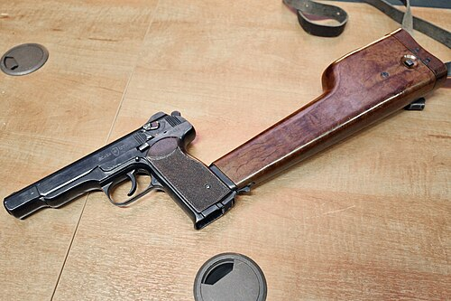

# Pistolet maszynowy APS (Steczkin)
### APS Stechkin Machine Pistol | АПС (Автоматический Пистолет Стечкина)

---

## Opis

APS (Автоматический Пистолет Стечкина — Automatyczny Pistolet Stieczkina) to radziecki pistolet maszynowy-pistolet kalibru 9×18 mm zaprojektowany przez Igora Stieczkina i przyjęty do służby w 1951 roku. Wyróżnia się możliwością prowadzenia ognia automatycznego (750 strz./min) przy użyciu odpinanej kolby-kabury jako stabilizatora. Magazynek 20-nabojowy i ogień automatyczny czynią z APS broń pośrednią między pistoletem a pistoletem maszynowym — przeznaczoną dla oficerów, artylerzystów, załóg pojazdów i sił specjalnych. Oficjalnie wycofany z regularnej służby w 1958 roku ze względu na masę i rozmiary, APS powrócił w latach 80.–90. i jest nadal używany przez siły specjalne i FSB. Posiada kultowy status w popkulturze rosyjskiej.

## Dane techniczne

| Parametr | Wartość |
|----------|---------|
| Typ | Pistolet maszynowy / pistolet automatyczny |
| Kraj produkcji | ZSRR / Rosja |
| Rok wprowadzenia | 1951 |
| Kaliber | 9×18 mm Makarov |
| Długość (bez kolby) | 225 mm |
| Długość (z kolbą złożoną) | 540 mm |
| Długość lufy | 140 mm |
| Masa (bez magazynka) | 1 020 g |
| Pojemność magazynka | 20 nabojów |
| Szybkostrzelność | 750 strz./min (automatycznie) |
| Skuteczny zasięg | 50 m (pistolet) / 150 m (z kolbą) |

## Charakterystyczne cechy rozpoznawcze

> Jak odróżnić APS od PM i pistoletów maszynowych:

- **Wyraźnie większy i dłuższy od PM — rozmiar "dużego pistoletu":** APS jest wyraźnie większy od PM — dłuższa lufa (140 mm vs 93 mm), wyższy chwyt, cięższy; przy noszeniu w kaburze widoczny jest "dużego pistoletu" profil
- **Dźwignia trybu ognia (selektywny ogień) po lewej stronie slajdu:** APS ma charakterystyczną dźwignię trybu ognia (semi / auto) po lewej stronie zamka — widoczna metalowa dźwignia z oznaczeniami; PM nie ma selektora ognia
- **Odpinaną kolba-kabura z tyłu chwytu:** APS jest dostarczany z drewnianą lub plastikową kaburą, która może być odpieta i zamocowana do tyłu chwytu jako kolba; ten charakterystyczny "karabinkowy" element jest ikoniczny; przy strzelaniu z kolbą APS wygląda jak miniaturowy karabin
- **Magazynek 20-nabojowy — wyraźnie dłuższy niż magazynek PM (8):** magazynek APS na 20 nabojów jest długi i widocznie sterczy z chwytu; PM ma krótki magazynek 8-nabojowy; ta różnica jest natychmiast widoczna
- **Dłuższa lufa niż PM — proporcjonalnie dłuższa rura nad chwytem:** przy porównaniu lufa APS (140 mm) jest proporcjonalnie dłuższa niż lufa PM (93 mm); "dłuższa rura" nad chwytem to cecha identyfikująca
- **Ryflowanie (karby) do naciągania zamka po obu stronach tylnej części slajdu:** APS ma charakterystyczne pionowe karby do naciągania na tylnej części slajdu z obu stron; PM ma karby tylko pionowe i mniej widoczne; układ karb jest subtelnym wyróżnikiem

## Ciekawostka

> APS jest jedynym pistoletem, który armia radziecka oficjalnie wycofała i... przyjęła ponownie po 30 latach. Wycofany w 1958 roku jako "za ciężki i duży", wrócił do służby w siłach specjalnych w latach 80. w Afganistanie — bo okazało się, że ogień automatyczny z krótkiej lufy jest bardziej skuteczny w walce w tunelach i budynkach niż single-shot PM. Specnaz nazwał go "starym, ale wciąż dobrym" — i APS do dziś nie odchodzi ostatecznie na emeryturę mimo pojawiania się kolejnych nowocześniejszych zastępców.

