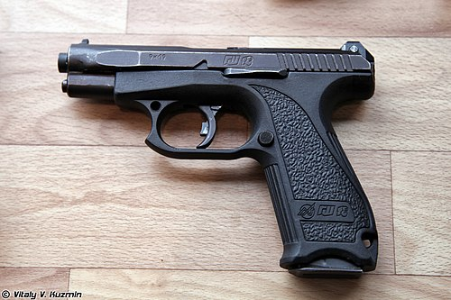

# Pistolet GSz-18
### GSh-18 Pistol | ГШ-18

---

## Opis

GSz-18 (ГШ-18 — Griaziew-Szipunow, 18 nabojów) to rosyjski pistolet samopowtarzalny kalibru 9×19 mm opracowany przez KBP (Griaziew i Szipunow) w Tule i przyjęty do służby w 2000 roku. Wyróżnia się wyjątkowo lekką polimerową ramą i obrotowym zamkiem (locked breech rotating barrel) — oryginalnym mechanizmem, który redukuje masę i odrzut. Dedykowana amunicja 9×19 mm PBP (7N31) ma rdzeń ze stali narzędziowej i przebija kamizelki balistyczne klasy III A na 10 m — co czyni GSz-18 jednym z najbardziej penetracyjnych pistoletów na świecie. Stosowany przez FSB, policję specjalną i wybrane jednostki wojskowe; konkuruje z MP-443 o rolę standardowego pistoletu.

## Dane techniczne

| Parametr | Wartość |
|----------|---------|
| Typ | Pistolet samopowtarzalny |
| Kraj produkcji | Rosja |
| Rok wprowadzenia | 2000 |
| Kaliber | 9×19 mm Parabellum / 9×19 mm PBP |
| Długość | 184 mm |
| Długość lufy | 103 mm |
| Masa (bez magazynka) | 590 g |
| Pojemność magazynka | 18 nabojów |
| Prędkość wylotowa | 600 m/s (7N31 PBP) |
| Skuteczny zasięg | 50 m |

## Charakterystyczne cechy rozpoznawcze

> Jak odróżnić GSz-18 od MP-443 i PM:

- **Wyjątkowo lekki — 590 g — najlżejszy wśród rosyjskich pistoletów służbowych:** GSz-18 waży zaledwie 590 g bez magazynka; PM waży 730 g, MP-443 — 950 g; ta lekkość jest odczuwalna w ręce i widoczna w sposobie trzymania przez strzelca
- **Polimerowa rama z bardzo widoczną szyną Picatinny:** GSz-18 ma wyraźną szynę pod lufą jak MP-443; ale cała rama jest wyraźnie bardziej "plastikowa" i lekka; połączenie dużej szyny i lekkiego wyglądu jest charakterystyczne
- **Charakterystyczny kształt "trójkątnego" chwytu z tylnym wycięciem:** chwyt GSz-18 ma charakterystyczny kształt ze specjalnym wycięciem w tylnej części ramy dla kciuka drugiej ręki; kształt jest geometrycznie unikalny wśród rosyjskich pistoletów
- **Brak zewnętrznego kurka — "hammerless" striker-fired:** GSz-18 nie ma widocznego zewnętrznego kurka; tylna część slajdu jest gładka; to odróżnia od PM i MP-443 (oba z kurkiem zewnętrznym); wygląd "bez kurka" jest charakterystyczny
- **Magazynek 18-nabojowy — wyraźnie duże pudełko magazynka:** magazynek na 18 nabojów jest jednym z największych w klasie rosyjskich pistoletów; chwyt jest odpowiednio szeroki — widoczna przy magazynku o dużej pojemności szerokość chwytu
- **Rzadziej spotykany niż PM i MP-443 — broń "elitarna":** GSz-18 jest mniej powszechny niż PM; jego widok sugeruje FSB, policję specjalną lub oficera wywiadu; w regularnej armii rzadki

## Ciekawostka

> GSz-18 z amunicją 7N31 PBP jest jednym z niewielu pistoletów na świecie zdolnych do przebicia standardowych kamizelek balistycznych NATO klasy IIIA na odległość 10 metrów. Eksperymenty wykazały, że 7N31 przebija 8 mm stali budowlanej z 10 m — co jest wynikiem niespotykawym dla naboju pistoletowego 9 mm. Zachodni eksperci byli zaskoczeni, bo NATO przez lata zakładało, że kamizelki IIIA chronią przed wszystkimi pistoletami. GSz-18 zademonstrował, że "standardowa ochrona" nie jest standardem uniwersalnym.

