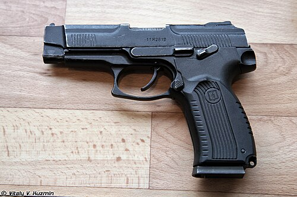

# Pistolet MP-443 Grach
### MP-443 Grach (PYa) Pistol | МП-443 «Грач» (ПЯ)

---

## Opis

MP-443 Grach (Грач — Gawron), oficjalnie PYa (Pistolet Yarygina), to rosyjski pistolet samopowtarzalny kalibru 9×19 mm Parabellum opracowany przez Władimira Yarygina i przyjęty do służby w 2003 roku jako oficjalny następnik PM. Standardowy pistolet armii rosyjskiej i policji nowej generacji — używa NATO-wskiego kalibru 9×19 mm, co jest istotną zmianą od 9×18 mm PM. Duży magazynek 17-nabojowy, podwójne działanie spustu (DA/SA), szyna Picatinny pod lufą i ergonomiczny polymer-frame chwyt sprawiają, że MP-443 jest nowoczesną bronią policyjną i wojskową klasy XXI wieku. Był wolno wdrażany ze względu na problemy z jakością produkcji w latach 2000.; od 2010 roku dostawy są stabilne.

## Dane techniczne

| Parametr | Wartość |
|----------|---------|
| Typ | Pistolet samopowtarzalny |
| Kraj produkcji | Rosja |
| Rok wprowadzenia | 2003 |
| Kaliber | 9×19 mm Parabellum |
| Długość | 198 mm |
| Długość lufy | 112 mm |
| Masa (bez magazynka) | 950 g |
| Pojemność magazynka | 17 nabojów |
| Prędkość wylotowa | 465 m/s |
| Skuteczny zasięg | 50 m |

## Charakterystyczne cechy rozpoznawcze

> Jak odróżnić MP-443 od PM i zachodnich pistoletów:

- **Wyraźnie większy i masywniejszy od PM — "nowoczesny policyjny" wygląd:** MP-443 jest wyraźnie większy od PM; szerszy chwyt (dwurzędowy magazynek 17 nabojów), dłuższa lufa; przy porównaniu PM wygląda jak "mały, stary pistolet" obok nowoczesnego MP-443
- **Szyna Picatinny pod lufą — charakterystyczny "ząb" pod rurą:** MP-443 ma wyraźną szynę taktyczną pod lufą do latarki lub lasera; PM nie ma szyny; ta szyna jest jedną z pierwszych różnic widocznych od razu
- **Szeroki, wysoki chwyt na dwurzędowy magazynek 17 nabojów:** chwyt MP-443 jest wyraźnie szerszy i wyższy od chwytu PM (8 nabojów); przy trzymaniu w dłoni widoczna jest wyraźna różnica w "objętości" uchwytu
- **Czarny polymer lub metal — nowoczesna ergonomia:** MP-443 ma czarny polimerowy lub stalowy chwyt z wyraźnymi ryflowaniami antypoślizgowymi; PM ma gładkie okładziny bakelitowe lub gumowe; estetyka MP-443 jest wyraźnie nowoczesna
- **Zewnętrzny kurek z tyłu slajdu — jak PM:** MP-443 zachowuje zewnętrzny kurek z tyłu zamka (jak PM); to odróżnia go od pistoletów "hammerless" (bez kurka zewnętrznego); kurek MP-443 jest mniejszy i nowocześniej ukształtowany niż kurek PM
- **Dźwignia bezpiecznika po lewej stronie ramy — jak PM:** MP-443 ma bezpiecznik po lewej stronie ramy; PM też ma bezpiecznik w tym miejscu; to cecha wspólna rosyjskich pistoletów odróżniająca od wielu zachodnich konstrukcji

## Ciekawostka

> MP-443 Grach miał jedną z najdłuższych i najbardziej problematycznych dróg do służby spośród nowoczesnych rosyjskich broni. Oficjalnie przyjęty w 2003 roku, przez kolejne siedem lat borykał się z problemami produkcyjnymi — pęknięcia ramy, zawodność zasilania. Żołnierze rosyjscy z pierwszych dostaw żartowali, że "Grach lata gorzej niż stary PM". Sytuacja poprawiła się około 2010 roku, ale PM wciąż służy jako broń zapasowa i w policji ze względu na olbrzymie zapasy magazynowe. W 2022 roku na Ukrainie strzelcy obu stron identyfikują pistolet rosyjski po tym, czy nosi PM (starszy, rezerwysta) czy MP-443 (młodszy, aktywna służba).

