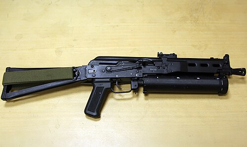

# Pistolet maszynowy OTs-23 Drotik
### OTs-23 Drotik Machine Pistol | ОЦ-23 «Дротик»

---

## Opis

OTs-23 Drotik (Дротик — Oszczep, rzutka) to rosyjski automatyczny pistolet maszynowy kalibru 5,45×18 mm MPts opracowany przez KBP w Tule w latach 90. dla policji i sił specjalnych. Wyróżnia się trójstrzałową serią z opóźnieniem — mechanizm strzelający oddaje trzy naboje przed skokiem zamka, co redukuje rozrzut serii. Kaliber 5,45×18 mm to ten sam co PSM — pocisk przenika kamizelki klasy I-II. Bardzo kompaktowa broń (długość 305 mm bez kolby) przeznaczona dla oficerów ochrony, policjantów w służbie cywilnej i agentów wywiadu. Nie była szeroko wdrażana ze względu na ograniczoną dostępność amunicji 5,45×18 mm; stosowana przez FSO (ochrona Kremla) i wybrane oddziały FSB.

## Dane techniczne

| Parametr | Wartość |
|----------|---------|
| Typ | Pistolet maszynowy / pistolet automatyczny |
| Kraj produkcji | Rosja |
| Rok wprowadzenia | ok. 1994 |
| Kaliber | 5,45×18 mm MPts |
| Długość (bez kolby) | 305 mm |
| Długość (z kolbą złożoną) | 535 mm |
| Długość lufy | 135 mm |
| Masa (bez magazynka) | 1 100 g |
| Pojemność magazynka | 24 nabojów |
| Szybkostrzelność | 1 700 strz./min (seryjnie) |
| Skuteczny zasięg | 50 m |

## Charakterystyczne cechy rozpoznawcze

> Jak odróżnić OTs-23 od PP-2000 i PM:

- **Mały kaliber — lufa wyraźnie cieńsza niż 9 mm pistolety:** OTs-23 w kalibrze 5,45 mm ma wyraźnie cieńszą lufę niż pistolety 9 mm (PM, MP-443); przy oglądaniu z przodu otwór lufy jest wyraźnie mniejszy
- **Składana kolba druciana — jak Kedr lub UZI:** OTs-23 ma metalową drucianą kolbę składaną do tyłu lub na bok; charakterystyczna "druciana kratownica" jako kolba jest zbliżona do Kedr i UZI
- **Długi magazynek 24-nabojowy wyraźnie sterczący z chwytu:** magazynek 24 nabojów na kaliber 5,45×18 mm jest długi (naboje są wąskie więc magazynek jest smukły ale długi); sterczy wyraźnie poniżej chwytu; PSM (ten sam kaliber) ma tylko 8 nabojów
- **Rzadkość — broń prawie nieznana poza Rosją:** OTs-23 Drotik jest jedną z rzadszych rosyjskich broni specjalnych; jego widok sugeruje specjalistyczną kolekcję lub bardzo wąskie zastosowanie FSO/FSB; przy pokazywaniu broni "co to jest?" jest częstą reakcją
- **Selektor trybu ognia z możliwością serii 3-nabojowych:** OTs-23 ma selektor z trybem serii 3-nabojowych — charakterystyczna trójpozycyjna dźwignia; mniej pistoletów ma serię 3-nabojową jako opcję
- **Mała, kompaktowa bryła bez szyny taktycznej:** OTs-23 jest prosty i kompaktowy — bez szyny Picatinny (starszy projekt); wygląd "prosty wojskowy" bez nowoczesnych dodatków

## Ciekawostka

> OTs-23 Drotik był projektowany jako alternatywa dla PSM dla oficerów wymagających większej pojemności magazynka i możliwości ognia automatycznego — ale w tym samym kalibrze 5,45×18 mm przenikającym kamizelki. Niestety, kaliber 5,45×18 mm jest produkowany w ograniczonych ilościach i dostępny głównie dla wojska; to spowodowało, że OTs-23 nigdy nie był masowo wdrożony. Ironicznie, FSO (ochrona Kremla), która jest jednym z głównych użytkowników Drotika, ma priorytetowy dostęp do amunicji 5,45×18 mm — bo chroni najważniejsze osoby w Rosji i musi mieć broń zdolną do penetracji kamizelek ewentualnych zamachowców.

