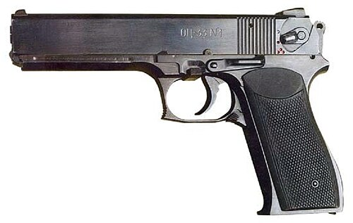

# Pistolet maszynowy OTs-33 Piernacz
### OTs-33 Pernach Machine Pistol | ОЦ-33 «Пернач»

---

## Opis

OTs-33 Piernacz (Пернач — historyczna buława policyjna) to rosyjski pistolet maszynowy kalibru 9×18 mm Makarov opracowany przez KBP w Tule i przyjęty do służby w 1999 roku dla policji specjalnej i sił szybkiego reagowania. Wyróżnia się kompaktową budową z automatycznym ogniem (850 strz./min) i magazynkiem 27-nabojowym — przy rozmiarach zaledwie nieznacznie większych od PM. Odpinaną kolba szkieletowa (do montażu z tyłu) pozwala na celny ogień automatyczny. OTs-33 jest bronią przeznaczoną dla operatorów policyjnych i jednostek antyterrorystycznych wymagających kompaktowej broni z możliwością ognia automatycznego; stosowany przez OMON, FSB i rosyjskie jednostki specjalne.

## Dane techniczne

| Parametr | Wartość |
|----------|---------|
| Typ | Pistolet maszynowy / pistolet automatyczny |
| Kraj produkcji | Rosja |
| Rok wprowadzenia | 1999 |
| Kaliber | 9×18 mm Makarov |
| Długość (bez kolby) | 205 mm |
| Długość (z kolbą złożoną) | 360 mm |
| Długość lufy | 130 mm |
| Masa (bez magazynka) | 1 050 g |
| Pojemność magazynka | 27 nabojów |
| Szybkostrzelność | 850 strz./min (auto) |
| Skuteczny zasięg | 50 m (pistolet) / 100 m (z kolbą) |

## Charakterystyczne cechy rozpoznawcze

> Jak odróżnić OTs-33 od APS i PM:

- **Wyraźnie większy magazynek — 27 nabojów sterczy poniżej chwytu:** magazynek OTs-33 na 27 nabojów jest długi i wyraźnie sterczy poniżej dolnej krawędzi chwytu; PM ma krótki magazynek 8-nabojowy; ta długość magazynka jest widoczna
- **Dwa przełączniki trybu ognia — widoczne po lewej stronie:** OTs-33 ma selektor trybu ognia (semi/auto/bezpiecznik) po lewej stronie; APS też ma selektor; PM nie ma; widoczna dźwignia selektora identyfikuje broń z możliwością ognia automatycznego
- **Kolba szkieletowa odcinana — nowocześniejsza od kabury-kolby APS:** OTs-33 ma nowoczesną metalową kolbę szkieletową (nie kaburę jak APS); kolba ma inny kształt od kaburo-kolby APS; bardziej "taktyczny" wygląd
- **Nieco krótszy od APS — kompaktowszy dla użycia policyjnego:** OTs-33 (205 mm bez kolby) jest nieco krótszy od APS (225 mm); proporcje są zbliżone, ale OTs-33 jest bardziej zwarty; oba są wyraźnie większe od PM
- **Charakterystyczna "podwójna" linia z boku zamka:** zamek OTs-33 ma widoczne linie ryflowania do naciągania zarówno z przodu jak i z tyłu; ta "podwójna" strefa chwytu do naciągania jest nowocześ­niejsza i bardziej rozbudowana niż w APS
- **Broń policyjna — widoczna głównie u OMON i FSB:** OTs-33 pojawia się głównie na fotografiach jednostek policyjnych i antyterrorystycznych, rzadko w regularnym wojsku; ten kontekst użycia jest sam w sobie identyfikatorem

## Ciekawostka

> Nazwa "Piernacz" pochodzi od historycznej polsko-rosyjskiej broni ceremonialnej — buławy z piórami (piernacz), symbolizującej władzę dowódcy. Projektanci KBP wybrali tę nazwę żartobliwie sugerując, że OTs-33 jest "buławą nowoczesnego dowódcy policji" — kompaktową bronią godną oficera, a nie tylko strażnika. Ironia polega na tym, że Piernacz jest jedną z rzadszych broni w rosyjskim arsenale policyjnym — jego wysoka szybkostrzelność (850 strz./min) i kaliber 9×18 mm są dobre do walki w pomieszczeniach, ale ograniczone zasięgiem; OMON preferuje karabiny szturmowe do zewnętrznych operacji.

