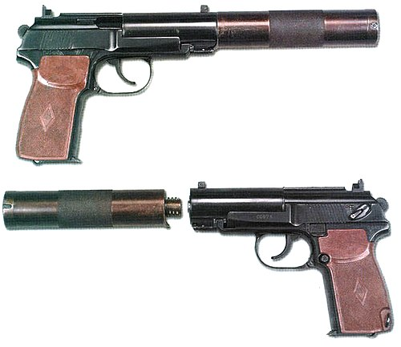

# Pistolet tłumiony PB (6P9)
### PB Silent Pistol | ПБ (Пистолет Бесшумный)

---

## Opis

PB (Пистолет Бесшумный — Pistolet Bezgłośny, oznaczenie GRAU: 6P9) to radziecki tłumiony pistolet kalibru 9×18 mm Makarov opracowany przez A.A. Dyeewa na bazie PM i przyjęty do służby w 1967 roku dla KGB i GRU. Wyróżnia się zintegrowanym układem tłumienia dźwięku podzielonym na dwa elementy — wewnętrzny tłumik w ramie (zastępuje część ramy) i zewnętrzny tłumik przykręcany do lufy; całość przy złożonym tłumiku zewnętrznym mieści się w standardowej kaburze. PB jest przeznaczony do cichego eliminowania celów na bliskich odległościach (do 25 m) — stosowany przez wywiad wojskowy, KGB i siły specjalne w Afganistanie, Czeczenii i operacjach specjalnych GRU.

## Dane techniczne

| Parametr | Wartość |
|----------|---------|
| Typ | Tłumiony pistolet samopowtarzalny |
| Kraj produkcji | ZSRR / Rosja |
| Rok wprowadzenia | 1967 |
| Kaliber | 9×18 mm Makarov |
| Długość (bez tłumika zewnętrznego) | 170 mm |
| Długość (z tłumikiem zewnętrznym) | 310 mm |
| Długość lufy | 105 mm |
| Masa (bez tłumika i magazynka) | 970 g |
| Pojemność magazynka | 8 nabojów |
| Prędkość wylotowa | 290 m/s (poddźwiękowa) |
| Skuteczny zasięg | 25–50 m |

## Charakterystyczne cechy rozpoznawcze

> Jak odróżnić PB od PM i pistoletów z tłumikami dokręcanymi:

- **Widoczna "szczelina" w ramie z lewej strony — wewnętrzny tłumik:** PB ma charakterystyczną podłużną szczelinę lub otwory w przedniej lewej części ramy — to wloty wewnętrznego tłumika zintegrowanego z ramą; żaden standardowy PM nie ma otworów w ramie; ta cecha jest natychmiastowym identyfikatorem
- **Zewnętrzny tłumik cylindryczny przykręcany z przodu:** z zewnętrznym tłumikiem PB ma charakterystyczną cylindryczną "rurę" dłuższą niż lufa; tłumik PB jest stosunkowo krótki w porównaniu do wielu zachodnich tłumikowych pistoletów
- **Bez tłumika zewnętrznego — wizualnie bardzo podobny do PM:** PB bez zewnętrznego tłumika jest bardzo zbliżony wizualnie do PM; różnice to otwory w ramie i nieco dłuższa lufa; trudny do odróżnienia dla nieeżperta bez bliższego oglądania
- **Poddźwiękowa prędkość wylotowa — słyszalny tylko mechanizm:** pocisk 9×18 mm z PB leci z prędkością 290 m/s (poniżej prędkości dźwięku 340 m/s); jedynym słyszalnym dźwiękiem jest mechanizm zamkowy; z zewnątrz strzał brzmi jak "klik" z metalowego mechanizmu
- **Magazynek 8-nabojowy — identyczny z PM:** magazynek PB jest identyczny z PM (8 nabojów 9×18); odróżnienie PB od PM po magazynku jest niemożliwe
- **Broń specjalna — rzadkość poza jednostkami wywiadowczymi:** PB pojawia się prawie wyłącznie na fotografiach sił specjalnych i agentów wywiadu; widok tej broni sugeruje operację specjalną lub jednostkę Spetsnaz

## Ciekawostka

> PB był jedną z pierwszych broni użytych przez sowieckich "cichych likwidatorów" w Afganistanie — żołnierze Specnaz GRU przeznaczeni do eliminowania mudżahedińskich dowódców nosili PB jako broń "ostateczności". Afgański konflikt ujawnił jednak słabość 9×18 mm — słaba siła zatrzymania na celach w grubych ubraniach zimowych. Dlatego w Afganistanie Specnaz szybko przeszedł na VSS Wintorez (9×39 mm) do akcji wymagających cichości i siły rażenia jednocześnie, a PB pozostał jako "pistolet drugorzędny" dla agentów wywiadu.

