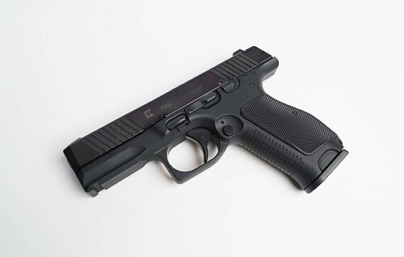

# Pistolet PL-14 (PL-15) Lebedev
### PL-14 / PL-15 Lebedev Pistol | ПЛ-14 / ПЛ-15 Лебедев

---

## Opis

PL-14 (Пистолет Лебедева — Pistolet Lebiedewa), znany też jako PL-15 w wersji wojskowej, to rosyjski pistolet samopowtarzalny kalibru 9×19 mm Parabellum opracowany przez Dmitrija Lebiedewa w Konsorcjum Kałasznikowa (Izhmash) i zaprezentowany w 2014 roku. Jest przeznaczony do programu "Ratnik-3" jako potencjalny zastępnik MP-443 Grach. Wyróżnia się wyjątkowo płaskim profilem (21 mm grubości), ergonomicznym chwytem, stałymi celownikami noktowizyjnymi i szyną Picatinny. PL-15K to skrócona wersja dla oficerów i służb specjalnych. W 2020 roku FSB zamówiło partię PL-15 — rozpoczynając stopniowe wdrożenie jako zamiennik MP-443 w jednostkach specjalnych.

## Dane techniczne

| Parametr | Wartość |
|----------|---------|
| Typ | Pistolet samopowtarzalny |
| Kraj produkcji | Rosja |
| Rok wprowadzenia | 2020 (ograniczone dostawy FSB) |
| Kaliber | 9×19 mm Parabellum |
| Długość | 206 mm |
| Szerokość | 21 mm |
| Długość lufy | 127 mm |
| Masa (bez magazynka) | 800 g |
| Pojemność magazynka | 15 lub 17 nabojów |
| Prędkość wylotowa | 460 m/s |
| Skuteczny zasięg | 50 m |

## Charakterystyczne cechy rozpoznawcze

> Jak odróżnić PL-14/15 od MP-443 i GSz-18:

- **Wyjątkowo płaski profil 21 mm — "nowoczesny zachodnim stylem":** PL-14/15 jest jednym z najcieńszych rosyjskich pistoletów; 21 mm grubości jest porównywalny z zachodnimi pistoletami klasy premium (Walther PPQ, HK VP9); wyraźnie cieńszy od MP-443 (~33 mm)
- **Brak zewnętrznego kurka — striker-fired hammerless:** PL-14/15 nie ma kurka zewnętrznego; tylna część slajdu jest gładka jak w GSz-18; to odróżnia od PM i MP-443 (z kurkami); "gładki tył zamka" to identyfikator striker-fired
- **Niska linia zamka (low bore axis) — wyraźne cechy ergonomiczne:** PL-14/15 ma bardzo niską linię lufy nad chwytem — chwyt sięga wyżej względem lufy; przy trzymaniu w dłoni kąt jest bardziej naturalny niż w MP-443; ta cecha jest widoczna przy porównaniu profili
- **Szyna Picatinny pod lufą i stałe celowniki noktowizyjne:** PL-14/15 ma nowoczesną szynę i stałe trójpunktowe celowniki z tritową insercją; nowoczesny wygląd celownika (biały lub jasnożółty punkt) jest widoczny
- **Bardzo nowy — rzadko spotykany poza FSB i pokazami:** PL-15 jest na etapie wdrożenia; poza FSB nie jest jeszcze masowo stosowany; widok tej broni sugeruje jednostkę specjalną najwyższej klasy lub wystawę branżową
- **Estetyka "premium" — bliżej Walther/HK niż PM:** PL-14/15 estetycznie przypomina zachodnioeuropejski pistolet premium bardziej niż tradycyjny rosyjski projekt; ta "zachodnia" estetyka jest zaskakująca dla osoby znającej rosyjskie pistolety

## Ciekawostka

> PL-14 był kontrowersyjny od początku — bo jego projektant Lebiedew pracował dla Konsorcjum Kałasznikowa, tradycyjnie producenta karabinów, nie pistoletów. KBP w Tule (tradycyjny producent rosyjskich pistoletów) poczuło się urażone. W rosyjskich mediach branżowych toczył się przez kilka lat spór: "kto ma prawo robić pistolety dla armii?" — KBP (tradycja i doświadczenie) czy Kałasznikow (marka i budżet)? W 2020 roku wygrał Kałasznikow — FSB zamówiło PL-15; ale KBP nadal dostarcza MP-443 dla wojska. Rosja ma więc dwa "nowe" pistolety służbowe równolegle.

